--- 
title: 'Geocomputation with R'
author: 'Robin Lovelace, Jakub Nowosad, Jannes Muenchow'
date: '2018-01-16'
knit: bookdown::render_book
site: bookdown::bookdown_site
documentclass: book
bibliography:
  - refs.bib
  - packages.bib
biblio-style: apalike
link-citations: yes
description: "Forthcoming book on geographic data with R."
github-repo: "Robinlovelace/geocompr"
url: 'https\://geocompr.robinlovelace.net'
---


# Welcome {-}

Welcome to the [online home](https://geocompr.robinlovelace.net) of *Geocomputation with R*, a forthcoming book with [CRC Press](https://www.crcpress.com/Chapman--HallCRC-The-R-Series/book-series/CRCTHERSER).

## Development {-}

Inspired by [**bookdown**](https://github.com/rstudio/bookdown) and other open source projects we are developing this book in the open.
Why?
To encourage contributions, ensure reproducibility and provide access to the material as it evolves.

The book's development can be divided into four main phases:

1. Foundations
2. Basic applications
3. Geocomputation methods
4. Advanced applications

Currently the focus is on Part 2, which we aim to be complete by December.
New chapters will be added to this website as the project progresses, hosted at [geocompr.robinlovelace.net](https://geocompr.robinlovelace.net) and kept up-to-date thanks to [Travis](https://travis-ci.org/Robinlovelace/geocompr).
Currently the build is:

[](https://travis-ci.org/Robinlovelace/geocompr) 

The version of the book you are reading now was built on 2018-01-16 and was built on [Travis](https://travis-ci.org/Robinlovelace/geocompr).

## How to contribute? {-}

**bookdown** makes editing a book as easy as editing a wiki, provided you have a GitHub account ([sign-up at github.com](https://github.com/)).
Once logged-in to GitHub, clicking on the 'edit me' icon highlighted in the image below will take you to the source [R Markdown](http://rmarkdown.rstudio.com/) where you can make changes:

[](https://github.com/Robinlovelace/geocompr/edit/master/index.Rmd)

To raise an issue about the book's content (e.g. code not running) or make a feature request, check-out the [issue tracker](https://github.com/Robinlovelace/geocompr/issues).

## Reproducibility {-}

To reproduce the book, you need a recent version of [R](https://cran.r-project.org/) and up-to-date packages, which can be installed with the following command (which requires [**devtools**](https://github.com/hadley/devtools)):


```r
devtools::install_github("robinlovelace/geocompr")
```

To build the book locally, clone or [download](https://github.com/Robinlovelace/geocompr/archive/master.zip) the [geocompr repo](https://github.com/Robinlovelace/geocompr/), load R in root directory (e.g. by opening [geocompr.Rproj](https://github.com/Robinlovelace/geocompr/blob/master/geocompr.Rproj) in RStudio) and run the following lines:


```r
bookdown::render_book("index.Rmd") # to build the book
browseURL("_book/index.html") # to view it
```

Further details can be found at [Robinlovelace/geocompr](https://github.com/Robinlovelace/geocompr#geocomputation-with-r).

# Preface {-}

This book is aimed at people who want to do spatial data analysis, visualization and modeling with a modern programming language (R).
There is no single target audience but we expect the book to be especially useful for:

- People who have learned spatial analysis skills using a desktop Geographic Information System (GIS) such as [QGIS](http://qgis.org/en/site/), [ArcMap](http://desktop.arcgis.com/en/arcmap/), [GRASS](https://grass.osgeo.org/) or [SAGA](http://www.saga-gis.org/en/index.html), who want access to a powerful (geo)statistical and visualization programming language and the benefits of a command-line approach [@sherman_desktop_2008]:

> With the advent of 'modern' GIS software, most people want to point and click their way through life. That’s good, but there is a tremendous amount of flexibility and power waiting for you with the command line.

- Graduate students and researchers from fields specializing in geographic data including Geography, Remote Sensing, Planning, GIS and Geographic Data Science
- Academics and post-graduate students working on projects in fields including Geology, Regional Science, Biology and Ecology, Agricultural Sciences (precision farming), Archaeology, Epidemiology, Transport Modeling, and broadly defined Data Science which require the power and flexibility of R for their research <!-- please add further fields-->
- Applied researchers and analysts in public, private or third-sector organisations who need the reproducibility, speed and flexibility of a command-line language such as R in applications dealing with spatial data as diverse as Urban and Transport Planning, Logistics, Geo-marketing (store location analysis) and Emergency Planning <!-- please add further examples-->

The book is designed to be accessible to a wide audience.
The chapters progress gradually in difficulty and exercises are provided at the end of each chapter to ensure understanding.
However, R novices may find the reproducible code chunks --- an integral part of the book --- difficult to understand and implement at first. 

Impatient readers are welcome to dive straight into the first practical examples in Chapter \@ref(spatial-class).
However we suggest most R beginners get up-to-speed with R before diving-in to chapters onwards (unless you're reading the book for an understanding of the concepts).
R has a supportive community that has developed a wealth of resources that can help here, three of which we highly recommend: [An introduction to R](http://colinfay.me/intro-to-r/) [@venables_introduction_2017],  [R for Data Science](http://r4ds.had.co.nz/) [@grolemund_r_2016] and [Efficient R Programming](https://csgillespie.github.io/efficientR/) [@gillespie_efficient_2016], especially [Chapter 2](https://csgillespie.github.io/efficientR/set-up.html#r-version) (on installing and setting-up R/RStudio) and [Chapter 10](https://csgillespie.github.io/efficientR/learning.html) (on learning to learn).
There are also many interactive resources, including DataCamp's [Introduction to R](https://www.datacamp.com/courses/free-introduction-to-r) and tutorials created with [**learnr**](https://rstudio.github.io/learnr/examples.html).

With such material to hand we are confident that the command-line approach demonstrated in this book will be worthwhile within a few months for most people, including programming novices.
Over time and with practice R will likely become the natural choice for many geographic applications.
We expect you will eventually find its interface faster than the point-and-click interface emphasized in many desktop GISs.
For some applications such as Spatial Statistics and modelling R may be the *only* realistic way to get the work done.

As outlined in section \@ref(why-geocomputation-with-r) there are many reasons for using R for geocomputation:
R is well-suited to the interactive use required in many geographic data analysis workflows compared with other languages.
R excels in the rapidly growing fields of Data Science (which includes data carpentry, statistical learning techniques and data visualization) and Big Data (via efficient interfaces to databases and distributed computing systems).

For some applications another language may be more appropriate, such as Python, Java or C++.
There are excellent resources for learning geocomputation *without R*, as discussed in section \@ref(software-for-geocomputation).
However we advocate learning one language (R) in *depth* to gain an understanding of the concepts.
Proficiency with one programming language is preferable to the *breadth* of knowledge (and potential for confusion) attainable by dabbling with many.

We believe that *Geocomputation with R* will equip you with the knowledge and skills needed to solve the majority of challenges that geographic data pose.
A logical question to ask if you've read this far may be: what *is* geocomputation anyway?
The answer is provided in section \@ref(what-is-geocomputation) which, alongside the rest of Chapter \@ref(intro), explains the motivations behind this book.

<!-- to think about, not sure if needed but then this would be a good place to point out why our book might have advantages over other books. Compare with:
- Bivand, R., Pebesma, E., Gomez-Rubio, V. (2013): Applied spatial data analysis with R.
- Blangiardo, M. & Cameletti, M. (2015): Spatial and spatio-temporal Bayesian models with R - INLA.
- Brunsdon, C. & Comber, L. (2015): An introduction to R for spatial analysis and mapping.
- Dorman, M. (2014): Learning R for geospatial analysis.
- Hijmans, R. (2016): Spatial data analysis and modeling with R.  http://rspatial.org/intr/index.html (haven't read it but might be more suitable for beginners, however, it does not consider sf; additionally, it provides more code than text, and hence, probably less explanations than our book) 
- Quiang, S. (2016): Environmental and Ecological Statistics with R (not really a competitor, I have ordered a copy, this book is really about modeling, and I would rather prefer the Zuur et al. books over it)
- Wegmann, M., Leutner, B., Dech, S. (2016): Remote Sensing and GIS for ecologists: Using Open Source Software.
- Zuur, A., Ieno, E., Saveliev, A. (2017): Beginner's guide to spatial, temporal and spatial-temporal ecological data analysis with R-INLA.

Put the competing books into categories, e.g., introduction to spatial analysis (Brundsdon, Dorman, Hijmans), advanced spatial analysis (Bivand), topical spatial analysis (Quiang, Wegmann),  (mainly) spatial modeling (Bivand, Blangiardo, Hijmans, Quiang, Zuur).
Point out where our book fits in and which gap it is filling -> somewhere between advanced (but not that hard) and spatial modeling with a broad range of topics (not just one like ecology).
We try to address a broad audiecence with an interest in spatial data, and how things can be **get done**, not just theoretically but in an applied way.
On the other hand, we embed the shown methods into the bigger field of GIScience, provide context and refer to further literature for the interested reader.

-->

<!-- ## Acknowledgements {-} -->
<!-- add list of people who helped with this book -->

<!--chapter:end:index.Rmd-->


# (PART) Foundations {-}

# Introduction {#intro}

This book is about harnessing the power of modern computers to *do things* with geographic data.
It teaches a range of spatial skills, including: reading, writing and manipulating geographic data; making static and interactive maps; applying geocomputation to solve real-world problems; and modeling geographic phenomena.
By demonstrating how various spatial operations can be linked, in reproducible 'code chunks' that intersperse the prose, the book also teaches a transparent and thus scientific workflow.
Learning how to use the wealth of geospatial tools available from the R command line can be exciting but creating *new ones* can be truly liberating, by removing constraints on your creativity imposed by software.
By the end of the book you should be able to create new tools for geocomputation in the form of shareable R scripts and functions.

Over the last few decades free and open source software for geospatial data ('FOSS4G') has progressed at an astonishing rate (see [foss4g.org](http://foss4g.org/)).
Thanks to FOSS4G and the wider open source movement geospatial analysis is no longer the preserve of those with expensive hardware and software: anyone can now download high performance spatial libraries on their computer.
However, despite the growth of geospatial software that is *open source*, much of it is still not easy to script.
Open source Geographic Information Systems (GIS) such as QGIS (see [qgis.org](http://qgis.org/en/site/)) have greatly reduced the 'barrier to entry' but their emphasis on the Graphical User Interface (GUI) can discourage reproducibility.
This book focuses on the Command Line Interface (CLI), enabling reproducible, and 'computational' workflows, something we will expand on in Chapter 13.
<!--\@ref(gis) --><!-- REF NEEDS TO BE FIXED IN FUTURE-->

\BeginKnitrBlock{rmdnote}<div class="rmdnote">Reproducibility is a major advantage of command-line interfaces, but what does it mean in practice?
We define it as follows:

> A process is reproducible only if the same results can be generated by others using publicly accessible code.

This may sound simple and easy to achieve (which it is if you carefully maintain your R code in script files) but has profound implications for teaching and the scientific process [@pebesma_r_2012].</div>\EndKnitrBlock{rmdnote}

A major aim of this book is to make geographic data analysis more accessible as part of a reproducible workflow.
R is a flexible language that allows access to many spatial software libraries (see section \@ref(why-geocomputation-with-r)).
Before going into the details of the software, however, it is worth taking a step back and thinking about what we mean by geocomputation.

## What is geocomputation?

Geocomputation is a relatively young field with a ~30 year history, dating back to the first conference on the subject in 1996.^[The conference took place at the University of Leeds, where one of the authors (Robin) is currently based and where the 21^st^ GeoComputation was hosted in 2017 (see
[geocomputation.org](http://www.geocomputation.org/)).]
<!-- todo: which chapters? -->
What distinguishes geocomputation from the older quantitative geography, is its emphasis on "creative and experimental" GIS applications [@longley_geocomputation:_1998].
Additionally, it is also about developing new, research-driven methods [@openshaw_geocomputation_2000]:

> GeoComputation is about using the various different types of geodata and about
developing relevant geo-tools within the overall context of a 'scientific'
approach.

But geocomputation and this book teach more than just methods and code: they are about *doing* "practical work that is beneficial or useful" [@openshaw_geocomputation_2000].
Of course, reading this book will give you a solid *knowledge* of geocomputational methods, and how to use them via the reproducible examples implemented in the code chunks in each chapter.
But there is much more.
This book aims to teach how to do geocomputation rather than just to think about it.
Hence, you should also be able to apply the learned methods and mastered skills to real-world data, for evidence-based analysis in your own areas of interest.
Moreover, throughout the book we encourage you to make geographic research more reproducible, scientific and socially beneficial. 

This book is also related to a movement that has been labelled Geographical Data Science (GDS).
This recent concept essentially combines 'data science' with GIS and, like Geocomputation, can be defined in comparison with GIS (see Table \@ref(tab:gdsl)).
The focus on reproducibility and a command-line interface in this book is aligned with GDS.


Table: (\#tab:gdsl)Differences in emphasis between the fields of Geographic Information Systems (GIS) and Geographic Data Science (GDS).

Attribute          GIS                        GDS                              
-----------------  -------------------------  ---------------------------------
Home disciplines   Geography                  Geography, Computing, Statistics 
Software focus     Graphical User Interface   Code                             
Reproduciblility   Minimal                    Maximal                          

While embracing recent developments in the field, we also wanted to pay respects to the wider field of Geography, with its 2000 history [@roller_eratosthenes_2010], and the narrower field of *Geographic Information System* (GIS) [@neteler_open_2008].
Geography has played an important role in explaining and influencing humanity's relationship with the natural
world^[A good example of this is Alexander von Humboldt's travels to South America, which laid the foundations for physical and plant geography [@wulf_invention_2015].
]
and this book aims to contribute to this so-called 'Geographic Tradition' [@livingstone_geographical_1992].
GIS has become almost synonymous with handling spatial data on a computer, and provides a basis for excellent open source tools which can be accessed from R, as we will see in Chapter 13.
<!-- todo - add dynamic reference to c13-->

The book's links to older disciplines were reflected in suggested titles for the book: *Geography with R* and *R for GIS*.
Each has advantages.
The former conveys the message that it comprises much more than just spatial data: 
non-spatial attribute data are inevitably interwoven with geometry data, and Geography is about more than where something is on the map.
The latter communicates that this is a book about using R as a GIS, to perform spatial operations on *geographic data* [@bivand_applied_2013].
However, the term GIS conveys some connotations (see Table \@ref(tab:gdsl)) which simply fail to communicate one of R's greatest strengths:
its console-based ability to seamlessly switch between geographic and non-geographic data processing, modeling and visualization tasks.
By contrast, the term geocomputation implies reproducible and creative programming.
Of course, (geocomputational) algorithms are powerful tools that can become highly complex.
However, all algorithms are composed of smaller parts.
By teaching you its foundations and underlying structure, we aim to empower you to create your own innovative solutions to geographic data problems.

## Why Geocomputation with R?

Early geographers used a variety of tools including rulers, compasses and sextants to advance knowledge about the world. 
However, until John Harrison invented the marine chronometer in the 18th century it had been impossible to determine the exact longitude at sea ('the longitude problem').
Prior to his invention ships followed for centuries a line of constant latitude making each journey much longer, more expensive and often more dangerous.
Nowadays this seems unimaginable with every smartphone having a GPS receiver at its disposal and a multitude of other sensors measuring the world in real-time (satellites, radar, autonomous cars, citizens, etc.).
For instance, an autonomous car could create 100 GB or more per day (see e.g., this [article](https://www.economist.com/news/science-and-technology/21696925-building-highly-detailed-maps-robotic-vehicles-autonomous-cars-reality)).
Equally, earth observation data (satellite imagery) has become so big that it is impossible to analyze the corresponding data with a single computer (see [http://r-spatial.org/2016/11/29/openeo.html](http://r-spatial.org/2016/11/29/openeo.html)).
Hence, we need computational power, software and related tools to handle and extract the most interesting patterns of this ever-increasing amount of (geo-)data.
(Geo-)Databases help with data management, storing and querying such large amounts of data.
Through interfaces, we can access subsets of these data for further analysis, information extraction and visualization.
In this book we treat R as a 'tool for the trade' for the latter.
<!-- What is 'the latter'? --> 

R is a multi-platform, open source language and environment for statistical computing and graphics ([https://www.r-project.org/](https://www.r-project.org/)).
With a wide range of packages R also supports advanced geospatial statistics, modeling and visualization.^[The integrated development environment (IDE) [RStudio](https://www.rstudio.com/) deserves mention here from a user perspective as it has made the interactive use of R more accessible].
At its core R is an object-oriented, [functional programming language](http://adv-r.had.co.nz/Functional-programming.html) [@wickham_advanced_2014], and was specifically designed as an interactive interface to other software [@chambers_extending_2016]. 
The latter also includes many 'bridges' to a treasure trove of GIS software, 'geolibraries' and functions.
<!-- todo - add this reference to ref(gis) -->
It is thus ideal for quickly creating 'geo-tools', without needing to master lower level languages (compared to R) such as C, FORTRAN and Java (see section \@ref(software-for-geocomputation)). 
This can feel like breaking free from the metaphorical 'glass ceiling' imposed by GUI-based proprietary geographic information systems (see Table \@ref(tab:gdsl) for a definition of GUI).
What is more, advanced users might even extend R with the power of other languages (e.g., C++ through **Rcpp** or Python through **reticulate**; see also section \@ref(software-for-geocomputation)).

An example showing R's flexibility with regard to geographic software development is its support for generating interactive maps thanks to **leaflet** [@R-leaflet].
The packages **tmap** and **mapview** [@R-tmap; @R-mapview] are built on and extend **leaflet**.
These packages help overcome the criticism that R has "limited interactive [plotting] facilities" [@bivand_applied_2013]. 
The code below illustrates this by generating Figure \@ref(fig:interactive).


```r
library(leaflet)
popup = c("Robin", "Jakub", "Jannes")
leaflet() %>%
  addProviderTiles("NASAGIBS.ViirsEarthAtNight2012") %>% 
  addAwesomeMarkers(lng = c(-3, 23, 11),
                    lat = c(52, 53, 49), 
                    popup = popup)
```

<div class="figure" style="text-align: center">
preservee0de7870c4b91c18
<p class="caption">(\#fig:interactive)World at night imagery from NASA overlaid by the authors' approximate home locations to illustrate interactive mapping with R.</p>
</div>

It would have been difficult to produce Figure \@ref(fig:interactive) using R a few years ago, let alone embed the results in an interactive html page (the interactive version can be viewed at [robinlovelace.net/geocompr](http://geocompr.robinlovelace.net/intro.html)).
This illustrates R's flexibility and how, thanks to developments such as **knitr** and **leaflet**, it can be used as an interface to other software, a theme that will recur throughout this book.
The use of R code, therefore, enables teaching geocomputation with reference to reproducible examples such as that provided in \@ref(fig:interactive) rather than abstract concepts.

## Software for geocomputation

R is a powerful language for geocomputation but there are many other options for spatial data analysis.
Awareness of these will help situate R in the wider geospatial ecosystem, and identify when a different tool may be more appropriate for a specific task.
Over time R developers have added various R interfaces (or 'bridges' as we call them in Chapter 13) to other software.
Therefore knowing what else is out there can also be useful from an R-spatial perspective because a) there may already be a bridge to something that adds the functionality you need and b) if there's not already a bridge there may be one on the horizon.
With this motivation in mind this section briefly introduces the languages [C++](https://isocpp.org/), [Java](https://www.oracle.com/java/index.html) and [Python](https://www.python.org/) for geocomputation, with reference to R.

A natural choice for geocomputation would be C++ since major GIS packages (e.g., [GDAL](http://www.gdal.org/), [QGIS](www.qgis.org), [GRASS](https://grass.osgeo.org/), [SAGA](www.saga-gis.org), and even [ArcGIS](https://www.arcgis.com/)) often rely in great parts on it.
This is because well-written C++ can be blazing fast, which makes it a good choice for performance-critical applications such as the processing of large spatial data.
Usually, people find it harder to learn than Python or R.
It is also likely that you have to invest a lot of time to code things that are readily available in R.
Therefore, we would recommend to learn R, and subsequently to learn C++ through **Rcpp** if a need for performance optimization arises.
Subsequently, you could even implement geoalgorithms you are missing from the most common desktop GIS with the help of **Rcpp**^[Though, in that case we would recommend to contribute the C++ code to one of the open-source GIS packages since this would make the geoalgorithm available to a wider audience.
In turn, you could access the GIS software via one of the available R-GIS interfaces. <!--(ref(gis))-->].

Java is another important (and versatile) language used in GIScience.
For example, the open-source desktop GIS [gvSig](http://www.gvsig.com/en/products/gvsig-desktop), [OpenJump](http://openjump.org/) and [uDig](http://udig.refractions.net/) are written in Java.
There are also many open source add-on libraries available for Java, including [GeoTools](http://docs.geotools.org/) and the [Java Topology Suite](https://www.locationtech.org/projects/technology.jts).^[Please note, that GEOS is a C++ port of the Java Topology Suite.]
Furthermore, many server-based applications use Java including among others [Geoserver/Geonode](http://geonode.org/), [deegree](http://www.deegree.org/) and [52°North WPS](http://52north.org/communities/geoprocessing/wps/).

Java's object-oriented syntax is similar to that of C++ but its memory management, at least from a user's perspective, is simpler and more robust.
Java is rather unforgiving regarding class, object and variable declarations, which encourages well-designed programming structure, useful in large projects with thousands of lines of codes placed in numerous files.
Following the *write once, run anywhere* principle, Java is platform-independent (which is unusual for a compiled language) and has excellent performance on large-scale systems.
This makes Java a suitable language for complex architecture projects such [RStudio](https://github.com/rstudio/rstudio), the Integrated Development Environment (IDE) in which this book was written!

Java is less suitable for statistical modeling and visualization than Python or R.
Although Java can be used for data science [@brzustowicz_data_2017], it has relatively few statistical libraries, especially compared with R.
Furthermore Java is hard to use interactively.
Interpreted languages (such as R and Python) are better suited for the type of interactive workflow used in many geographic workflows than compiled languages (such as Java and C++).
Unlike Java (and most other languages) R has native support for data frames and matrices, making it especially well suited for (geographic) data analysis.

Python is the final language for geocomputation that deserves attention in this section.
Like R, Python has gained popularity due to the rapid growth of data science [@robinson_impressive_2017].
Both languages are object-oriented, and have lots of further things in common.
Due to their similarities there is much on-line discussion framing the relative merits of each language as a competition, as exemplified by an [infographic](https://www.datacamp.com/community/tutorials/r-or-python-for-data-analysis) by DataCamp titled "DATA SCIENCE WARS: R vs Python", which arguably generates more heat than light.

In practice both languages have their strengths and to some extent which you use is less important than the domain of application and communication of results.
Learning either will provide a head-start in learning the other.
However, there are major advantages of R over Python for geocomputation which explains its prominence in this book.
R has unparalleled support for statistics, including spatial statistics, with hundreds of packages (unmatched by Python) supporting thousands of statistical methods.

The major advantage of Python is that it is a *general-purpose* programming language.
It is well-suited to many applications, including desktop software, computer games, websites and data science.
R, by contrast, was originally developed for statistics.^[R
has been extended in various directions, notably in  **shiny**, a package for developing interactive we applications in R.]
This also explains Python's larger user base compared with R's.
Python is often the only shared language between different (geocomputation) communities, explaining why it has become the 'glue' that holds many GIS programs together.
Many geoalgorithms, including those in QGIS and ArcMap, can be accessed from the Python command line, making it well-suited as a starter language for command-line GIS.^[Python modules providing access to geoalgorithms include `grass.script` for GRASS (https://grasswiki.osgeo.org/wiki/GRASS_and_Python), `saga-python` for SAGA-GIS (http://saga-python.readthedocs.io/en/latest/), `processing` for QGIS and `arcpy` for ArcGIS.
]

For spatial statistics and predictive modeling, however, R is second-to-none.
This does not mean you must chose either R or Python: Python supports most common statistical techniques (though R tends to support new developments in spatial statistics earlier) and many concepts learned from Python can be applied to the R world.
Like R Python also supports spatial data analysis and manipulation with packages such as **osgeo**, **Shapely**, **NumPy** and **PyGeoProcessing** [@garrard_geoprocessing_2016].

## R's spatial ecosystem

<!-- paragraphs (with references to chapters in the book): -->
<!-- 1. this book focus -> sf + raster/stars + leaflet/mapview (the recent state of spatial R); the history of R spatial is way longer -->

There are many ways to handle spatial data in R, with dozens of packages in the area.^[An overview of R's spatial ecosystem can be found in the CRAN Task View on the Analysis of Spatial Data
(see [cran.r-project.org/web/views/Spatial.html](https://cran.r-project.org/web/views/Spatial.html)).]
In this book we endeavor to teach the state-of-the-art in the field whilst ensuring that the methods are future-proof.
Like many areas of software development, R's spatial ecosystem is rapidly evolving.
Because R is open source, these developments can easily build on previous work, by 'standing on the shoulders of giants', as Isaac Newton put it in [1675](http://digitallibrary.hsp.org/index.php/Detail/Object/Show/object_id/9285).
This approach is advantageous because it encourages collaboration and avoids 'reinventing the wheel'.
The package **sf** (covered in Chapter \@ref(spatial-class)), for example, builds on its predecessor **sp**.

A surge in development time (and interest) in 'R-Geo' has followed the award of a grant by the R Consortium for the development of support for Simple Features, an open-source standard and model to store and access vector geometries. 
This resulted in the **sf** package (covered in \@ref(intro-sf)).
Multiple places reflect the immense interest in **sf**. This is especially true for the [R-sig-Geo Archives](https://stat.ethz.ch/pipermail/r-sig-geo/), a long-standing open access email list containing much R-spatial wisdom accumulated over the years.
Many posts on the list now discuss **sf** and related packages, suggesting that R's spatial software developers are using the package and, therefore, it is here to stay.

We even propose that the release of **sf** heralds a new era for spatial data analysis and geocomputation in R.
This era ^[We refrain from labeling it the **geoverse** with any seriousness awaiting a better name!] clearly has the wind in its sails and is set to dominate future developments in R's spatial ecosystem for years to come.
So time invested in learning the 'new ways' of handling spatial data, and reading this book, is well spent!

<div class="figure" style="text-align: center">
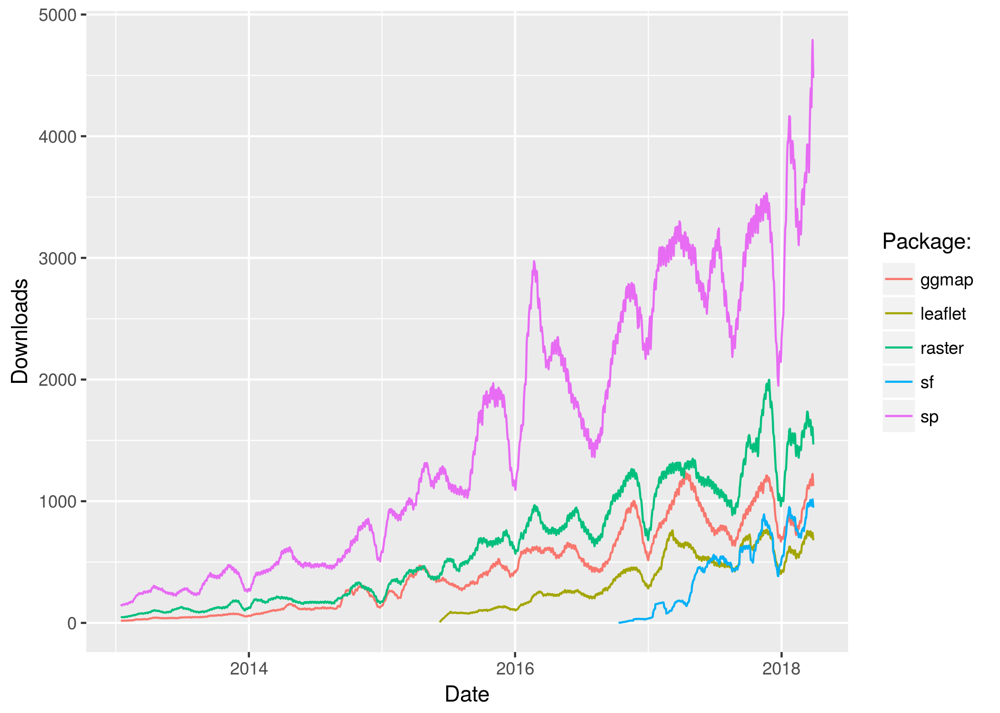
<p class="caption">(\#fig:cranlogs)The popularity of spatial packages in R. The y-axis shows the average number of downloads, within a 30-day rolling window, of R's top 5 spatial packages, defined as those with the highest number of downloads within the last 30 days.</p>
</div>

It is noteworthy that shifts in the wider R community, as exemplified by the data processing package **dplyr** (released in [2014](https://cran.r-project.org/src/contrib/Archive/dplyr/)) influenced shifts in R's spatial ecosystem. 
Alongside other packages that have a shared style and emphasis on 'tidy data' (including e.g., **ggplot2**), **dplyr** was placed in the **tidyverse** 'metapackage' in late [2016](https://cran.r-project.org/src/contrib/Archive/tidyverse/).
The **tidyverse** approach, with its focus on long-form data and fast intuitively named functions, has become immensely popular.
This has led to a demand for 'tidy spatial data' which has been partly met by **sf** and other approaches such as **tabularaster**.
An obvious feature of the **tidyverse** is the tendency for packages to work in harmony.
Although an equivalent **geoverse** is presently missing, there is an on-going discussion of harmonizing R's many spatial packages^[
See the [r-spatial](https://github.com/r-spatial/) organisation and conversations in the [discussion](https://github.com/r-spatial/discuss/issues/11) repo for more on this.
] and a growing number of actively developed packages which are designed to work in harmony with **sf** (Table \@ref(tab:revdep)). 


Table: (\#tab:revdep)The top 5 most downloaded packages that depend on sf, in terms of average number of downloads per day over the previous month. As of 2018-01-08 there are 49 packages which import sf.

package    Downloads
--------  ----------
plotly          1176
raster          1031
spData           551
spdep            532
leaflet          427

## The history of R-spatial

There are many benefits of using recent spatial packages such as **sf**, but it also important to be aware of the history of R's spatial capabilities: many functions, use-cases and teaching material are contained in older packages.
These can still be useful today, provided you know where to look.

R's spatial capabilities originated in early spatial packages in the S language [@bivand_implementing_2000].
The 1990s saw the development of numerous S scripts and a handful of packages for spatial statistics.
R packages arose from these and by 2000 there were R packages for various spatial methods "point pattern analysis, geostatistics, exploratory spatial data analysis and spatial econometrics", according to an [article](http://www.geocomputation.org/2000/GC009/Gc009.htm) presented at GeoComputation2000  [@bivand_open_2000]
Some of these, notably **spatial**, **sgeostat** and **splancs** are still available on CRAN [@rowlingson_splancs:_1993; @rowlingson_splancs:_2017;@venables_modern_2002; @university_sgeostat:_2016].

A subsequent article in R News (the predecessor of [The R Journal](https://journal.r-project.org/)) contained an overview of spatial statistical software in R at the time, much of which was based on previous code written for S/S-PLUS [@ripley_spatial_2001].
This overview described packages for spatial smoothing and interpolation (e.g., **akima**, **spatial**, **sgeostat** and **geoR**) and point pattern analysis [**splancs** and **spatstat**; @akima_akima:_2016; @rowlingson_splancs:_2017; @jr_geor:_2016].
<!-- there is something wrong with the citation: Jr and Diggle 2016 (@jr_geor:_2016)-->
While all these are still available on CRAN, **spatstat** stands out among them, as it remains dominant in the field of spatial point pattern analysis [@baddeley_spatial_2015].

The following R News issue (Volume 1/3) put spatial packages in the spotlight again, with an introduction to **splancs** and a commentary on future prospects regarding spatial statistics [@bivand_more_2001].
Additionally, the issue introduced two packages for testing spatial autocorrelation that eventually became part of **spdep** [@bivand_spdep:_2017].
Notably, the commentary mentions the need for standardization of spatial interfaces, efficient mechanisms for exchanging data with GIS, and handling of spatial metadata such as coordinate reference systems (CRS).

**maptools** [written by Nicholas Lewin-Koh; @bivand_maptools:_2017] is another important package from this time.
Initially **maptools** just contained a wrapper around [shapelib](http://shapelib.maptools.org/) and permitted the reading of ESRI Shapefiles into geometry nested lists. 
The corresponding and nowadays obsolete S3 class called "Map" stored this list alongside an attribute data frame. 
The work on the "Map" class representation was nevertheless important since it directly fed into **sp** prior to its publication on CRAN.

In 2003, @hornik_approaches_2003 published an extended review of spatial packages. 
Around this time the development of R's spatial capabilities increasingly supported interfaces to external libraries, especially to GDAL and PROJ.4.
These interfaces facilitated geographic data I/O (meaning input output and covered in chapter \@ref(read-write)) and CRS transformations, respectively.
@hornik_approaches_2003 proposed a spatial data class system, including support for points, lines, polygons and grids based on GDAL's support for a wide range of spatial data formats.
All these ideas contributed to the packages **rgdal** and **sp**, which became the foundational packages for spatial data analysis with R [@bivand_applied_2013].

**rgdal** provided GDAL bindings for R which greatly extended R's spatial capabilities in terms of access to previously unavailable spatial data formats.
Initially, Tim Keitt released it in 2003 with support for raster drivers.
But soon, **rgdal** also enabled storing information about coordinate reference system (building on top of the PROJ.4 library), allowed map projections, datum transformations and OGR vector reading. 
Many of these additional capabilities were thanks to Barry Rowlingson who folded them into the **rgdal** codebase in March 2006.^[A presentation at the 2003 DSC conference in Vienna gives the background as he saw it then [@rowlingson_rasp:_2003]; see also his announcement of the **Rmap** package on [R-help](https://stat.ethz.ch/pipermail/r-help/2003-January/028413.html) in early 2003.]

**sp**, released in 2005, overcame R's inability to distinguish spatial and non-spatial objects [@pebesma_classes_2005].
It grew from a [workshop](http://spatial.nhh.no/meetings/vienna/index.html) before, and a session at the 2003 DSC conference in Vienna, gathering input from most interested package developers. 
At the same time, [sourceforge](https://sourceforge.net/) was chosen for development collaboration (migrated to [R-Forge](https://r-forge.r-project.org) five years later) and the [R-sig-geo mailing list](https://stat.ethz.ch/mailman/listinfo/r-sig-geo) was started.

Prior to 2005, spatial coordinates were generally treated as any other number. 
This changed with **sp** as it provided generic classes and methods for spatial data.
The sophisticated class system supported points, lines, polygons and grids, with and without attribute data. 

<!--???-->
<!-- points, multipoints, pixels, full grid, line, lines, spatial lines, polygon, polygons, spatial polygons -->
Making use of the S4 class system, **sp** stores each piece of 'spatially specific' information (such as bounding box, coordinate reference system, attribute table) in slots, which are accessible via the `@` symbol.
For instance, **sp**-classes store attribute data in the `data` slot as a `data.frame`.
This enables non-spatial data operations to work alongside spatial operations (see section \@ref(why-simple-features)).
Additionally, **sp** implemented generic methods for spatial data types for well-known functions such as `summary()` and `plot()` .

In the following, **sp** classes rapidly became the go-to standard for spatial data in R, resulting in a proliferation of packages that depended on it from around 20 in 2008 and over 100 in 2013 [@bivand_applied_2013].
Now more than 450 packages rely on **sp**, making it an important part of the R ecosystem. 
<!-- https://github.com/Robinlovelace/geocompr/issues/58 -->
<!-- https://github.com/edzer/sfr/issues/387#issuecomment-308949140 -->

Prominent R packages using **sp** include: **gstat**, for spatial and spatio-temporal geostatistics; **geosphere**, for spherical trigonometry; and **adehabitat** used for the analysis of habitat selection by animals [@R-gstat; @calenge_package_2006; @hijmans_geosphere:_2016].

While **rgdal** and **sp** solved many spatial issues, R was still lacking geometry calculation abilities.
Therefore, Colin Rundel started to develop a package that interfaces GEOS, an open-source geometry library, during a Google Summer of Coding project in 2010.
The resulting **rgeos** package [first released in 2010; @R-rgeos] brought geometry calculations to R by allowing functions and operators from the GEOS library to manipulate **sp** objects.
Another limitation of **sp** was its limited support of raster data.
The **raster**-package [first released in 2010; @R-raster] overcame this by providing `Raster*` classes and functions for creating, reading and writing raster data.
A key feature of **raster** is its ability to work with datasets that are too large to fit into the main memory (RAM), thereby overcoming one of R's major limitations when working on large raster data.^[The
**raster** package also provided tools for raster algebra, general raster functions and the development of more additional raster functions.]

In parallel with or partly even preceding the development of spatial classes and methods came the support for R as an interface to dedicated GIS software.
The **GRASS** package [@bivand_using_2000] and follow-on packages **spgrass6** and **rgrass7** (for GRASS GIS 6 and 7, respectively) were prominent examples in this direction [@bivand_spgrass6:_2016;@bivand_rgrass7:_2016].
Other examples of bridges between R and GIS include **RSAGA** [@R-RSAGA, first published in 2008], **ArcGIS** [@brenning_arcgis_2012, first published in 2008], and **RQGIS** [@R-RQGIS, first published in 2016].
<!-- More information about interfaces between R and GIS software could be find in ref(gis). -->

Map making was not a focus of R's early spatial capabilities.
But soon **sp** provided methods for advanced map making using both the base and lattice plotting system. 
Despite this, a demand for the layered grammar of graphics was growing especially after the release of **ggplot2** in 2007.
**ggmap** extended **ggplot2**'s spatial capabilities [@kahle_ggmap:_2013].
However, its main purpose was the easy access of several APIs to automatically download map tiles (among others, Google Maps and OpenStreetmap) and subsequent plotting of these as a basemap. 
<!--Additionally, *ggmap** lets you use (mainly Google's) geocoding and routing services.-->
Though **ggmap** facilitated map-making with **ggplot2**, one main limitation remained.
To make spatial data work with the **ggplot2** system, one needed to `fortify` spatial objects.
Basically, this means, you need to combine the coordinates and attribute slots of a spatial class object into one data frame.
While this works well in the case of points, it duplicates the same information over and over again in the case of polygons, since each coordinate (vertex) of a polygon receives the attribute data of the polygon.
This is especially disadvantageous if you need to deal with tens of thousands of polygons.
With the introduction of simple features to R this limitation disappears, and it seems likely that this will make **ggplot2** the standard tool for the visualization of vector data. 
This might be different regarding the visualization of raster data. Raster visualization methods received a boost with the release of **rasterVis** [@lamigueiro_displaying_2014] which builds on top of the lattice system.
More recently, new packages aim at easing the creation of complex, high-quality maps with minimal code.
The **tmap** package (released in 2014) might serve as an archetype for this kind of development [@R-tmap].
It facilitates the user-friendly creation of thematic maps with an intuitive command-line interface (see also [**mapmisc**](https://cran.r-project.org/package=mapmisc)) . 
<!-- ADD THIS LATTER -->
<!-- CITE the paper Tennekes, M. (2017) tmap: Thematic Maps in R. Forthcoming in the Journal
of Statistical Software http://von-tijn.nl/tijn/research/presentations/tmap_user2017.pdf-->
**tmap** is a sophisticated yet user friendly mapping package which works in harmony with the **leaflet** package (released in 2015) for interactive map making [@R-leaflet]. 
Similarly, the **mapview** package builds also on top of **leaflet** [@R-mapview] for interactive mapping based on **sp** or **sf** objects. **mapview** allows the access of a wide range of background maps, scale bars and more.

However, it is noteworthy that among all the recent developments described above, the support for simple features [**sf**; @R-sf] has been without doubt the most important evolution in R's spatial ecosystem.
Naturally, this is the reason why we will describe **sf** in detail in Chapter \@ref(spatial-class).

<!-- ## How to read this book -->

## Exercises

1. Think about the terms 'GIS', 'GDS' and 'Geocomputation' described above. Which is your favorite, and why?

1. Provide three reasons for using a scriptable language such as R for geocomputation instead of using an established GIS program such as QGIS.

1. Name two advantages and two disadvantages of using mature packages compared with 'cutting edge' packages for spatial data (for example **sp** vs **sf**).


<!--chapter:end:01-introduction.Rmd-->


# Geographic data in R {#spatial-class}

## Prerequisites {-}

This is the first practical chapter of the book, and therefore it comes with some software requirements.
We assume that you have an up-to-date version of R installed and that you are comfortable using software with a command-line interface such as the integrated development environment (IDE) RStudio.[^1]

[^1]: 

    If you need to install R, we recommend reading [section 2.3](https://csgillespie.github.io/efficientR/set-up.html#r-version) and [section 2.5](https://csgillespie.github.io/efficientR/set-up.html#rstudio) of the freely available book *Efficient R Programming* @gillespie_efficient_2016.
    Packages can be kept up-to-date with `update.packages()`.

    If you are not a regular R user, we recommend that you familiarize yourself with the language before proceeding with this chapter.
    You can do so using resources such as @gillespie_efficient_2016, @grolemund_r_2016 as well as online interactive guides such as [DataCamp](https://www.datacamp.com/courses/free-introduction-to-r).

    We recommend organising your work as you learn, for example with the help of an RStudio '[project](https://csgillespie.github.io/efficientR/set-up.html#project-management)' called `geocomp-learning`.
    Creating new script for each chapter or section of interest will help consolidate and extend the skills learned.
    The code you type to help learn the content of this chapter could be placed in a file called `chapter-02.R`, for example.
    Everyone learns in a different way; structure your work so it makes sense to you; and avoid copy-pasting to get used to typing code.

<!-- Another option is to use the RStudio project provided in the root directory of the [`geocompr`](https://github.com/Robinlovelace/geocompr) GitHub repository. -->
<!-- This will make it easier to run this book's worked examples on your computer. -->

After you've checked you R installation and brushed-up on your R skills where appropriate, the next step is to install and load the packages used in this chapter.
Packages are installed with `install.packages("package_name")`.
We will use the two packages that provide functions for handling spatial data, loaded with `library(package_name)` as follows:


```r
library(sf)          # classes and functions for vector data
library(raster)      # classes and functions for raster data
```

The chapter also relies on two data packages: **spData** and **spDataLarge**, the latter of which must be installed after **spData** is loaded:^[**spDataLarge** can also be installed with the following command: `install.packages("spDataLarge", repos = "https://nowosad.github.io/drat/", type = "source")`.]


```r
library(spData)        # load geographic data
```


```r
install.packages("spDataLarge") # after loading spData
```


```r
library(spDataLarge)   # load geographic data
```

\BeginKnitrBlock{rmdnote}<div class="rmdnote">On Mac and Linux a few requirements must be met to install **sf**.
These are described in the package's README at [github.com/r-spatial/sf](https://github.com/r-spatial/sf).</div>\EndKnitrBlock{rmdnote}

This chapter will provide brief explanations of the fundamental geographic data models: vector and raster.
We will introduce the theory behind each data model and the disciplines in which they predominate, before demonstrating their implementation in R.
<!-- Vector and raster models are vital to geospatial analysis [@longley_geographic_2015]. -->

The *vector data model* represents the world using points, lines and polygons.
These have discrete, well-defined borders, meaning that vector datasets usually have a high level of precision (but not necessarily accuracy as we will see in \@ref(units)).
The *raster data model* divides the surface up into cells of constant size.
Raster datasets are the basis of background images used in web-mapping and have been a vital source of geographic data since the origins of aerial photography and satellite-based remote sensing devices.
Rasters aggregate spatially specific features to a given resolution, meaning that they are consistent over space and scalable (many worldwide raster datasets are available).
<!-- The downside of this is that small features can be blurred or lost. (commented - too specific) -->
<!-- todo: add figure(s) showing raster data and blurring? -->

Which to use?
The answer likely depends on your domain of application:

- Vector data tends to dominate the social sciences because human settlements tend to have discrete borders.
- Raster often dominates in environmental sciences because of the reliance on remote sensing data. 

There is much overlap in some fields and raster and vector datasets can be used side-by-side:
ecologists and demographers, for example, commonly use both vector and raster data.
Whether your work involves more use of vector or raster datasets, it is worth understanding the underlying data model before using them, as discussed in subsequent chapters.
This book uses **sf** and **raster** packages to work with vector data and raster datasets respectively.

## Vector data

\BeginKnitrBlock{rmdnote}<div class="rmdnote">Take care when using the word 'vector' as it can have two meanings in this book:
geographic vector data and the `vector` class (note the `monospace` font) in R.
The former is a data model, the latter is an R class just like `data.frame` and `matrix`.
Still, there is a link between the two: the spatial coordinates which are at the heart of the geographic vector data model can be represented in R using `vector` objects.</div>\EndKnitrBlock{rmdnote}

The geographic vector model is based on points located within a coordinate reference system (CRS).
Points can represent self-standing features (e.g. the location of a bus stop) or they can be linked together to form more complex geometries such as lines and polygons.
Most point geometries contain only two dimensions (3 dimensional CRSs contain an additional $z$ value, typically representing height above sea level).

In this system London, for example, can be represented by the coordinates `c(-0.1, 51.5)`.
This means that its location is -0.1 degrees east and 55.5 degrees north of the origin.
The origin in this case is at 0 degrees longitude (the Prime Meridian) and 0 degree latitude (the Equator) in a geographic ('lon/lat') CRS (Figure \@ref(fig:vectorplots), left panel).
The same point could also be approximated in a projected CRS with 'Easting/Northing' values of `c(530000, 180000)` in the British National Grid ([BNG](https://en.wikipedia.org/wiki/Ordnance_Survey_National_Grid)), meaning that London is located 530 km *East* and 180 km *North* of the $origin$ of the CRS.
This can be verified visually: slightly more than 5 'boxes' --- square areas bounded by the grey grid lines 100 km in width --- separate the point representing London from the origin (Figure \@ref(fig:vectorplots), right panel).

The location of BNG's origin, in the sea beyond South West Peninsular, ensures that most locations in the UK have positive Easting and Northing values.^[
The origin we are referring to, depicted in blue in Figure \@ref(fig:vectorplots), is in fact the 'false' origin.
The 'true' origin, the location at which distortions are at a minimum, is located at 2° W and 49° N.
This was selected by the [Ordnance Survey](https://www.ordnancesurvey.co.uk/support/the-national-grid.html) to be roughly in the center of the British landmass longitudinally.
]
There is more to CRSs, as described in sections \@ref(crs-intro) and \@ref(reproj-geo-data) but, for the purposes of this section, it is sufficient to know that coordinates consist of two numbers representing distance from an origin, usually in $x$ then $y$ dimensions.


<div class="figure" style="text-align: center">

<p class="caption">(\#fig:vectorplots)Illustration of vector (point) data in which location of London (the red X) is represented with reference to an origin (the blue circle). The left plot represents a geographic CRS with an origin at 0° longitude and latitude. The right plot represents a projected CRS with an origin located in the sea west of the South West Peninsula.</p>
</div>


<!-- Commented out: not really necessary here - keeping as could be useful elsewhere: -->
<!-- In mathematical notation these points are typically represented as numbers separated by commas and enclosed by a pair of brackets:  -->
<!-- $(1, 3)$ for example, represents a point located one unit to the right and three units above the origin. -->
<!-- Instead of creating these points manually, one would commonly read-in data with functions such as `read_csv()` from the **tidyverse** or `read_sf()` from the **sf** package (see chapter \@ref(read-write)). -->
<!-- To generate new data (e.g., for testing), one can use the command `c()` (think of 'c' for 'combine'), as illustrated -->
<!-- below:^[Other methods for generating numbers include with the `seq()` function (short for 'sequence') for generating regular sequences or `runif()`, `rnorm()` and other functions generating random numbers following some kind of probability distribution. -->
<!-- The **mapedit** package can be used to create spatial data manually on an interactive map. -->
<!-- ] -->

<!-- ```{r} -->
<!-- p = c(1, 3) -->
<!-- ``` -->

<!-- Now this can be plotted in Cartesian space, as illustrated in figure \@ref(fig:cartesian): -->

<!-- ```{r cartesian, fig.cap="Illustration of vector point data in base R."} -->
<!-- plot(x = p[1], y = p[2], xlim =  c(0, 5), ylim = c(0, 5)) -->
<!-- ``` -->

### An introduction to simple features {#intro-sf}

Simple features is an open standard developed and endorsed by the Open Geospatial Consortium ([OGC](http://portal.opengeospatial.org/files/?artifact_id=25355)) to represent a wide range of geographic information.
It is a hierarchical data model that simplifies geographic data by condensing a complex range of geographic forms into a single geometry class.
Only 7 out of 68 possible types of simple feature are currently used in the vast majority of GIS operations (Figure \@ref(fig:sf-ogc)).
The R package **sf** [@R-sf] fully supports all of these (including plotting methods etc.).^[
The full OGC standard includes rather exotic geometry types including 'surface' and 'curve' geometry types, which currently have limited application in real world applications.
All 68 types can be represented with the **sf** package, although (at the time of writing) all methods, such as plotting, are only supported for the 7 types described in this chapter.
]

<div class="figure" style="text-align: center">

<p class="caption">(\#fig:sf-ogc)The subset of the Simple Features class hierarchy supported by sf.</p>
</div>

**sf** can represent all common vector geometry types (raster data classes are not supported by **sf**): points, lines, polygons and their respective 'multi' versions (which group together features of the same type into a single feature).
**sf** also supports geometry collections, which can contain multiple geometry types in a single object.
Given the breadth of geographic data forms, it may come as a surprise that a class system to support all of them is provided in a single package, which can be installed from CRAN:^[The
development version, which may contain new features, can be installed with `devtools::install_github("r-spatial/sf").`
]
**sf** incorporates the functionality of the three main packages of the **sp** paradigm (**sp** [@R-sp] for the class system, **rgdal** [@R-rgdal] for reading and writing data, **rgeos** [@R-rgeos] for spatial operations undertaken by GEOS) in a single, cohesive whole.
This is well-documented in **sf**'s [vignettes](http://cran.rstudio.com/package=sf).

As the first vignette explains, simple feature objects in R are stored in a data frame, with geographic data occupying a special column, a 'list-column'. This column is usually named 'geom' or 'geometry'.
We will use the `world` dataset provided by the **spData**, loaded at the beginning of this chapter (see [nowosad.github.io/spData](https://nowosad.github.io/spData/) for a list datasets loaded by the package).
`world` is a spatial object containing spatial and attribute columns, the names of which are returned by the function `names()` (the last column contains the geographic information):


```r
names(world)
#>  [1] "iso_a2"    "name_long" "continent" "region_un" "subregion"
#>  [6] "type"      "area_km2"  "pop"       "lifeExp"   "gdpPercap"
#> [11] "geom"
```

It is the contents of this modest-looking `geom` column that gives `sf` objects their spatial powers, a 'list-column' that contains all the coordinates.
The **sf** package provides a `plot()` method for visualizing geographic data:
the follow command creates Figure \@ref(fig:world-all).


```r
plot(world)
```

<div class="figure" style="text-align: center">
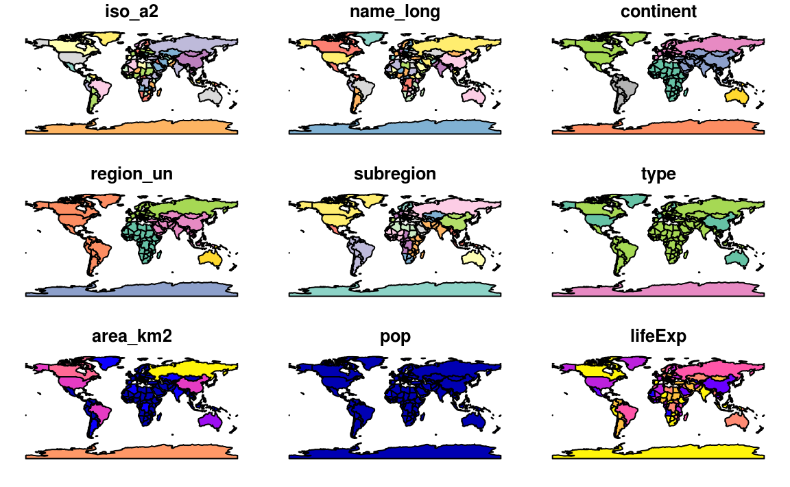
<p class="caption">(\#fig:world-all)A spatial plot of the world using the sf package, with a facet for each attribute.</p>
</div>

Note that instead of creating a single map, as most GIS programs would, the `plot()` command has created multiple maps, one for each variable in the `world` datasets.
This behavior can be useful for exploring the spatial distribution of different variables and is discussed further in \@ref(basic-map) below.

Being able to treat spatial objects as regular data frames with spatial powers has many advantages, especially if you are already used to working with data frames.
The commonly used `summary()` function, for example, provides a useful overview of the variables within the `world` object.


```r
summary(world["lifeExp"])
#>     lifeExp                geom    
#>  Min.   :48.9   MULTIPOLYGON :177  
#>  1st Qu.:64.3   epsg:4326    :  0  
#>  Median :72.8   +proj=long...:  0  
#>  Mean   :70.6                      
#>  3rd Qu.:77.1                      
#>  Max.   :83.6                      
#>  NA's   :9
```

Although we have only selected one variable for the `summary` command, it also outputs a report on the geometry.
This demonstrates the 'sticky' behavior of the geometry columns of **sf** objects, meaning the geometry is kept unless the user deliberately removes them, as we'll see in section \@ref(vector-attribute-manipulation).
The result provides a quick summary of both the non-spatial and spatial data contained in `world`: the average life expectancy is 73 years (ranging from less than 50 to more than 80 years) across all countries.

\BeginKnitrBlock{rmdnote}<div class="rmdnote">The word `MULTIPOLYGON` in the summary output above refers to the geometry type of features (countries) in the `world` object.
This representation is necessary for countries with islands such as Indonesia and Greece.
Other geometry types are described in section \@ref(sf-classes).</div>\EndKnitrBlock{rmdnote}

<!-- TODO: cross-reference section covering CRSs. -->
It is worth taking a deeper look at the basic behavior and contents of this simple feature object, which can usefully be thought of as a '**S**patial data**F**rame).

`sf` objects are easy to subset.
The code below shows its first two rows and three columns.
The output shows two major differences compared with a regular `data.frame`: the inclusion of additional geographic data (`geometry type`, `dimension`, `bbox` and CRS information - `epsg (SRID)`, `proj4string`), and the presence of final `geometry` column:


```r
world[1:2, 1:3]
#> Simple feature collection with 2 features and 3 fields
#> geometry type:  MULTIPOLYGON
#> dimension:      XY
#> bbox:           xmin: 11.6401 ymin: -17.93064 xmax: 75.15803 ymax: 38.48628
#> epsg (SRID):    4326
#> proj4string:    +proj=longlat +datum=WGS84 +no_defs
#>   iso_a2   name_long continent                           geom
#> 1     AF Afghanistan      Asia MULTIPOLYGON (((61.2 35.7, ...
#> 2     AO      Angola    Africa MULTIPOLYGON (((16.3 -5.88,...
```

All this may seem rather complex, especially for a class system that is supposed to be simple.
However, there are good reasons for organizing things this way and using **sf**.

<!-- It's a `MULTIPOLYGON` with 177 features and a geographic (longitude/latidue) coordinate reference system (CRS) with an EPSG code of `4326`. -->

### Why simple features?

Simple features is a widely supported data model that underlies data structures in many GIS applications including QGIS and PostGIS.
A major advantage of this is that using the data model ensures your work is cross-transferable to other set-ups, for example importing from and exporting to spatial databases.

A more specific question from an R perspective is "why use the **sf** package when **sp** is already tried and tested"?
There are many reasons (linked to the advantages of the simple features model) including:

- Fast reading and writing of data
- Enhanced plotting performance
- **sf** objects can be treated as data frames in most operations
- **sf** functions can be combined using `%>%` operator and works well with the [tidyverse](http://tidyverse.org/) collection of R packages
- **sf** function names are relatively consistent and intuitive (all begin with `st_`)

Due to such advantages some spatial packages (including **tmap**, **mapview** and **tidycensus**) have added support for **sf**.
However, it will take many years for most packages to transition and some will never switch.
Fortunately these can still be used in a workflow based on `sf` objects, by converting them to the `Spatial` class used in **sp**: 


```r
library(sp)
world_sp = as(world, Class = "Spatial")
# sp functions ...
```

`Spatial` objects can be converted back to `sf` in the same way or with `st_as_sf()`:


```r
world_sf = st_as_sf(world_sp, "sf")
```


### Basic map making {#basic-map}

You can quickly create basic maps in **sf** with the base `plot()` function. By default, **sf** creates a multi-panel plot (like **sp**'s `spplot()`), one sub-plot for each variable (see left-hand image in Figure \@ref(fig:sfplot)). 


```r
plot(world[3:4])
plot(world["pop"])
```

<div class="figure" style="text-align: center">
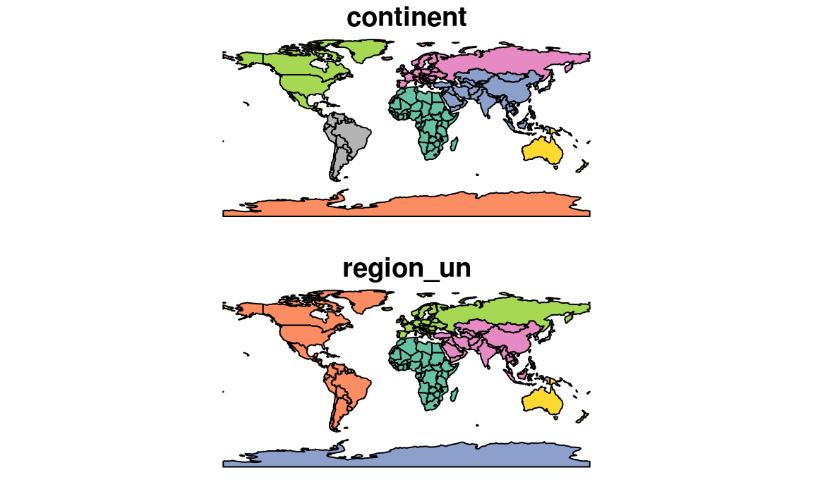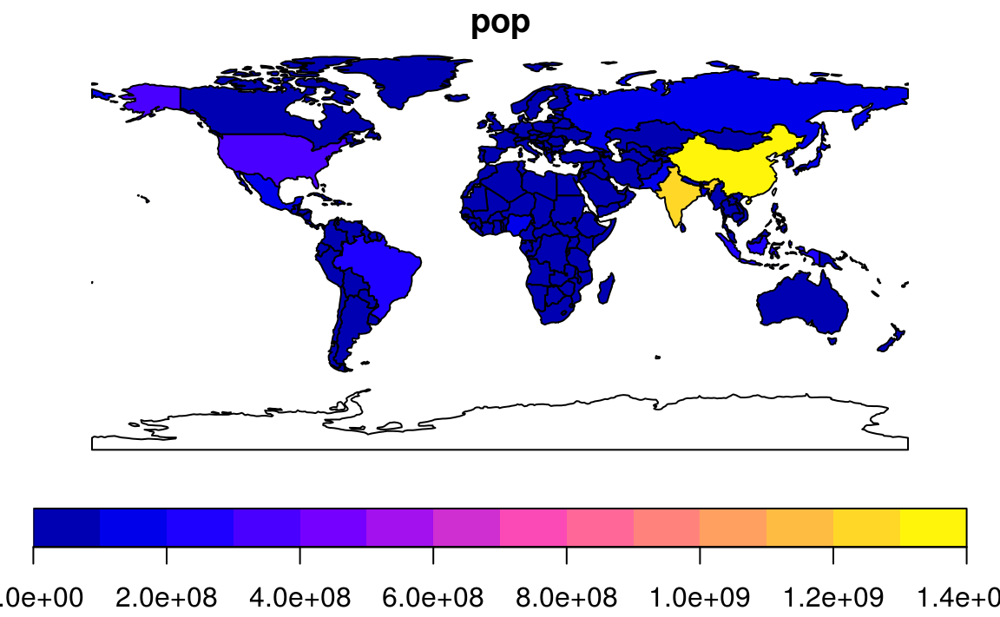
<p class="caption">(\#fig:sfplot)Plotting with sf, with multiple variables (left) and a single variable (right).</p>
</div>

As with **sp**, you can add further layers to your maps using the `add = TRUE`-argument of the `plot()` function .^[In
fact, when you `plot()` an **sf** object, R is calling `sf:::plot.sf()` behind the scenes.
`plot()` is a generic method that behaves differently depending on the class of object being plotted.]
To illustrate this, and prepare for content covered in chapters \@ref(attr) and \@ref(spatial-operations) on attribute and spatial data operations, we will subset and combine countries in the `world` object, which creates a single object representing Asia:


```r
asia = world[world$continent == "Asia", ]
asia = st_union(asia)
```

We can now plot the Asian continent over a map of the world.
Note, however, that this only works if the initial plot has only one layer:


```r
plot(world["pop"])
plot(asia, add = TRUE, col = "red")
```

<div class="figure" style="text-align: center">
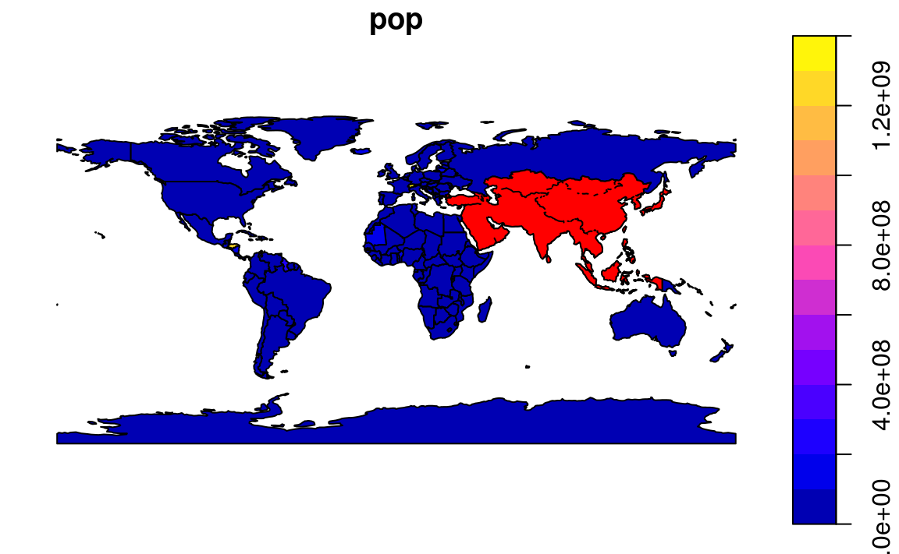
<p class="caption">(\#fig:asia)A plot of Asia added as a layer on top of countries worldwide.</p>
</div>

This can be very useful for quickly checking the geographic correspondence between two or more layers: 
the `plot()` function is fast to execute and requires few lines of code, but does not create interactive maps with a wide range of options.
For more advanced map making we recommend using a dedicated visualization package such as **tmap**, **ggplot2**, **mapview**, or **leaflet**.
<!-- TODO: cross reference advanced mapping chapter -->

<!-- 
- plot() function 
- map export 
-->

<!-- Maybe show also somewhere that `world[0]` produces only a plot of the geometry which is rather useful if you do not want to plot a specific attribute. This way, you can for example dismiss the col = "white"-argument in your Nigeria example.
Sorry for commenting on this again but just to clarify africa[0] selects zero columns but since the geometry column is sticky it won't be dismissed. Nevertheless, to be more explicit one should probably use plot(st_geometry(africa))-->


### Base plot arguments {#base-args}

**sf** simplifies spatial data objects compared with **sp** and provides a near-direct interface to GDAL and GEOS C++ functions.
In theory this should make **sf** faster than **sp**/**rgdal**/**rgeos**.
This section introduces **sf** classes in preparation for subsequent chapters which deal with vector data (in particular Chapters \@ref(spatial-operations) and \@ref(transform)).

As a final exercise, we will see one way of how to do a spatial overlay in **sf**.
First, we convert the countries of the world into centroids, and then subset those in Asia. Finally, the `summary` command tells us how many centroids (countries) are part of Asia (43) and how many are not (134).


```r
world_centroids = st_centroid(world)
sel_asia = st_intersects(world_centroids, asia, sparse = FALSE)
#> although coordinates are longitude/latitude, st_intersects assumes that they are planar
```


```r
summary(sel_asia)
#>      V1         
#>  Mode :logical  
#>  FALSE:134      
#>  TRUE :43
```

Note: `st_intersects()` uses [GEOS](https://trac.osgeo.org/geos/) in the background for the spatial overlay operation (see also Chapter \@ref(spatial-operations)).

Since **sf**'s `plot()` function builds on base plotting methods, you may also use its many optional arguments (see `?plot` and `?par`).
This provides a powerful but not necessarily intuitive interface.
To make the area of circles proportional to population, for example, the `cex` argument can be used as follows (see Figure \@ref(fig:contpop) created with the code below and the exercises in section \@ref(ex2)):


```r
plot(world["continent"])
plot(world_centroids, add = TRUE, cex = sqrt(world$pop) / 10000)
```

<div class="figure" style="text-align: center">
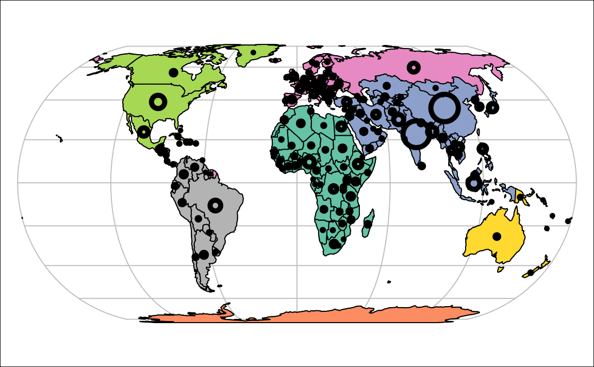
<p class="caption">(\#fig:contpop)Country continents (represented by fill color) and 2015 populations (represented by points, with point area proportional to population) worldwide.</p>
</div>

<!-- More appropriate for subsequent chapters. -->
<!-- This shows that there are 43 countries in Asia -->
<!-- We can check if they are the same countries as follows: -->

<!-- ```{r} -->
<!-- africa_centroids2 = world_centroids[sel_africa, ] -->
<!-- identical(africa_centroids, africa_centroids2) -->
<!-- ``` -->

### Simple feature classes {#sf-classes}

To understand new data formats in depth, it often helps to build them from the ground up.
This section walks you through vector spatial classes step-by-step, from the elementary simple feature geometry to simple feature objects of class `sf` representing complex spatial data.
Before describing each geometry type that the **sf** package supports, it is worth taking a step back to understand the building blocks of `sf` objects. 
As stated in section \@ref(intro-sf), simple features are simply data frames with at least one special column that makes it spatial.
These spatial columns are often called `geom` or `geometry` and can be like non-spatial columns: `world$geom` refers to the spatial element of the `world` object described above.
These geometry columns are 'list columns' of class `sfc`.
In turn, `sfc` objects are composed of one or more objects of class `sfg`: simple feature geometries.

To understand how the spatial components of simple features work, it is vital to understand simple feature geometries.
For this reason we cover each currently supported `sfg` type in the next subsections before moving on to describe how these can be combined to form `sfc` and eventually full `sf` objects.

#### Simple feature geometry types {#geometry}

<!-- This section demonstrates how the full range of geometry types supported by the **sf** package can be created, combined and plotted. -->
Geometries are the basic building blocks of simple features.
Simple features in R can take on one of the 17 geometry types supported by the **sf** package.
In this chapter we will focus on the seven most commonly used types: `POINT`, `LINESTRING`, `POLYGON`, `MULTIPOINT`, `MULTILINESTRING`, `MULTIPOLYGON` and `GEOMETRYCOLLECTION`.<!--FIG-->
Find the whole list of possible feature types in [the PostGIS manual ](http://postgis.net/docs/using_postgis_dbmanagement.html).

Generally, well-known binary (WKB) or well-known text (WKT) are the standard encoding for simple feature geometries.
WKB representations are usually hexadecimal strings easily readable for computers.
This is why GIS and spatial databases use WKB to transfer and store geometry objects.
WKT, on the other hand, is a human-readable text markup description of simple features. 
Both formats are exchangeable, and if we present one, we will naturally choose the WKT representation.

The basis for each geometry type is the point. 
A point is simply a coordinate in 2D, 3D or 4D space (see `vignette("sf1")` for more information) such as:

- `POINT (5 2)`

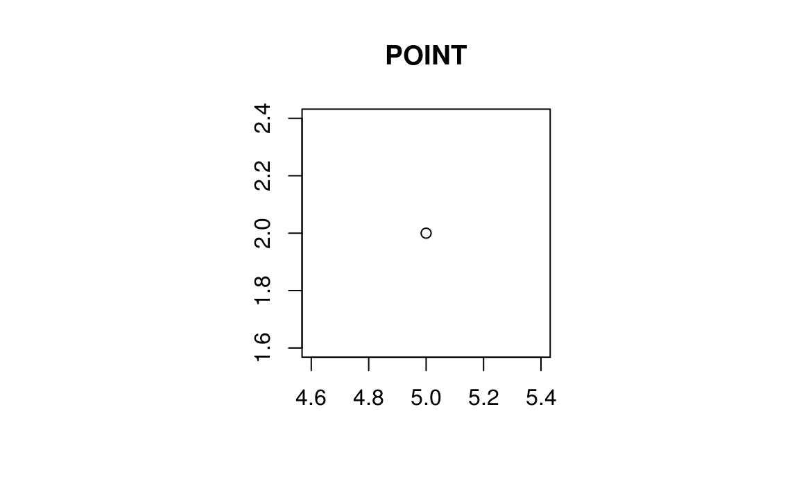

A linestring is a sequence of points with a straight line connecting the points, for example:

- `LINESTRING (1 5, 4 4, 4 1, 2 2, 3 2)`

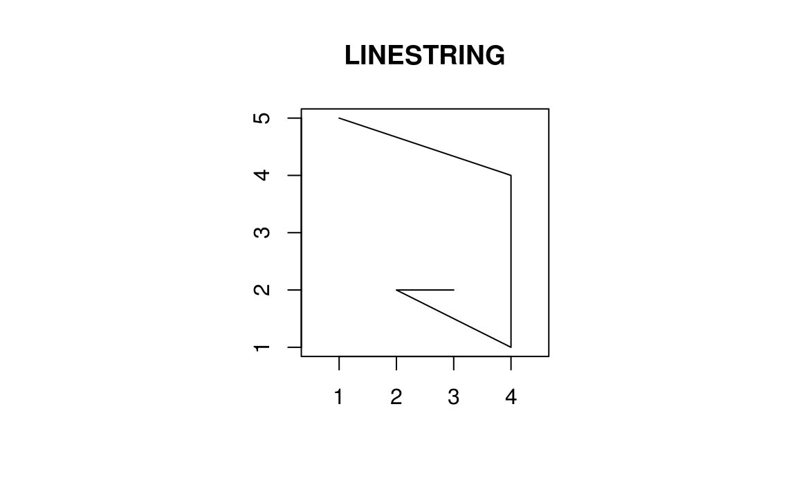

A polygon is a sequence of points that form a closed, non-intersecting ring.
Closed means that the first and the last point of a polygon have the same coordinates. 
By definition, a polygon has one exterior boundary (outer ring) and can have zero or more interior boundaries (inner rings), also known as holes.

- Polygon without a hole - `POLYGON ((1 5, 2 2, 4 1, 4 4, 1 5))`

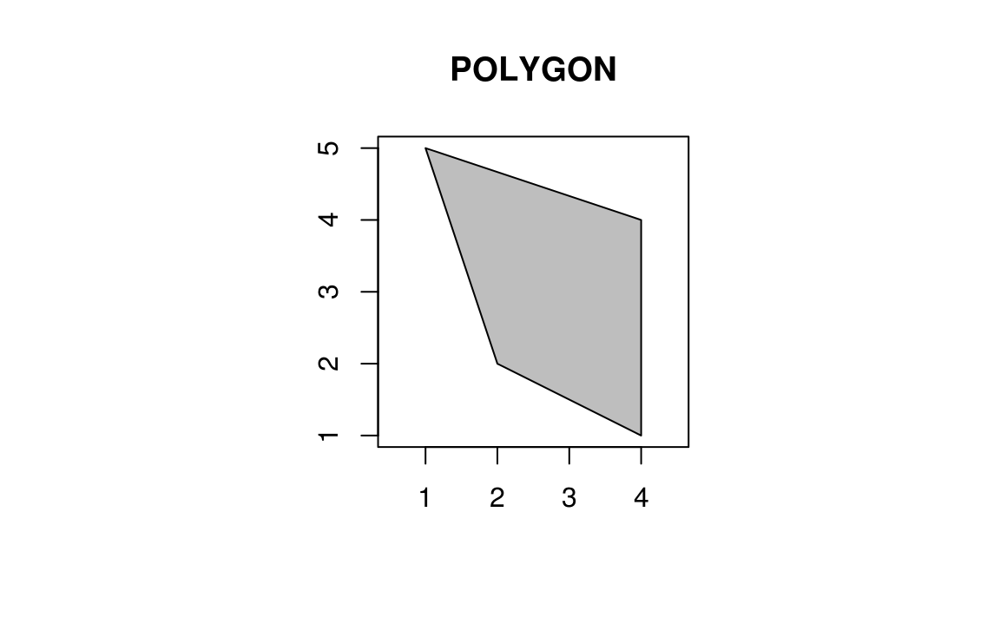

- Polygon with one hole - `POLYGON ((1 5, 2 2, 4 1, 4 4, 1 5), (2 4, 3 4, 3 3, 2 3, 2 4))`

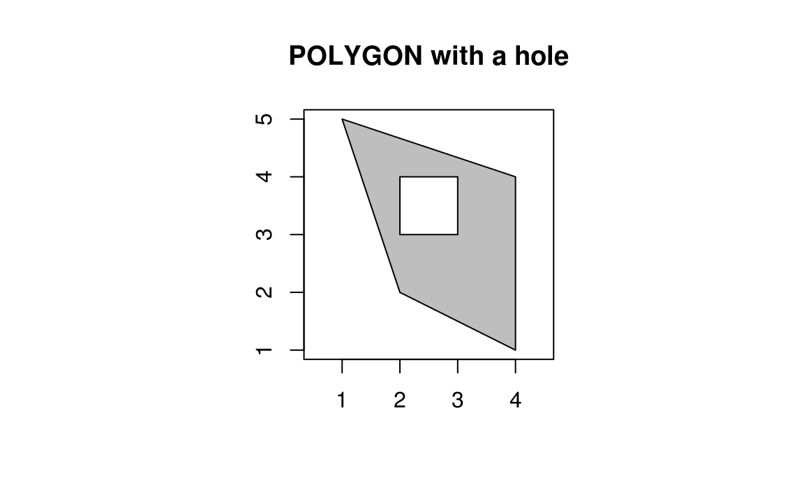

So far we have created geometries with only one geometric entity per feature.
However, **sf** also allows multiple geometries to exist within a single feature (hence the term 'geometry collection') using "multi" version of each geometry type:

- Multipoint - `MULTIPOINT (5 2, 1 3, 3 4, 3 2)`
- Multistring - `MULTILINESTRING ((1 5, 4 4, 4 1, 2 2, 3 2), (1 2, 2 4))`
- Multipolygon - `MULTIPOLYGON (((1 5, 2 2, 4 1, 4 4, 1 5), (0 2, 1 2, 1 3, 0 3, 0 2)))`

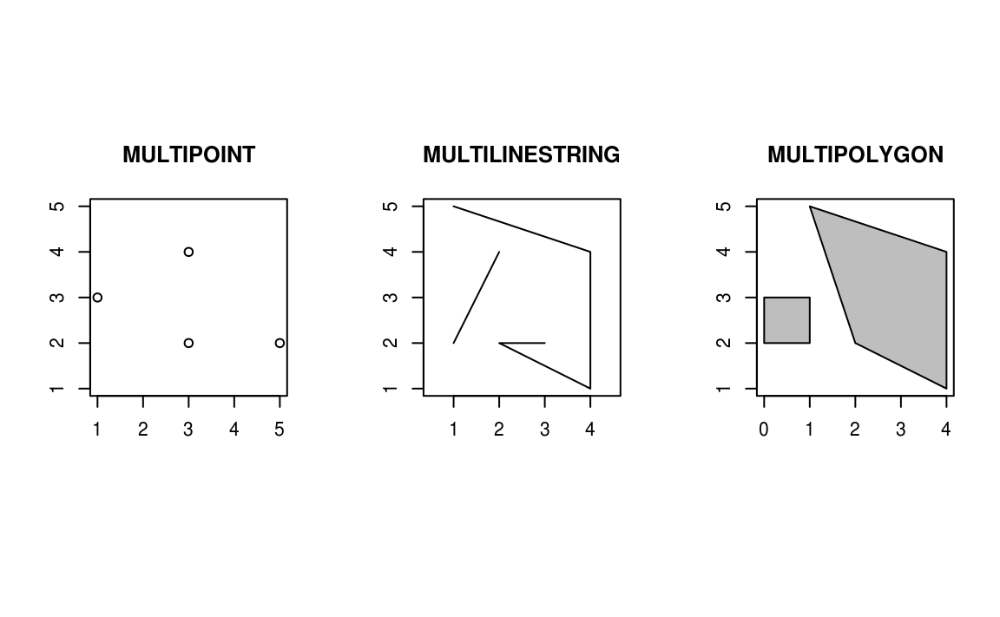

Finally, a geometry collection might contain any combination of geometry types:

- Geometry collection - `GEOMETRYCOLLECTION (MULTIPOINT (5 2, 1 3, 3 4, 3 2), LINESTRING (1 5, 4 4, 4 1, 2 2, 3 2)))`


#### Simple feature geometry (sfg) objects {#sfg}

The `sfg` class represents the different simple feature geometry types: point, linestring, polygon (and their 'multi' equivalents, such as multipoints) or geometry collection.

Usually you are spared the tedious task of creating geometries on your own since you can simply import an already existing spatial file.
However, there are a set of functions to create simple feature geometry objects (`sfg`) from scratch if needed.
The names of these functions are simple and consistent, as they all start with the `st_`  prefix and end with the name of the geometry type in lowercase letters:

- A point - `st_point()`
- A linestring - `st_linestring()`
- A polygon - `st_polygon()`
- A multipoint - `st_multipoint()`
- A multilinestring - `st_multilinestring()`
- A multipolygon - `st_multipolygon()`
- A geometry collection - `st_geometrycollection()`

`sfg` objects can be created from three native data types:

1. A numeric vector - a single point
2. A matrix - a set of points, where each row contains a point - a multipoint or linestring
3. A list - any other set, e.g. a multilinestring or geometry collection

To create point objects, we use the `st_point()` function in conjunction with a numeric vector:


```r
# note that we use a numeric vector for points
st_point(c(5, 2)) # XY point
#> POINT (5 2)
st_point(c(5, 2, 3)) # XYZ point
#> POINT Z (5 2 3)
st_point(c(5, 2, 1), dim = "XYM") # XYM point
#> POINT M (5 2 1)
st_point(c(5, 2, 3, 1)) # XYZM point
#> POINT ZM (5 2 3 1)
```

<!-- is this really important? -->
XY, XYZ and XYZM types of points are automatically created based on the length of a numeric vector. 
Only the XYM type needs to be specified using a `dim` argument.

By contrast, use matrices in the case of multipoint (`st_multipoint()`) and linestring (`st_linestring()`) objects:


```r
# the rbind function simplifies the creation of matrices
## MULTIPOINT
multipoint_matrix = rbind(c(5, 2), c(1, 3), c(3, 4), c(3, 2))
st_multipoint(multipoint_matrix)
#> MULTIPOINT (5 2, 1 3, 3 4, 3 2)

## LINESTRING
linestring_matrix = rbind(c(1, 5), c(4, 4), c(4, 1), c(2, 2), c(3, 2))
st_linestring(linestring_matrix)
#> LINESTRING (1 5, 4 4, 4 1, 2 2, 3 2)
```

Finally, use lists for the creation of multilinestrings, (multi-)polygons and geometry collections:


```r
## POLYGON
polygon_list = list(rbind(c(1, 5), c(2, 2), c(4, 1), c(4, 4), c(1, 5)))
st_polygon(polygon_list)
#> POLYGON ((1 5, 2 2, 4 1, 4 4, 1 5))
```


```r
## POLYGON with a hole
polygon_border = rbind(c(1, 5), c(2, 2), c(4, 1), c(4, 4), c(1, 5))
polygon_hole = rbind(c(2, 4), c(3, 4), c(3, 3), c(2, 3), c(2, 4))
polygon_with_hole_list = list(polygon_border, polygon_hole)
st_polygon(polygon_with_hole_list)
#> POLYGON ((1 5, 2 2, 4 1, 4 4, 1 5), (2 4, 3 4, 3 3, 2 3, 2 4))
```


```r
## MULTILINESTRING
multilinestring_list = list(rbind(c(1, 5), c(4, 4), c(4, 1), c(2, 2), c(3, 2)), 
                            rbind(c(1, 2), c(2, 4)))
st_multilinestring((multilinestring_list))
#> MULTILINESTRING ((1 5, 4 4, 4 1, 2 2, 3 2), (1 2, 2 4))
```


```r
## MULTIPOLYGON
multipolygon_list = list(list(rbind(c(1, 5), c(2, 2), c(4, 1), c(4, 4), c(1, 5))),
                         list(rbind(c(0, 2), c(1, 2), c(1, 3), c(0, 3), c(0, 2))))
st_multipolygon(multipolygon_list)
#> MULTIPOLYGON (((1 5, 2 2, 4 1, 4 4, 1 5)), ((0 2, 1 2, 1 3, 0 3, 0 2)))
```


```r
## GEOMETRYCOLLECTION
gemetrycollection_list = list(st_multipoint(multipoint_matrix),
                              st_linestring(linestring_matrix))
st_geometrycollection(gemetrycollection_list)
#> GEOMETRYCOLLECTION (MULTIPOINT (5 2, 1 3, 3 4, 3 2), LINESTRING (1 5, 4 4, 4 1, 2 2, 3 2))
```

<!-- table -->
<!-- figure - image/fig1.jpg -->
<!-- they are interconnected - points could create mulitpoints or lines; -->
<!-- lines could create mutlilines or polygons, etc. -->
<!-- https://r-spatial.github.io/sf/articles/sf1.html -->

#### Simple feature geometry column {#sfc}

One `sfg` object contains only a single simple feature geometry. 
A simple feature geometry column (`sfc`) is a list of `sfg` objects, which is additionally able to contain information about the coordinate reference system in use.
For instance, to combine two simple features into one object with two features, we can use the `st_sfc()` function. 
This is important since `sfg` represents the geometry column in **sf** data frames:


```r
# sfc POINT
point1 = st_point(c(5, 2))
point2 = st_point(c(1, 3))
st_sfc(point1, point2)
#> Geometry set for 2 features 
#> geometry type:  POINT
#> dimension:      XY
#> bbox:           xmin: 1 ymin: 2 xmax: 5 ymax: 3
#> epsg (SRID):    NA
#> proj4string:    NA
#> POINT (5 2)
#> POINT (1 3)
```

In most cases, an `sfc` object contains objects of the same geometry type.
Therefore, when we convert `sfg` objects of type polygon into a simple feature geometry column, we would also end up with an `sfc` object of type polygon. 
Equally, a geometry column of multilinestrings would result in an `sfc` object of type multilinestring:


```r
# sfc POLYGON
polygon_list1 = list(rbind(c(1, 5), c(2, 2), c(4, 1), c(4, 4), c(1, 5)))
polygon1 = st_polygon(polygon_list)
polygon_list2 = list(rbind(c(0, 2), c(1, 2), c(1, 3), c(0, 3), c(0, 2)))
polygon2 = st_polygon(polygon_list2)
st_sfc(polygon1, polygon2)
#> Geometry set for 2 features 
#> geometry type:  POLYGON
#> dimension:      XY
#> bbox:           xmin: 0 ymin: 1 xmax: 4 ymax: 5
#> epsg (SRID):    NA
#> proj4string:    NA
#> POLYGON ((1 5, 2 2, 4 1, 4 4, 1 5))
#> POLYGON ((0 2, 1 2, 1 3, 0 3, 0 2))
```


```r
# sfc MULTILINESTRING
multilinestring_list1 = list(rbind(c(1, 5), c(4, 4), c(4, 1), c(2, 2), c(3, 2)), 
                            rbind(c(1, 2), c(2, 4)))
multilinestring1 = st_multilinestring((multilinestring_list1))
multilinestring_list2 = list(rbind(c(2, 9), c(7, 9), c(5, 6), c(4, 7), c(2, 7)), 
                            rbind(c(1, 7), c(3, 8)))
multilinestring2 = st_multilinestring((multilinestring_list2))
st_sfc(multilinestring1, multilinestring2)
#> Geometry set for 2 features 
#> geometry type:  MULTILINESTRING
#> dimension:      XY
#> bbox:           xmin: 1 ymin: 1 xmax: 7 ymax: 9
#> epsg (SRID):    NA
#> proj4string:    NA
#> MULTILINESTRING ((1 5, 4 4, 4 1, 2 2, 3 2), (1 ...
#> MULTILINESTRING ((2 9, 7 9, 5 6, 4 7, 2 7), (1 ...
```

It is also possible to create an `sfc` object from `sfg` objects with different geometry types:


```r
# sfc GEOMETRY
st_sfc(point1, multilinestring1)
#> Geometry set for 2 features 
#> geometry type:  GEOMETRY
#> dimension:      XY
#> bbox:           xmin: 1 ymin: 1 xmax: 5 ymax: 5
#> epsg (SRID):    NA
#> proj4string:    NA
#> POINT (5 2)
#> MULTILINESTRING ((1 5, 4 4, 4 1, 2 2, 3 2), (1 ...
```

<!-- if you want to use it - st_cast() to a proper geometry type -->
<!-- or st_is to select only one geometry type -->
<!-- http://r-spatial.org/r/2017/01/12/newssf.html -->
<!-- methods(class = "sfc") -->

As mentioned before, `sfc` objects can additionally store information on the coordinate reference systems (CRS).
<!-- What's CRS -->
To specify a certain CRS, we can use the `epsg (SRID)` or `proj4string` attributes of an `sfc` object.
The default value of `epsg (SRID)` and `proj4string` is `NA` (*Not Available*):


```r
st_sfc(point1, point2)
#> Geometry set for 2 features 
#> geometry type:  POINT
#> dimension:      XY
#> bbox:           xmin: 1 ymin: 2 xmax: 5 ymax: 3
#> epsg (SRID):    NA
#> proj4string:    NA
#> POINT (5 2)
#> POINT (1 3)
```

All geometries in an `sfc` object must have the same CRS. 

We can add coordinate reference system as a `crs` argument of `st_sfc()`. 
This argument accepts either an integer with the `epsg` code (for example, `4326`)  or a `proj4string` character string (for example, `"+proj=longlat +datum=WGS84 +no_defs"`) (see section \@ref(crs-intro)). 


```r
# EPSG definition
st_sfc(point1, point2, crs = 4326)
#> Geometry set for 2 features 
#> geometry type:  POINT
#> dimension:      XY
#> bbox:           xmin: 1 ymin: 2 xmax: 5 ymax: 3
#> epsg (SRID):    4326
#> proj4string:    +proj=longlat +datum=WGS84 +no_defs
#> POINT (5 2)
#> POINT (1 3)
```


```r
# PROJ4STRING definition
st_sfc(point1, point2, crs = "+proj=longlat +datum=WGS84 +no_defs")
#> Geometry set for 2 features 
#> geometry type:  POINT
#> dimension:      XY
#> bbox:           xmin: 1 ymin: 2 xmax: 5 ymax: 3
#> epsg (SRID):    4326
#> proj4string:    +proj=longlat +datum=WGS84 +no_defs
#> POINT (5 2)
#> POINT (1 3)
```

For example, we can set the UTM Zone 11N projection with `epsg` code `2955`:


```r
st_sfc(point1, point2, crs = 2955)
#> Geometry set for 2 features 
#> geometry type:  POINT
#> dimension:      XY
#> bbox:           xmin: 1 ymin: 2 xmax: 5 ymax: 3
#> epsg (SRID):    2955
#> proj4string:    +proj=utm +zone=11 +ellps=GRS80 +towgs84=0,0,0,0,0,0,0 +units=m +no_defs
#> POINT (5 2)
#> POINT (1 3)
```

As you can see above, the `proj4string` definition was automatically added.
Now we can try to set the CRS using `proj4string`:


```r
st_sfc(point1, point2, crs = "+proj=utm +zone=11 +ellps=GRS80 +towgs84=0,0,0,0,0,0,0 +units=m +no_defs")
#> Geometry set for 2 features 
#> geometry type:  POINT
#> dimension:      XY
#> bbox:           xmin: 1 ymin: 2 xmax: 5 ymax: 3
#> epsg (SRID):    NA
#> proj4string:    +proj=utm +zone=11 +ellps=GRS80 +towgs84=0,0,0,0,0,0,0 +units=m +no_defs
#> POINT (5 2)
#> POINT (1 3)
```

However, the `epsg` string of our result remained empty. 
This is because there is no general method to convert from `proj4string` to `epsg`.

<!-- precision -->
<!-- plots can be made -->

#### Simple feature objects {#sf}

So far, we have only dealt with the pure geometries.
Most of the time, however, these geometries come with a set of attributes describing them. 
These attributes could represent the name of the geometry, measured values, groups to which the geometry belongs, and many more.
For example, we measured a temperature of 25°C on Trafalgar Square in London on June 21^st^ 2017. 
Hence, we have a specific point in space (the coordinates), the name of the location (Trafalgar Square), a temperature value and the date of the measurement.
Other attributes might include a urbanity category (city or village), or a remark if the measurement was made using an automatic station.

The simple feature class, `sf`, is a combination of an attribute table (`data.frame`) and a simple feature geometry column (`sfc`).
Simple features are created using the `st_sf()` function:


```r
# sfg objects
london_point = st_point(c(0.1, 51.5))
ruan_point = st_point(c(-9, 53))

# sfc object
our_geometry = st_sfc(london_point, ruan_point, crs = 4326)

# data.frame object
our_attributes = data.frame(name = c("London", "Ruan"),
                            temperature = c(25, 13),
                            date = c(as.Date("2017-06-21"), as.Date("2017-06-22")),
                            category = c("city", "village"),
                            automatic = c(FALSE, TRUE))

# sf object
sf_points = st_sf(our_attributes, geometry = our_geometry)
```

The above example illustrates the components of `sf` objects. 
Firstly, coordinates define the geometry of the simple feature geometry (`sfg`).
Secondly, we can combine the geometries in a simple feature geometry column (`sfc`) which also stores the CRS.
Subsequently, we store the attribute information on the geometries in a `data.frame`.
Finally, the `st_sf()` function combines the attribute table and the `sfc` object in an `sf` object.


```r
sf_points
#> Simple feature collection with 2 features and 5 fields
#> geometry type:  POINT
#> dimension:      XY
#> bbox:           xmin: -9 ymin: 51.5 xmax: 0.1 ymax: 53
#> epsg (SRID):    4326
#> proj4string:    +proj=longlat +datum=WGS84 +no_defs
#>     name temperature       date category automatic         geometry
#> 1 London          25 2017-06-21     city     FALSE POINT (0.1 51.5)
#> 2   Ruan          13 2017-06-22  village      TRUE    POINT (-9 53)
```


```r
class(sf_points)
#> [1] "sf"         "data.frame"
```

The result shows that `sf` objects actually have two classes, `sf` and `data.frame`.
Simple features are simply data frames (square tables), but with spatial attributes (usually stored in a special `geom` list-column in the data frame).
This duality is central to the concept of simple features:
most of the time a `sf` can be treated as and behaves like a `data.frame`.
Simple features are, in essence, data frames with a spatial extension.

<!-- https://r-spatial.github.io/sf/articles/sf1.html#how-attributes-relate-to-geometries -->

## Raster data

The geographic raster data model consists of a raster header^[Depending on the file format the header is part of the actual image data file, e.g., GeoTiff, or stored in an extra header or world file, e.g., ASCII grid formats] and a matrix (with rows and columns) representing equally spaced cells (often also called pixels; Figure \@ref(fig:raster-intro-plot):A).
The raster header defines the coordinate reference system, the extent and the origin.
The origin (or starting point) is frequently the coordinate of the lower-left corner of the matrix (the **raster** package, however, uses the upper left corner, by default (Figure  \@ref(fig:raster-intro-plot):B)).
The header defines the extent via the number of columns, the number of rows and the cell size resolution.
Hence, starting from the origin, we can easily access and modify each single cell by either using the ID of a cell  (Figure  \@ref(fig:raster-intro-plot):B) or by explicitly specifying the rows and columns.
This matrix representation avoids storing explicitly the coordinates for the four corner points (in fact it only stores one coordinate, namely the origin) of each cell corner as would be the case for rectangular vector polygons.
This and map algebra makes raster processing much more efficient and faster than vector data processing.
However, in contrast to vector data, a raster cell can only hold a single value.
The value might be numeric or categorical (Figure  \@ref(fig:raster-intro-plot):C).

<div class="figure" style="text-align: center">

<p class="caption">(\#fig:raster-intro-plot)Raster data: A - cell IDs; B - cell values; C - a colored raster map.</p>
</div>

Raster maps usually represent continuous phenomena such as elevation, temperature, population density or spectral data (Figure \@ref(fig:raster-intro-plot2)).
Of course, we can represent discrete features such as soil or land-cover classes also with the help of a raster data model (Figure \@ref(fig:raster-intro-plot2)).
Consequently, the discrete borders of these features become blurred, and depending on the spatial task a vector representation might be more suitable.

<div class="figure" style="text-align: center">

<p class="caption">(\#fig:raster-intro-plot2)Examples of continuous (left) and categorical (right) raster.</p>
</div>

### An introduction to raster

The **raster** package supports raster objects in R. 
It provides an extensive set of functions to create, read, export, manipulate and process raster datasets.
Aside from general raster data manipulation, **raster** provides many low level functions that can form the basis to develop more advanced raster functionality.
**raster** also lets you work on large raster datasets that are too large to fit into the main memory. 
In this case, **raster** provides the possibility to divide the raster into smaller chunks (rows or blocks), and processes these iteratively instead of loading the whole raster file into RAM (for more information, please refer to `vignette("functions", package = "raster")`.

For the illustration of **raster** concepts, we will use datasets from the **spDataLarge** (note these packages were loaded at the beginning of the chapter).
It consists of a few raster and one vector datasets covering an area of the Zion National Park (Utah, USA).
For example, `srtm.tif` is a digital elevation model of this area (for more details - see its documentation `?srtm`)
First of all, we would like to create a `RasterLayer` object named `new_raster`:


```r
raster_filepath = system.file("raster/srtm.tif", package = "spDataLarge")
new_raster = raster(raster_filepath)
```

Typing the name of the raster into the console, will print out the raster header (extent, dimensions, resolution, CRS) and some additional information (class, data source name, summary of the raster values): 


```r
new_raster
#> class       : RasterLayer 
#> dimensions  : 457, 465, 212505  (nrow, ncol, ncell)
#> resolution  : 0.000833, 0.000833  (x, y)
#> extent      : -113, -113, 37.1, 37.5  (xmin, xmax, ymin, ymax)
#> coord. ref. : +proj=longlat +datum=WGS84 +no_defs +ellps=WGS84 +towgs84=0,0,0 
#> data source : /home/travis/R/Library/spDataLarge/raster/srtm.tif 
#> names       : srtm 
#> values      : 1024, 2892  (min, max)
```

To access individual header information, you can use following commands:


```r
# dimensions (number of rows, number of columns, number of cells)
dim(new_raster)
#> [1] 457 465   1
```


```r
# spatial resolution
res(new_raster)
#> [1] 0.000833 0.000833
```


```r
# spatial extent
extent(new_raster)
#> class       : Extent 
#> xmin        : -113 
#> xmax        : -113 
#> ymin        : 37.1 
#> ymax        : 37.5
```


```r
# coordinate reference system
crs(new_raster)
#> CRS arguments:
#>  +proj=longlat +datum=WGS84 +no_defs +ellps=WGS84 +towgs84=0,0,0
```

<!--CRSargs(CRS("+init=epsg:4326"))-->
Note that in contrast to the **sf** package, **raster** only accepts the `proj4string` representation of the coordinate reference system.

<!--
You can also summarize and plot raster cell values in a non-spatial fashion using base R functions such as `summary()` and `hist()`.


```r
# numerical summary of the data
summary(new_raster)
#> Warning in .local(object, ...): summary is an estimate based on a sample of 1e+05 cells (47.06% of all cells)
#>         srtm
#> Min.    1024
#> 1st Qu. 1535
#> Median  1836
#> 3rd Qu. 2111
#> Max.    2892
#> NA's       0
```


```r
# histogram of the values
hist(new_raster)
#> Warning in .hist1(x, maxpixels = maxpixels, main = main, plot = plot, ...):
#> 47% of the raster cells were used. 100000 values used.
```

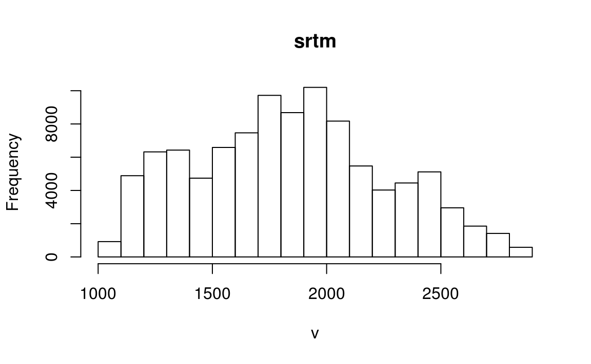

`getValues()` extracts the values of a raster as a numerical vector.
To only select specific rows, use the `row` parameter.


```r
new_raster_values = getValues(new_raster)
head(new_raster_values)
#> [1] 1728 1718 1715 1710 1703 1701
```

The new vector, `new_raster_values`, can serve as input for subsequent statistical operations.
-->

Sometimes it is important to know if all values of a raster are currently in memory or on disk.
Find out with the `inMemory()` function:


```r
inMemory(new_raster)
#> [1] FALSE
```

`help(package = "raster", topic = "raster-package")` returns a full list of all available **raster** functions.

### Basic map making

Similar to the **sf** package, **raster** also provides `plot()` methods for its own classes.


```r
plot(new_raster)
```


<!-- Moreover, it is possible to plot a raster and overlay it with vector data. -->
<!-- For this purpose, we need to read-in a vector dataset: -->

<!-- ```{r, message=FALSE, results='hide'} -->
<!-- vector_filepath = system.file("vector/zion.gpkg", package="spDataLarge") -->
<!-- new_vector = st_read(vector_filepath) -->
<!-- ``` -->

<!-- Our new object, `new_vector`, is a polygon representing the borders of Zion National Park (`?zion`). -->
<!-- We can add the borders to the elevation map using the `add` argument of the `plot()`: -->

<!-- ```{r basic-new-raster-vector-plot} -->
<!-- plot(new_raster) -->
<!-- plot(new_vector$geom, add = TRUE) -->
<!-- ``` -->

There are several different approaches to plot raster data in R:

- You can use `spplot()` to visualize several (such as spatiotemporal) layers at once. You can also do so  with the **rasterVis** package which provides more advanced methods for plotting raster objects.
- Packages such as **tmap**, **mapview** and **leaflet** facilitate especially interactive mapping of both raster and vector objects. 
<!-- TODO: cross reference advanced mapping chapter -->

### Raster classes {#raster-classes}

The `RasterLayer` class represents the simplest form of a raster object, and consists of only one layer.
The easiest way to create a raster object in R is to read-in a raster file from disk or from a server.


```r
raster_filepath = system.file("raster/srtm.tif", package = "spDataLarge")
new_raster = raster(raster_filepath)
```

The **raster** package supports numerous drivers with the help of **rgdal**.
To find out which drivers are available on your system, run `raster::writeFormats()` and `rgdal::gdalDrivers()`.

Aside from reading in a raster, you can also create one from scratch.
Running `raster()` creates an empty `RasterLayer`.
Here, however, we will create manually a very simple raster.
This should make it easy to understand how raster and related operations work.
Our raster should consist of just three rows and columns centered around the null meridian and the equator (see `xmn`, `xmx`, `ymn` and `ymx` parameters).
Additionally, we define a resolution of 0.5, which here corresponds to 0.5 degrees since the default proj4string of a raster object is WGS84.
Finally, we set the values with the `vals` argument.
Here, we just number the cells, that means we assign 1 to cell 1, 2 to cell 2, and finally 36 to cell 36.
We know that there are 36 cells by multiplying six (rows) by six (columns).
As we have seen above, setting raster values in R corresponds to a row-wise cell filling starting at the upper left corner.
Consequently, the upper first row contains the values 1 to 6, the second row 7 to 12, and the last row 31 to 36.


```r
# creation of the RasterLayer object with a given number of columns and rows, and extent
new_raster2 = raster(nrow = 6, ncol = 6, res = 0.5, 
                     xmn = -1.5, xmx = 1.5, ymn = -1.5, ymx = 1.5,
                     vals = 1:36)
```

For still further ways of creating a raster object have a look at the help file - `?raster`.
<!--
There are several ways to add new values to the `Raster*` objects.
Values for the whole object could be add with `setValues()`:


```r
# adding random values to the raster object
new_random_values = sample(seq_len(ncell(new_raster4)))
setValues(new_raster4, new_random_values)
```


It is also possible to replace cell values by specifying cell numbers, or row and column numbers:


```r
# change the value of 15th cell to 826
new_raster4[15] = 826
# change the value of the cell in the second row and forth column to 826
new_raster4[2, 4] = 826 
```
-->

Aside from `RasterLayer`, there are two additional classes: `RasterBrick` and `RasterStack`.
Both can handle multiple layers, but differ regarding the number of supported file formats, type of internal representation and processing speed.

A `RasterBrick` consists of multiple layers, which typically correspond to a single multispectral satellite file or a single multilayer object in memory. 
The `brick()` function creates a `RasterBrick` object.
Usually, you provide it with a filename to a multilayer raster file but might also use another raster object and other spatial objects (see its help page for all supported formats).


```r
multilayer_raster_filepath = system.file("raster/landsat.tif", package="spDataLarge")
r_brick = brick(multilayer_raster_filepath)
r_brick
#> class       : RasterBrick 
#> dimensions  : 1428, 1128, 1610784, 4  (nrow, ncol, ncell, nlayers)
#> resolution  : 30, 30  (x, y)
#> extent      : 301905, 335745, 4111245, 4154085  (xmin, xmax, ymin, ymax)
#> coord. ref. : +proj=utm +zone=12 +datum=WGS84 +units=m +no_defs +ellps=WGS84 +towgs84=0,0,0 
#> data source : /home/travis/R/Library/spDataLarge/raster/landsat.tif 
#> names       : landsat.1, landsat.2, landsat.3, landsat.4 
#> min values  :      7550,      6404,      5678,      5252 
#> max values  :     19071,     22051,     25780,     31961
```

The `nlayers` function retrieves the number of layers stored in a `Raster*` object:


```r
nlayers(r_brick)
#> [1] 4
```

A `RasterStack` is similar to a `RasterBrick` in the sense that it consists also of multiple layers.
However, in contrast to `RasterBrick`, `RasterStack` allows you to connect several raster objects stored in different files or multiply objects in memory.
More specifically, a `RasterStack` is a list of `RasterLayer` objects with the same extent and resolution. 
Hence, one way to create it is with the help of spatial objects already existing in R's global environment. 
And again, one can simply specify a path to a file stored on disk.
<!-- The possibility to create a `RasterStack` from a file stored on disk and an object residing in R's global environment is one of the main differences compared to a `RasterBrick`. -->


```r
raster_on_disk = raster(r_brick, layer = 1)
raster_in_memory = raster(xmn = 301905, xmx = 335745, ymn = 4111245, ymx = 4154085, res = 30)
values(raster_in_memory) = sample(1:ncell(raster_in_memory))
crs(raster_in_memory) = crs(raster_on_disk)
```


```r
r_stack <- stack(raster_in_memory, raster_on_disk)
r_stack
#> class       : RasterStack 
#> dimensions  : 1428, 1128, 1610784, 2  (nrow, ncol, ncell, nlayers)
#> resolution  : 30, 30  (x, y)
#> extent      : 301905, 335745, 4111245, 4154085  (xmin, xmax, ymin, ymax)
#> coord. ref. : +proj=utm +zone=12 +datum=WGS84 +units=m +no_defs +ellps=WGS84 +towgs84=0,0,0 
#> names       :   layer, landsat.1 
#> min values  :       1,      7550 
#> max values  : 1610784,     19071
```

Another difference is that the processing time for `RasterBrick` objects is usually shorter than for `RasterStack` objects.

Decision on which `Raster*` class should be used depends mostly on a character of input data. 
Processing of a single mulitilayer file or object is the most effective with `RasterBrick`, while `RasterStack` allows calculations based on many files, many `Raster*` objects, or both.

\BeginKnitrBlock{rmdnote}<div class="rmdnote">Operations on `RasterBrick` and `RasterStack` objects will typically return a `RasterBrick`.</div>\EndKnitrBlock{rmdnote}

## Coordinate Reference Systems {#crs-intro}

Vector and raster spatial data types share concepts intrinsic to spatial data.
Perhaps the most fundamental of these is the Coordinate Reference System (CRS), which defines how the spatial elements of the data relate to the surface of the Earth (or other bodies).
<!-- Coordinates are meaningless without a CRS, as we don't know theirs units (meters, feets, degrees) or what's the origin -->
<!-- (-12579102, 4439107) = (-113, 37) -->
CRSs are either geographic or projected, as introduced at the beginning of this chapter (see Figure \@ref(fig:vectorplots)).
This section will will explain each type, laying the foundations for section \@ref(reproj-geo-data) on CRS transformations.

### Geographic coordinate systems

Geographic coordinate systems identify any location on the Earth's surface using two values --- longitude and latitude. 
*Longitude* is location in the East-West direction in angular distance from the Prime Meridian plane.
*Latitude* is angular distance North or South of the equatorial plane.
Distance in geographic CRSs are therefore not measured in meters.
This has important consequences, as demonstrated in section \@ref(reproj-geo-data).

The surface of the Earth in geographic coordinate systems is represented by a spherical or ellipsoidal surface.
Spherical models assume that the Earth is a perfect sphere of a given radius.
Spherical models have the advantage of simplicity but are rarely used because they are inaccurate: the Earth is not a sphere!
Ellipsoidal models are defined by two parameters: the equatorial radius and the polar radius.
These are suitable because the Earth is compressed: the equatorial radius is around 11.5 km longer than the polar radius [@maling_coordinate_1992].^[
The degree of compression is often referred to as [*flattening*](https://en.wikipedia.org/wiki/Flattening), defined in terms of the equitorial radius ($a$) and polar radius ($b$) as follows: $f = (a - b) / a$. The terms *ellipticity* and *compression* can also be used [@maling_coordinate_1992].
Because $f$ is a rather small value, digital ellipsoid models use the 'inverse flattening' ($rf = 1/f$) to define the Earth's compression.
Values of $a$ and $rf$ used in a variety of ellipsoidal models can be seen be executing `st_proj_info(type = "ellps")`.
]

Ellipsoids are part of a wider component of CRSs: the *datum*.
This contains information on what ellipsoid to use (with the `ellps` parameter in the proj4 CRS library) and the precise relationship between the Cartesian coordinates and location on the Earth's service.
These additional details are stored in the `towgs84` argument of  [proj4](http://proj4.org/parameters.html#towgs84-datum-transformation-to-wgs84) notation (see [proj4.org/parameters.html](http://proj4.org/parameters.html) for details).
These allow local variations in Earth's surface, e.g. due to large mountain ranges, to be accounted for in a local CRS.
There are two types of datum --- local and geocentric.
In a *local datum* such as `NAD83` the ellipsoidal surface is shifted to align with the surface at a particular location.
In a *geocentric datum*  such as `WGS84` the center is the Earth's center of gravity and the accuracy of projections is not optimized for a specific location.
Available datum definitions can be seen by executing `st_proj_info(type = "datum")`.
<!-- plots? -->
<!-- plus maybe table (few examples) -->

### Projected coordinate systems 

Projected CRSs are based on Cartesian coordinates on an implicitly flat surface.
They have an origin, x and y axes, and a linear unit of measurement such as meters.
All projected CRSs are based on a geographic CRS, described in the previous section, and rely on map projections to convert the three-dimensional surface of the Earth into Easting and Northing (x and y) values in a projected CRS.

This transition cannot be done without adding some distortion.
Therefore, some properties of the Earth's surface are distorted in this process, such as area, direction, distance, and shape.
A projected coordinate system can preserve only one or two of those properties.
Projections are often named based on a property they preserve: equal-area preserves area, azimuthal preserve direction, equidistant preserve distance, and conformal preserve local shape.

There are three main groups of projection types - conic, cylindrical, and planar.
In a conic projection, the Earth's surface is projected onto a cone along a single line of tangency or two lines of tangency. 
Distortions are minimized along the tangency lines and rise with the distance from those lines in this projection.
Therefore, it is the best suited for maps of mid-latitude areas.
A cylindrical projection maps the surface onto a cylinder.
This projection could also be created by touching the Earth's surface along a single line of tangency or two lines of tangency. 
Cylindrical projections are used most often when mapping the entire world.
A planar projection projects data onto a flat surface touching the globe at a point or along a line of tangency. 
It is typically used in mapping polar regions.
<!-- other projections? -->
<!-- https://en.wikipedia.org/wiki/List_of_map_projections -->
<!-- plus maybe table (few examples) -->
<!-- add good reference to projections -->
`st_proj_info(type = "proj")` gives a list of the available projections supported by the PROJ.4 library.

<!-- maybe a new section - how to pick the best projection? -->
<!-- https://source.opennews.org/articles/choosing-right-map-projection/ -->

### CRSs in R {#crs-in-r}

Two main ways to describe CRS in R are an `epsg` code or a `proj4string` definition.
Both of these approaches have advantages and disadvantages. 
An `epsg` code is usually shorter, and therefore easier to remember. 
The code also refers to only one, well-defined coordinate reference system. 
On the other hand, a `proj4string` definition allows you more flexibility when it comes to specifying different parameters such as the projection type, the datum and the ellipsoid.^[Complete list of the `proj4string` parameters can be found at http://proj4.org/parameters.html#parameter-list.] 
This way you can specify many different projections, and modify existing ones.
This also makes the `proj4string` approach more complicated.
<!-- ^[In the background, `sf` and `raster` use the [PROJ.4](http://proj4.org/) software, which enables transformations between different projections]. -->
`epsg` points to exactly one particular CRS.

Spatial R packages support a wide range of CRSs and they use the long-established [proj4](http://proj4.org/) library.
Other than searching for EPSG codes online, another quick way to find out about available CRSs is via the `rgdal::make_EPSG()` function, which outputs a data frame of available projections.
Before going into more detail, it's worth learning how to view and filter them inside R, as this could save time trawling the internet.
The following code will show available CRSs interactively, allowing you to filter ones of interest (try filtering for the OSGB CRSs for example):


```r
crs_data = rgdal::make_EPSG()
View(crs_data)
```

In **sf** the CRS of an object can be retrieved using `st_crs()`.
For this, we need to read-in a vector dataset:


```r
vector_filepath = system.file("vector/zion.gpkg", package="spDataLarge")
new_vector = st_read(vector_filepath)
```

Our new object, `new_vector`, is a polygon representing the borders of Zion National Park (`?zion`).


```r
st_crs(new_vector) # get CRS
#> Coordinate Reference System:
#>   No EPSG code
#>   proj4string: "+proj=utm +zone=12 +ellps=GRS80 +towgs84=0,0,0,0,0,0,0 +units=m +no_defs"
```

In cases when a coordinate reference system (CRS) is missing or the wrong CRS is set, the `st_set_crs()` function can be used:


```r
new_vector = st_set_crs(new_vector, 26912) # set CRS
```

The warning message informs us that the `st_set_crs()` function does not transform data from one CRS to another.

<div class="figure" style="text-align: center">

<p class="caption">(\#fig:vector-crs)Examples of geographic (WGS 84; left) and projected (NAD83 / UTM zone 12N; right) and coordinate systems for a vector data type.</p>
</div>

The `projection()` function can be used to access CRS information from a `Raster*` object: 


```r
projection(new_raster) # get CRS
#> [1] "+proj=longlat +datum=WGS84 +no_defs +ellps=WGS84 +towgs84=0,0,0"
```

The same function, `projection()`, is used to set a CRS for raster objects.
The main difference, compared to vector data, is that raster objects only accept `proj4` definitions:


```r
projection(new_raster) = "+proj=utm +zone=12 +ellps=GRS80 +towgs84=0,0,0,0,0,0,0 +units=m +no_defs" # set CRS
```

<div class="figure" style="text-align: center">

<p class="caption">(\#fig:raster-crs)Examples of geographic (WGS 84; left) and projected (NAD83 / UTM zone 12N; right) and coordinate systems for a raster data type</p>
</div>

We will expand on CRSs and how to project from one CRS to another in much more detail in chapter \@ref(transform).
<!-- comparing projections? == -->
<!-- - st_as_sf(x, coords = c("x","y")) -->
<!-- - st_bbox -->

## Units

<!-- https://cran.r-project.org/web/packages/units/vignettes/measurement_units_in_R.html -->
An important feature of CRSs is that they contain information about spatial units.
Clearly it is vital to know whether a house's measurements are in feet or meters, and the same applies to maps.
It is good cartographic practice to add a *scale bar* onto maps to demonstrate the relationship between distances on the page or screen and distances on the ground.
Likewise, it is important to formally specify the units in which the geometry data or pixels are measured to provide context, and ensure that subsequent calculations are done in context.

A novel feature of geometry data in `sf` objects is that they have *native support* for units.
This means that distance, area and other geometric calculations in **sf** return values that come with a `units` attribute, defined by the **units** package [@pebesma_measurement_2016].
This is advantageous because it prevents confusion caused by the fact that different CRSs use different units (most use meters, some use feet).
Furthermore, it also provides information on dimensionality, as illustrated by the following calculation which reports the area of Nigeria:


```r
nigeria = world[world$name_long == "Nigeria", ]
```


```r
st_area(nigeria)
#> 9.05e+11 m^2
```

The result is in units of square meters (m^2^), showing a) that the result represents two-dimensional space and b) and that Nigeria is a large country!
This information, stored as an attribute (which interested readers can discover with `attributes(st_area(nigeria))`) is advantageous for many reasons, for example it could feed into subsequent calculations such as population density.
Reporting units prevents confusion.
To take the Nigeria example, if the units remained unspecified, one could incorrectly assume that the units were in km^2^.
To translate the huge number into a more digestible size, it is tempting to divide the results by a million (the number of square meters in a square kilometer):


```r
st_area(nigeria) / 1e6
#> 905062 m^2
```

However, the result is incorrectly given again as square meters.
The solution is to set the correct units with the **units** package:


```r
units::set_units(st_area(nigeria), km^2)
#> 905062 km^2
```

<!-- Is that right? I mean, the units DESCRIPTION says "Support for measurement units in R vectors, matrices and arrays". Since raster datasets are just matrices, units might be easily used with them?-->
Units are of equal importance in the case of raster data.
However, so far **sf** is the only spatial package that supports units, meaning that people working on raster data should approach changes in the units of analysis (for example, converting pixel widths from imperial to decimal units) with care.
The `new_raster` object (see above) uses a UTM projection with meters as units.
Consequently, its resolution is also given in meters but you have to know it, since the `res()` function simply returns a numeric vector.


```r
res(new_raster)
#> [1] 0.000833 0.000833
```

If we used the WGS84 projection, the units would change.


```r
repr = projectRaster(new_raster, crs = "+init=epsg:4326")
res(repr)
#> [1] 7.47e-09 7.52e-09
```

Again, the `res()` command gives back a numeric vector without any unit, forcing us to know that the unit of the WGS84 projection is decimal degrees.

<!-- Something about when units are not set: -->
<!-- ```{r} -->
<!-- st_distance(sf_point1, sf_point2) -->
<!-- ``` -->

<!-- ## Precision -->

## Exercises {#ex2}

<!-- vector exercises -->
1. What does the summary of the `geometry` column tell us about the `world` dataset, in terms of:
    - The geometry type?
    - How many countries there are?
    - The coordinate reference system (CRS)?
1. Using **sf**'s `plot()` command, create a map of Nigeria in context, building on the code that creates and plots Asia above (see Figure \@ref(fig:asia) for an example of what this could look like). 
    - Hint: this used the `lwd`, `main` and `col` arguments of `plot()`. 
    - Bonus: make the country boundaries a dotted grey line.
    - Hint: `border` is an additional argument of `plot()` for **sf**  objects.
1. What does the `cex` argument do in the `plot()` function that generates Figure \@ref(fig:contpop)?
    - Why was `cex` set to the `sqrt(world$pop) / 10000` instead of just the population directly?
    - Bonus: what equivalent arguments to `cex` exist in the dedicated visualization package **tmap**?
1. Re-run the code that 'generated' Figure \@ref(fig:contpop) at the end of \@ref(base-args) and find 3 similarities and 3 differences between the plot produced on your computer and that in the book.
    - What is similar?
    - What has changed?
    - Bonus: play around with and research base plotting arguments to make your version of Figure \@ref(fig:contpop) more attractive. Which arguments were most useful?
    - Advanced: try to reproduce the map presented in Figure \@ref(base-args). Copy-and-pasting is prohibited!
<!-- raster exercises -->
1. Read the `raster/nlcd2011.tif` file from the **spDataLarge** package. 
What kind of information can you get about the properties of this file?
<!-- (crs, ncols, nrow, ncells, bbox, navalues) -->
1. Create an empty `RasterLayer` object called `my_raster` with 10 columns and 10 rows and resolution of 10 units.
Assign random values between 0 and 10 to the new raster and plot it.
<!-- crs exercises -->
<!-- 1. pros and cons of the projection types -->
<!-- 1. pros and cons of epsg/proj4 -->
<!-- units exercises -->
<!-- 1. ?? -->

<!--chapter:end:02-spatial-data.Rmd-->


# Attribute operations {#attr}

## Prerequisites {-}

- This chapter requires the packages **sf**, **raster** and **tidyverse**: 


```r
library(sf)
library(raster)
library(tidyverse)
```

- It also relies on **spData**, which loads datasets used in the code examples of this chapter:


```r
library(spData)
```

## Introduction

Attribute data is non-spatial information associated with geographic (geometry) data.
A bus stop provides a simple example.
In a spatial vector object its position would typically be represented by latitude and longitude coordinates (geometry data), in addition to its name.
The name is an *attribute* of the feature (to use Simple Features terminology) that bears no relation to its geometry.
<!-- idea: add an example of a bus stop (or modify a previous example so it represents a bus stop) in the previous chapter  -->

Another example is the elevation value (attribute) for a specific grid cell in raster data.
Unlike vector data, the raster data model stores the coordinate of the grid cell only indirectly:
There is a less clear distinction between attribute and spatial information in raster data.
Say, we are in the 3^rd^ row and the 4^th^ column of a raster matrix.
To derive the corresponding coordinate, we have to move from the origin three cells in x-direction and four cells in y-direction with the cell resolution defining the distance for each x- and y-step.
The raster header gives the matrix a spatial dimension which we need when plotting the raster or when we want to combine two rasters, think, for instance, of adding the values of one raster to another (see also next Chapter).
<!-- should we somewhere add a table comparing advantages/disadvantages of using the vector or raster data model, would fit nicely into chapter 2 -->

This chapter focuses on non-geographic operations on vector and raster data.
For vector data, we will introduce subsetting, aggregating and joining attribute data in the next section.
Note that the corresponding functions also have a geographic equivalent.
Sometimes you can even use the same functions for attribute and spatial operations.
This is the case for subsetting as base R's `[` and tidyverse's `filter()` let you also subset spatial data based on the spatial extent of another spatial object (see Chapter \@ref(spatial-operations)).
Therefore the skills you learn here are cross-transferable which is also why this chapter lays the foundation for the next chapter (Chapter \@ref(spatial-operations)) which extends the here presented methods to the spatial world.

Raster attribute data operations are covered in Section \@ref(manipulating-raster-objects), which covers the creating continuous and categorical raster layers and extracting cell values from one layer and multiple layers (raster subsetting). 
Section \@ref(summarizing-raster-objects) provides an overview of 'global' raster operations which can be used to characterize entire raster datasets.

## Vector attribute manipulation

Geographic vector data in R are well-support by `sf`, a class which extends the `data.frame`.
Thus `sf` objects have one column per attribute variable (such as 'name') and one row per observation, or *feature* (e.g. per bus station).
`sf` objects also have a special column to contain geometry data, usually named `geometry`.
The `geometry` column is special because it is a *list-colum*, which can contain multiple geographic entities (points, lines, polygons) per row.
In Chapter \@ref(spatial-class) we saw how to perform *generic methods* such as `plot()` and `summary()` on `sf` objects.
**sf** also provides methods that allow `sf` objects to behave like regular data frames:


```r
methods(class = "sf") # methods for sf objects, first 12 shown
```


```r
#>  [1] aggregate             cbind                 coerce               
#>  [4] initialize            merge                 plot                 
#>  [7] print                 rbind                 [                    
#> [10] [[<-                  $<-                   show                 
```


Many of these functions, including `rbind()` (for binding rows of data together) and `$<-` (for creating new columns) were developed for data frames.
A key feature of `sf` objects is that they store spatial and non-spatial data in the same way, as columns in a `data.frame` (the geometry column is typically called `geometry`).

\BeginKnitrBlock{rmdnote}<div class="rmdnote">The geometry column of `sf` objects is typically called `geometry` but any name can be used.
The following command, for example, creates a geometry column named g:
  
`st_sf(data.frame(n = world$name_long), g = world$geom)`

This enables geometries imported from spatial databases to have a variety of names such as `wkb_geometry` and `the_geom`.</div>\EndKnitrBlock{rmdnote}

`sf` objects also support `tibble` and `tbl` classes used in the tidyverse, allowing 'tidy' data analysis workflows for spatial data.
Thus **sf** enables the full power of R's data analysis capabilities to be unleashed on geographic data.
Before using these capabilities it's worth re-capping how to discover the basic properties of vector data objects.
Let's start by using base R functions for to get a measure of the `world` dataset:


```r
dim(world) # it is a 2 dimensional object, with rows and columns
#> [1] 177  11
nrow(world) # how many rows?
#> [1] 177
ncol(world) # how many columns?
#> [1] 11
```

Our dataset contains ten non-geographic columns (and one geometry list-column) with almost 200 rows representing the world's countries.

Extracting the attribute data of an `sf` object is the same as removing its geometry:


```r
world_df = st_set_geometry(world, NULL)
class(world_df)
#> [1] "data.frame"
```

This can be useful if the geometry column causes problems, e.g., by occupying large amounts of RAM, or to focus the attention on the attribute data.
For most cases, however, there is no harm in keeping the geometry column because non-spatial data operations on `sf` objects only change an object's geometry when appropriate (e.g. by dissolving borders between adjacent polygons following aggregation).
This means that proficiency with attribute data in `sf` objects equates to proficiency with data frames in R.
For many applications, the tidyverse package **dplyr** offers the most effective and intuitive approach of working with data frames, hence the focus on this approach in this section.^[
Unlike objects of class `Spatial` of the **sp** package, `sf` objects are also compatible with the **tidyverse** packages **dplyr** and **ggplot2**.
The former provides fast and powerful functions for data manipulation (see [Section 6.7](https://csgillespie.github.io/efficientR/data-carpentry.html#data-processing-with-data.table) of @gillespie_efficient_2016), and the latter provides powerful plotting capabilities.
]

### Vector attribute subsetting

Base R subsetting functions include `[`, `subset()` and  `$`.
**dplyr** subsetting functions include `select()`, `filter()`, and `pull()`.
Both sets of functions preserve the spatial components of attribute data in `sf` objects.

The `[` operator can subset both rows and columns. 
You use indices to specify the elements you wish to extract from an object, e.g., `object[i, j]`, with `i` and `j` typically being numbers or logical vectors --- `TRUE`s and `FALSE`s --- representing rows and columns (they can also be character strings, indicating row or column names).
<!-- you can also use `[`(world, 1:6, 1) -->
Leaving `i` or `j` empty returns all rows or columns, so `world[1:5, ]` returns the first five rows and all columns.
The examples below demonstrate subsetting with base R.
The results are not shown; check the results on your own computer:


```r
world[1:6, ] # subset rows by position
```


```r
world[, 1:3] # subset columns by position
```


```r
world[, c("name_long", "lifeExp")] # subset columns by name
```

A demonstration of the utility of using `logical` vectors for subsetting is shown in the code chunk below.
This creates a new object, `small_countries`, containing nations whose surface area is smaller than 10,000 km^2^:


```r
sel_area = world$area_km2 < 10000
summary(sel_area) # a logical vector
#>    Mode   FALSE    TRUE 
#> logical     170       7
small_countries = world[sel_area, ]
```

The intermediary `sel_object` is a logical vector that shows that only seven countries match the query.
A more concise command, that omits the intermediary object, generates the same result:


```r
small_countries = world[world$area_km2 < 10000, ]
```

The base R function `subset()` provides yet another way to achieve the same result:


```r
small_countries = subset(world, area_km2 < 10000)
```

<!-- , after the package has been loaded: [or - it is a part of tidyverse] -->
Base R functions are mature and widely used.
However, the more recent **dplyr** approach has several advantages.
It enables intuitive workflows.
It is fast, due to its C++ backend.
This is especially useful when working with big data as well as **dplyr**'s database integration.
The main **dplyr** subsetting functions are `select()`, `slice()`, `filter()` and `pull()`.

<div class="rmdnote">
<p><strong>raster</strong> and <strong>dplyr</strong> packages have a function called <code>select()</code>. If both packages are loaded, this can generate error messages containing the text: <code>unable to find an inherited method for function ‘select’ for signature ‘&quot;sf&quot;’</code>. To avoid this error message, and prevent ambiguity, we use the long-form function name, prefixed by the package name and two colons (usually omitted from R scripts for concise code): <code>dplyr::select()</code>.</p>
</div>

`select()` selects columns by name or position.
For example, you could select only two columns, `name_long` and `pop`, with the following command (note the sticky `geom` column remains):


```r
world1 = dplyr::select(world, name_long, pop)
names(world1)
#> [1] "name_long" "pop"       "geom"
```

`select()` also allows subsetting of a range of columns with the help of the `:` operator: 


```r
# all columns between name_long and pop (inclusive)
world2 = dplyr::select(world, name_long:pop)
```

Omit specific columns with the `-` operator:


```r
# all columns except subregion and area_km2 (inclusive)
world3 = dplyr::select(world, -subregion, -area_km2)
```

Conveniently, `select()` lets you subset and rename columns at the same time, for example:


```r
world4 = dplyr::select(world, name_long, population = pop)
names(world4)
#> [1] "name_long"  "population" "geom"
```

This is more concise than the base R equivalent:


```r
world5 = world[, c("name_long", "pop")] # subset columns by name
names(world5)[names(world5) == "pop"] = "population" # rename column manually
```

`select()` also works with 'helper functions' for advanced subsetting operations, including `contains()`, `starts_with()` and `num_range()` (see the help page with `?select` for details).

All **dplyr** functions including `select()` always return a dataframe-like object. 
To extract a single vector, one has to explicitly use the `pull()` command.
The subsetting operator in base R (see `?[`), by contrast, tries to return objects in the lowest possible dimension.
This means selecting a single column returns a vector in base R.
To turn off this behavior, set the `drop` argument to `FALSE`.


```r
# create throw-away dataframe
d = data.frame(pop = 1:10, area = 1:10)
# return dataframe object when selecting a single column
d[, "pop", drop = FALSE]
select(d, pop)
# return a vector when selecting a single column
d[, "pop"]
pull(d, pop)
```

Due to the sticky geometry column, selecting a single attribute from an sf-object with the help of `[()` returns also a dataframe.
Contrastingly, `pull()` and `$` will give back a vector.


```r
# dataframe object
world[, "pop"]
# vector objects
world$pop
pull(world, pop)
```

`slice()` is the row-equivalent of `select()`.
The following code chunk, for example, selects the 3^rd^ to 5^th^ rows:


```r
slice(world, 3:5)
```

`filter()` is **dplyr**'s equivalent of base R's `subset()` function.
It keeps only rows matching given criteria, e.g., only countries with a very high average of life expectancy:


```r
# Countries with a life expectancy longer than 82 years
world6 = filter(world, lifeExp > 82)
```

The standard set of comparison operators can be used in the `filter()` function, as illustrated in Table \@ref(tab:operators): 


Table: (\#tab:operators)Table of comparison operators that result in boolean (TRUE/FALSE) outputs.

Symbol      Name                            
----------  --------------------------------
`==`        Equal to                        
`!=`        Not equal to                    
`>, <`      Greater/Less than               
`>=, <=`    Greater/Less than or equal      
`&, |, !`   Logical operators: And, Or, Not 

<!-- describe these: ==, !=, >, >=, <, <=, &, | -->
<!-- add warning about = vs == -->
<!-- add info about combination of &, |, ! -->

A benefit of **dplyr** is its compatibility with the *pipe* operator ` %>% `.
This 'R pipe', which takes its name from the Unix pipe `|` and is part of the **magrittr** package, enables expressive code by 'piping' the output of a previous command into the first argument of the next function.
This allows *chaining* data analysis commands, with the data frame being passed from one function to the next.

This is illustrated below, in which the `world` dataset is subset by columns (`name_long` and `continent`) and the first five rows (result not shown).


```r
world7 = world %>%
  filter(continent == "Asia") %>%
  dplyr::select(name_long, continent) %>%
  slice(1:5)
```

The above chunk shows how the pipe operator allows commands to be written in a clear order:
the above run from top to bottom (line-by-line) and left to right.
Without `%>%` one would be forced to create intermediary objects or use nested function calls, e.g.:


```r
world8 = slice(
  dplyr::select(
    filter(world, continent == "Asia"),
    name_long, continent),
  1:5)
```

This generates the same result --- verify this with `identical(world7, world8)` --- in the same number of lines of code, but in a much more confusing way, starting with the function that is called last!

There are additional advantages of pipes from a communication perspective: they encourage adding comments to self-contained functions and allow single lines *commented-out* without breaking the code.

### Vector attribute aggregation

Aggregation operations summarize datasets by a grouping variable, which can be either another attribute column or a spatial object.
Imagine we would like to calculate the number of people per continent. 
Fortunately, our `world` dataset has the necessary ingredients, with the `pop` column containing the population per country and the grouping variable `continent`.
In base R this can be done with `aggregate()` as follows:


```r
aggregate(pop ~ continent, FUN = sum, data = world, na.rm = TRUE)
```

The result is a non-spatial data frame with six rows, one per continent, and two columns (see Table \@ref(tab:continents) with results for the top 3 most populous continents).

`summarize()` is the **dplyr** equivalent of `aggregate()`, which uses the function `group_by()` to create the grouping variable.
The tidy equivalent of the `aggregate()` method is as follows:


```r
group_by(world, continent) %>%
  summarize(pop = sum(pop, na.rm = TRUE))
```

This approach is flexible, allowing the resulting columns to be named.
Further, omitting the grouping variable puts everything in one group.
This means `summarize()` can be used to calculate Earth's total population (~7 billion) and number of countries:


```r
world %>% 
  summarize(pop = sum(pop, na.rm = TRUE), n_countries = n())
```


```
#>        pop n_countries
#> 1 7.21e+09         177
```

The result is a spatial data frame of class `sf` (only the non-spatial results are shown): the aggregation procedure dissolves boundaries within continental land masses (explained in detail in section \@ref(geometry-unions)).
In the previous code chunk `pop` and `n_countries` are column names in the result.
`sum()` and `n()` were the aggregating functions.

Let's combine what we've learned so far about **dplyr** by chaining together functions to find the world's 3 most populous continents (with `dplyr::n()` ) and the number of countries they contain.
The output of the following code is presented in Table \@ref(tab:continents)):


```r
world %>% 
  dplyr::select(pop, continent) %>% 
  group_by(continent) %>% 
  summarize(pop = sum(pop, na.rm = TRUE), n_countries = n()) %>% 
  top_n(n = 3, wt = pop) %>%
  st_set_geometry(value = NULL) 
```


Table: (\#tab:continents)The top 3 most populous continents, and the number of countries in each.

continent         pop   n_countries
----------  ---------  ------------
Africa       1.15e+09            51
Asia         4.31e+09            47
Europe       7.39e+08            39

\BeginKnitrBlock{rmdnote}<div class="rmdnote">More details are provided in the help pages (which can be accessed via `?summarize` and `vignette(package = "dplyr")` and Chapter 5 of [R for Data Science](http://r4ds.had.co.nz/transform.html#grouped-summaries-with-summarize). </div>\EndKnitrBlock{rmdnote}

<!-- `sf` objects are well-integrated with the **tidyverse**, as illustrated by the fact that the aggregated objects preserve the geometry of the original `world` object. -->
<!-- Here, we even had to make some efforts to prevent a spatial operation. -->
<!-- When `aggregate()`ing the population we have just used the population vector.  -->
<!-- Had we used the spatial object (world[, "population"]), `aggregate()` would have done a spatial aggregation of the polygon data.  -->
<!-- The same would have happened, had we not dismissed the geometry prior to using the `summarize()` function. -->
<!-- We will explain this so-called 'dissolving polygons' in more detail in the the next chapter. -->

<!-- Todo (optional): add exercise exploring similarities/differences with `world_continents`? -->

<!-- should it stay or should it go (?) aka should we present the arrange function?: -->
<!-- Jannes: I would suggest to leave the arrange function as an exercise to the reader. -->

<!-- ```{r} -->
<!-- # sort variables -->
<!-- ## by name -->
<!-- world_continents %>%  -->
<!--   arrange(continent) -->
<!-- ## by population (in descending order) -->
<!-- world_continents %>%  -->
<!--   arrange(-pop) -->
<!-- ``` -->

###  Vector attribute joining

<!-- https://github.com/dgrtwo/fuzzyjoin -->
<!-- http://r4ds.had.co.nz/relational-data.html -->
<!-- non-unique keys -->

Combining data from different sources is a common task in data preparation. 
Joins do this by combining tables based on a shared 'key' variable.
**dplyr** has powerful functions for joining: `left_join()`, `right_join()`,  `inner_join()`, `full_join`, `semi_join()` and `anti_join()`.
These function names follow conventions used in the database language [SQL](http://r4ds.had.co.nz/relational-data.html) [@grolemund_r_2016, Chapter 13].
Using them with `sf` objects is the focus of this section.
**dplyr** join functions work the same on data frames and `sf` objects, the only important difference being the `geometry` list column.
The result of data joins can be either an `sf` or `data.frame` object.

Most joins involving spatial data will have an `sf` object as the first argument and a `data.frame` object as the second argument, resulting in a new `sf` object (the reverse order is also possible and will return a `data.frame`).
We will focus on the commonly used left and inner joins, which use the same syntax as the other join types [see @grolemund_r_2016 for more join types].

The easiest way to understand the concept of joins is to show how they work with a smaller dataset. 
We will use an `sf` object `north_america` with country codes (`iso_a2`), names and geometries, as well as a `data.frame` object `wb_north_america` containing information about urban population and unemployment for three countries.
Note that `north_america` contains data about Canada, Greenland and the United States but the World Bank dataset (`wb_north_america`) contains information about Canada, Mexico and the United States:


```r
north_america = world %>%
  filter(subregion == "Northern America") %>%
  dplyr::select(iso_a2, name_long)
north_america$name_long
#> [1] "Canada"        "Greenland"     "United States"
```


```r
wb_north_america = worldbank_df %>% 
  filter(name %in% c("Canada", "Mexico", "United States")) %>%
  dplyr::select(name, iso_a2, urban_pop, unemploy = unemployment)
```

We will use a left join to combine the two datasets.
Left joins are the most commonly used operation for adding attributes to spatial data, as they return all observations from the left object (`north_america`) and the matched observations from the right object (`wb_north_america`) in new columns.
Rows in the left object without matches in the right (`Greenland` in this case) result in `NA` values.

To join two objects we need to specify a key.
This is a variable (or a set of variables) that uniquely identifies each observation (row). 
The `by` argument of **dplyr**'s join functions lets you identify the key variable. 
In simple cases, a single, unique variable exist in both objects like the `iso_a2` column in our example (you may need to rename columns with identifying information for this to work):


```r
left_join1 = north_america %>% 
  left_join(wb_north_america, by = "iso_a2")
```

This has created a spatial dataset with the new variables added.
The utility of this is shown in Figure \@ref(fig:unemploy), which shows the unemployment rate (a World Bank variable) across the countries of North America.

<div class="figure" style="text-align: center">
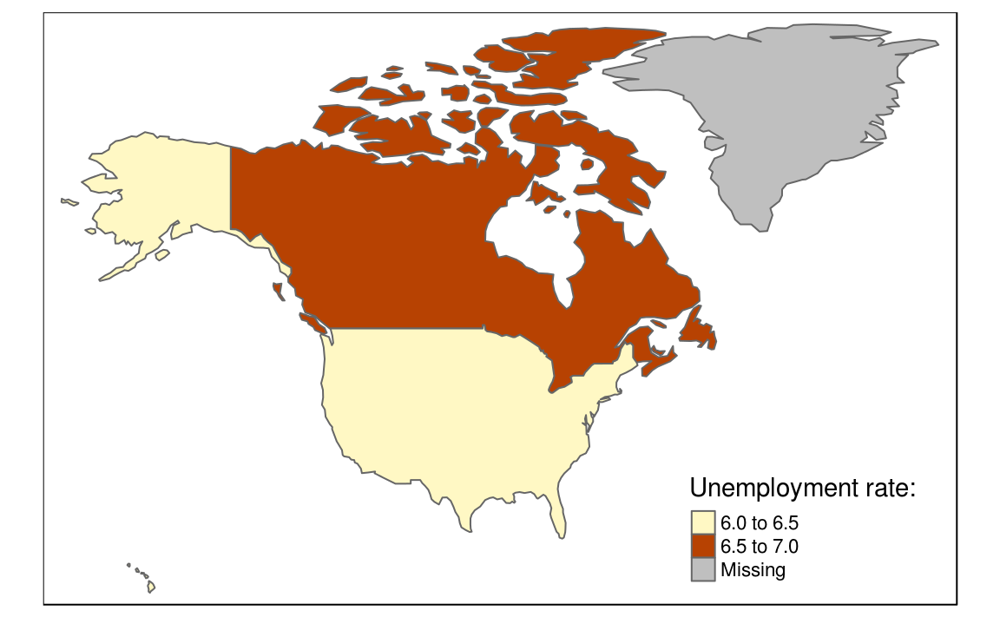
<p class="caption">(\#fig:unemploy)The unemployment rate (taken from World Bank statistics) in Canada and the United States to illustrate the utility of joining attribute data on to spatial datasets.</p>
</div>

It is also possible to join objects by different variables.
Both of the datasets have variables with names of countries, but they are named differently.
The `north_america` has a `name_long` column and the `wb_north_america` has a `name` column.
In these cases a named vector, such as `c("name_long" = "name")`, can specify the connection:


```r
left_join2 = north_america %>% 
  left_join(wb_north_america, by = c("name_long" = "name"))
names(left_join2)
#> [1] "iso_a2.x"  "name_long" "iso_a2.y"  "urban_pop" "unemploy"  "geom"
```

Note that the result contains two duplicated variables - `iso_a2.x` and `iso_a2.y` because both `x` and `y` objects have the column `iso_a2`.
This can be solved by specifying all the keys:


```r
left_join3 = north_america %>% 
  left_join(wb_north_america, by = c("iso_a2", "name_long" = "name"))
```

Joins also work when a data frame is the first argument.
This keeps the geometry column but drops the `sf` class, returning a `data.frame` object.


```r
# keeps the geom column, but drops the sf class
left_join4 = wb_north_america %>%
  left_join(north_america, by = c("iso_a2"))
class(left_join4)
#> [1] "data.frame"
```

\BeginKnitrBlock{rmdnote}<div class="rmdnote">In most cases the geometry column is only useful in an `sf` object.
The geometry column can only be used for creating maps and spatial operations if R 'knows' it is a spatial object, defined by a spatial package such as **sf**.
Fortunately non-spatial data frames with a geometry list column (like `left_join4`) can be coerced into an `sf` object as follows: `st_as_sf(left_join4)`. </div>\EndKnitrBlock{rmdnote}

<!-- On the other hand, it is also possible to remove the geometry column of `left_join4` using base R functions or `dplyr`. -->
<!-- Here, this is this simple because the geometry column is just another `data.frame` column and no longer the sticky geometry column of an `sf` object (see also Chapter \@ref(spatial-class)): -->

<!-- ```{r} -->
<!-- # base R -->
<!-- left_join4_df = subset(left_join4, select = -geom) -->
<!-- # or dplyr -->
<!-- left_join4_df = left_join4 %>% dplyr::select(-geom) -->
<!-- left_join4_df -->
<!-- class(left_join4_df) -->
<!-- ``` -->

In contrast to `left_join()`, `inner_join()` keeps only observations from the left object (`north_america`) where there are matching observations in the right object (`wb_north_america`). 
All columns from the left and right object are still kept:


```r
inner_join1 = north_america %>% 
  inner_join(wb_north_america, by = c("iso_a2", "name_long" = "name"))
inner_join1$name_long
#> [1] "Canada"        "United States"
```

### Creating attributes and removing spatial information {#vec-attr-creation}
<!-- lubridate? -->

Often, we would like to create a new column based on already existing columns.
For example, we want to calculate population density for each country.
For this we need to divide a population column, here `pop`, by an area column , here `area_km2` with unit area in square km.
Using base R, we can type:


```r
world_new = world # do not overwrite our original data
world_new$pop_dens = world_new$pop / world_new$area_km2
```

Alternatively, we can use one of **dplyr** functions - `mutate()` or `transmute()`.
`mutate()` adds new columns at the penultimate position in the `sf` object (the last one is reserved for the geometry):


```r
world %>% 
  mutate(pop_dens = pop / area_km2)
```

The difference between `mutate()` and `transmute()` is that the latter skips all other existing columns (except for the sticky geometry column):


```r
world %>% 
  transmute(pop_dens = pop / area_km2)
```

`unite()` pastes together existing columns. 
For example, we want to combine the `continent` and `region_un` columns into a new column named `con_reg`.
Additionally, we can define a separator (here: a colon `:`) which defines how the values of the input columns should be joined, and if the original columns should be removed (here: `TRUE`):


```r
world_unite = world %>%
  unite("con_reg", continent:region_un, sep = ":", remove = TRUE)
```

The `separate()` function does the exact opposite of the `unite()` function, i.e., it splits one column into multiple columns using either a regular expression or character positions.


```r
world_separate = world_unite %>% 
  separate(con_reg, c("continent", "region_un"), sep = ":")
```


The two functions `rename()` and `set_names()` are useful for renaming columns.
The first one, `rename()` replaces an old name with a new one.
For example, to change a column name from `name_long` to `name`, we type:


```r
world %>% 
  rename(name = name_long)
```

`set_names()` changes all column names at once, which is why we only have to provide the new names in form of a vector: 


```r
new_names = c("ISO_A2", "Name", "Continent", "Region", "Subregion", 
              "Country_type", "Area_in_km2", "Population", "Life_Expectancy",
              "GDP_per_capita", "geom")
world %>% 
  set_names(new_names)
```

It is important to note that attribute data operations preserve the geometry of the simple features.
As mentioned at the outset of the chapter, it can be useful to remove the geometry.
Do do this, you have to explicitly remove it because `sf` explicitly makes the geometry column sticky.
This behavior ensures that data frame operations do not accidentally remove the geometry column.
Hence, an approach such as `select(world, -geom)` will be unsuccessful instead use `st_set_geometry()`.^[Note that `st_geometry(world_st) = NULL` also works to remove the geometry from `world` but overwrites the original object.]


```r
world_data = world %>% st_set_geometry(NULL)
class(world_data)
#> [1] "data.frame"
```

## Manipulating raster objects

In contrast to the vector data model underlying simple features (which represents points, lines and polygons as discrete entities in space), raster data represent continuous surfaces.
This section shows how raster objects work, by creating them *from scratch*, building on section \@ref(an-introduction-to-raster).
Because of their unique structure, subsetting and other operations on raster datasets work in a different way, as demonstrated in section \@ref(raster-subsetting).

The following code recreates the raster dataset used in section \@ref(raster-classes), the result of which is illustrated in Figure \@ref(fig:cont-cate-rasters).
This demonstrates how the `raster()` function works to create an example raster named `elev` (representing elevations).


```r
elev = raster(nrow = 6, ncol = 6, res = 0.5,
              xmn = -1.5, xmx = 1.5, ymn = -1.5, ymx = 1.5,
              vals = 1:36)
```

The result is a raster object with 6 rows and 6 columns (specified by the `nrow` and `ncol` arguments), and a minimum and maximum spatial extent in x and y direction (`xmn`, `xmx`, `ymn`, `ymax`).
The `vals` argument sets the values that each cell contains: numeric data ranging from 1 to 36 in this case.
Raster objects can also contain categorical values of class `logical` or `factor` variables in R.
The following code creates a raster representing grain sizes (Figure \@ref(fig:cont-cate-rasters)):


```r
grain_order = c("clay", "silt", "sand")
grain_char = sample(grain_order, 36, replace = TRUE)
grain_fact = factor(grain_char, levels = grain_order)
grain = raster(nrow = 6, ncol = 6, res = 0.5, 
               xmn = -1.5, xmx = 1.5, ymn = -1.5, ymx = 1.5,
               vals = grain_fact)
```


\BeginKnitrBlock{rmdnote}<div class="rmdnote">`raster` objects can contain values of class `numeric`, `integer`, `logical` or `factor`, but not `character`.
To use character values they must first be converted into an appropriate class, for example using the function `factor()`. 
The `levels` argument was used in the preceding code chunk to create an ordered factor:
clay < silt < sand in terms of grain size.
See the [Data structures](http://adv-r.had.co.nz/Data-structures.html) chapter of @wickham_advanced_2014 for further details on classes.</div>\EndKnitrBlock{rmdnote}

`raster` objects represent categorical variables as integers, so `grain[1, 1]` returns a number that represents a unique identifier, rather than "clay", "silt" or "sand". 
The raster object stores the corresponding look-up table or "Raster Attribute Table" (RAT) as a data frame in a new slot named `attributes`, which can be viewed with `ratify(grain)` (see `?ratify()` for more information).
Use the function `levels()` for retrieving and adding new factor levels to the attribute table:


```r
levels(grain)[[1]] = cbind(levels(grain)[[1]], wetness = c("wet", "moist", "dry"))
levels(grain)
#> [[1]]
#>   ID VALUE wetness
#> 1  1  clay     wet
#> 2  2  silt   moist
#> 3  3  sand     dry
```

This behavior demonstrates that raster cells can only possess one value, an identifier which can be used to look up the attributes in the corresponding attribute table (stored in a slot named `attributes`).
This is illustrated in command below, which returns the grain size and wetness of cell IDs 1, 11 and 35, we can run:


```r
factorValues(grain, grain[c(1, 11, 35)])
#>   VALUE wetness
#> 1  sand     dry
#> 2  silt   moist
#> 3  clay     wet
```

<div class="figure" style="text-align: center">
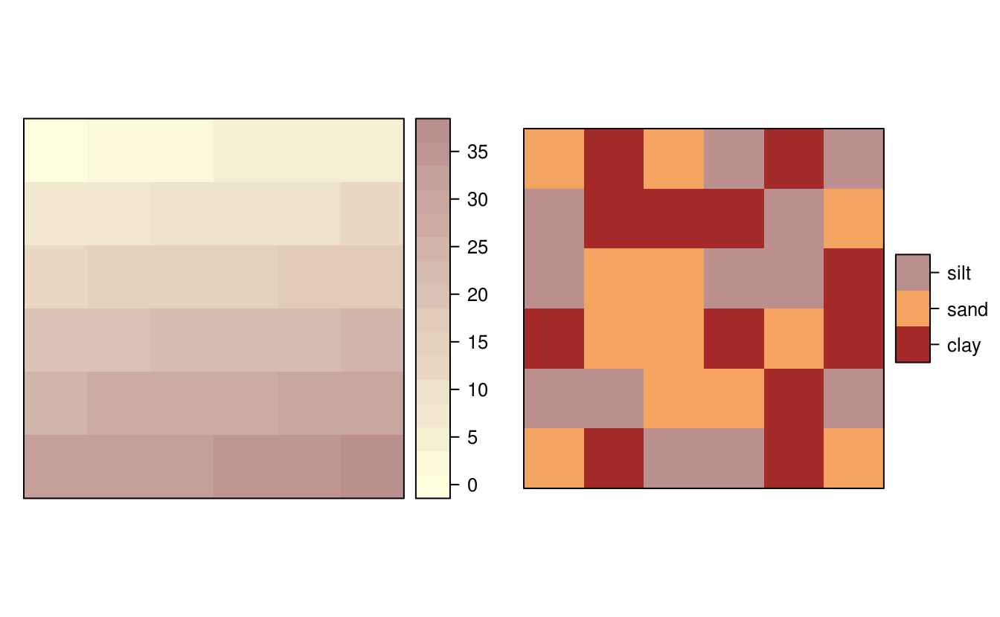
<p class="caption">(\#fig:cont-cate-rasters)Raster datasets with numeric (left) and categorical values (right).</p>
</div>

### Raster subsetting

Raster subsetting is done with the base R operator `[`, which accepts a variety of inputs:

- row-column indexing
- cell IDs
- coordinates
- another raster object

The latter two represent spatial subsetting (see section \@ref(raster-subsetting) in the next chapter).
The first two subsetting options are demonstrated in the commands below ---
both return the value of the top left pixel in the raster object `elev` (results not shown):


```r
# row 1, column 1
elev[1, 1]
# cell ID 1
elev[1]
```

To extract all values or complete rows, you can use `values()` and `getValues()`.
For multi-layered raster objects `stack` or `brick`, this will return the cell value(s) for each layer.
For example, `stack(elev, grain)[1]` returns a matrix with one row and two columns --- one for each layer.
<!-- In this example we have used cell ID subsetting, of course, you can also use row-column or coordinate indexing. -->
For multi-layer raster objects another way to subset is with `raster::subset()`, which extracts layers from a raster stack or brick. The `[[` and `$` operators can also be used:


```r
r_stack = stack(elev, grain)
names(r_stack) = c("elev", "grain")
# three ways to extract a layer of a stack
raster::subset(r_stack, "elev")
r_stack[["elev"]]
r_stack$elev
```

Cell values can be modified by overwriting existing values in conjunction with a subsetting operation.
The following code chunk, for example, sets the upper left cell of `elev` to 0:


```r
elev[1, 1] = 0
elev[]
#>  [1]  0  2  3  4  5  6  7  8  9 10 11 12 13 14 15 16 17 18 19 20 21 22 23
#> [24] 24 25 26 27 28 29 30 31 32 33 34 35 36
```

Leaving the square brackets empty is a shortcut version of `values()` for retrieving all values of a raster.
Multiple cells can also be modified in this way:


```r
elev[1, 1:2] = 0
```

### Summarizing raster objects

**raster** contains functions for extracting descriptive statistics for entire rasters.
Printing a raster object to the console by typing its name, returns minimum and maximum values of a raster.
`summary()` provides common descriptive statistics (minimum, maximum, interquartile range and number of `NA`s).
Further summary operations such as the standard deviation (see below) or custom summary statistics can be calculated with `cellStats()`. 


```r
cellStats(elev, sd)
```

\BeginKnitrBlock{rmdnote}<div class="rmdnote">If you provide the `summary()` and `cellStats()` functions with a raster stack or brick object, they will summarize each layer separately, as can be illustrated by running: `summary(brick(elev, grain))`</div>\EndKnitrBlock{rmdnote}

Raster value statistics can be visualized in a variety of ways.
Specific functions such as `boxplot()`, `density()`, `hist()` and `pairs()` work also with raster objects, as demonstrated in the histogram created with the command below (not shown):


```r
hist(elev)
```

In case a visualization function does not work with raster objects, one can extract the raster data to be plotted with the help of `values()` or `getValues()`.

Descriptive raster statistics belong to the so-called global raster operations.
These and other typical raster processing operations are part of the map algebra scheme which are covered in the next chapter (section \@ref(map-algebra)).

<div class="rmdnote">
<p>Some function names clash between packages (e.g., <code>select</code>, as discussed in a previous note). In addition to not loading packages by referring to functions verbosely (e.g., <code>dplyr::select()</code>) another way to prevent function names clashes is by unloading the offending package with <code>detach()</code>. The following command, for example, unloads the <strong>raster</strong> package (this can also be done in the <em>package</em> tab which resides by default in the right-bottom pane in RStudio): <code>detach(&quot;package:raster&quot;, unload = TRUE, force = TRUE)</code>. The <code>force</code> argument makes sure that the package will be detached even if other packages depend on it. This, however, may lead to a restricted usability of packages depending on the detached package, and is therefore not recommended.</p>
</div>

## Exercises

For these exercises we will use the `us_states` and `us_states_df` datasets from the **spData** package:


```r
library(spData)
data(us_states)
data(us_states_df)
```

`us_states` is a spatial object (of class `sf`), containing geometry and a few attributes (including name, region, area, and population) of states within the contiguous United States.
`us_states_df` is a data frame (of class `data.frame`) containing the name and additional variables (including median income and poverty level, for years 2010 and 2015) of US states, including Alaska, Hawaii and Puerto Rico.
The data comes from the US Census Bureau, and is documented in `?us_states` and `?us_states_df`.

<!-- Attribute subsetting -->
1. Create a new object called `us_states_name` that contains only the `NAME` column from the `us_states` object. 
What is the class of the new object? <!--why there is a "sf" part? -->
1. Select columns from the `us_states` object which contain population data.
Obtain the same result using a different command (bonus: try to find three ways of obtaining the same result).
Hint: try to use helper functions, such as `contains` or `starts_with` from **dplyr** (see `?contains`).
1. Find all states with the following characteristics (bonus find *and* plot them):
    - Belong to the Midwest region.
    - Belong to the West region, have an area below 250,000 km^2^ *and* in 2015 a population greater than 5,000,000 residents (hint: you may need to use the function `units::set_units()` or `as.numeric()`).
    - Belong to the South region, had an area larger than 150,000 km^2^ or a total population in 2015 larger than 7,000,000 residents.
<!-- Attribute aggregation -->
1. What was the total population in 2015 in the `us_states` dataset?
What was the minimum and maximum total population in 2015?
1. How many states are there in each region?
1. What was the minimum and maximum total population in 2015 in each region?
What was the total population in 2015 in each region?
<!-- Attribute joining -->
1. Add variables from `us_states_df` to `us_states`, and create a new object called `us_states_stats`.
What function did you use and why?
Which variable is the key in both datasets?
What is the class of the new object?
1. `us_states_df` has two more variables than `us_states`.
How you can find them? (hint: try to use the `dplyr::anti_join` function)
<!-- Attribute creation -->
1. What was the population density in 2015 in each state?
What was the population density in 2010 in each state?
1. How much has population density changed between 2010 and 2015 in each state?
Calculate the change in percentages and map them.
1. Change the columns names in `us_states` to lowercase. (Hint: helper functions - `tolower()` and `colnames()` may help).
<!-- Mixed exercises -->
<!-- combination of use of select, mutate, group_by, summarize, etc  -->
1. Using `us_states` and `us_states_df` create a new object called `us_states_sel`.
The new object should have only two variables - `median_income_15` and `geometry`.
Change the name of the `median_income_15` column to `Income`.
1. Calculate the change in median income between 2010 and 2015 for each state.
Bonus: what was the minimum, average and maximum median income in 2015 for each region?
What is the region with the largest increase of the median income?
<!-- Raster exercises -->
1. Create a raster from scratch with nine rows and columns and a resolution of 0.5 decimal degrees (WGS84).
Fill it with random numbers.
Extract the values of the four corner cells. 
1. What is the most common class of our example raster `grain` (hint: `modal()`)?
1. Plot the histogram and the boxplot of the `data(dem, package = "RQGIS")` raster. 
1. Now attach also `data(ndvi, package = "RQGIS")`. 
Create a raster stack using `dem` and `ndvi`, and make a `pairs()` plot

<!--chapter:end:03-attribute-operations.Rmd-->


# Spatial operations

## Prerequisites {-}

- This chapter requires the packages **sf**, **raster** and **tidyverse**: 


```r
library(sf)
library(raster)
library(tidyverse)
```

- It also relies on **spData**, which loads datasets used in the code examples of this chapter:


```r
library(spData)
```

## Introduction

Spatial operations are a vital part of geocomputation.
This chapter shows how spatial objects can be modified in a multitude of ways based on their location and shape.
The content builds on the previous chapter because many spatial operations have a non-spatial (attribute) equivalent.
This is especially true for *vector* operations: section \@ref(vector-attribute-manipulation) on vector attribute manipulation provides the basis for understanding its spatial counterpart, namely spatial subsetting (covered in section \@ref(spatial-subsetting)).
Spatial joining (section \@ref(spatial-joining)) and aggregation (\@ref(spatial-aggr)) also have non-spatial counterparts, covered in the previous chapter.

Spatial operations differ from non-spatial operations in some ways, however.
To illustrate the point, imagine you are researching road safety.
Spatial joins can be used to find road speed limits related with administrative zones, even when no zone ID is provided.
<!-- This could be a really good example that - a candidate to replace the rather contrived asia example below. -->
But this raises the question: should the road completely fall inside a zone for its values to be joined?
Or is simply crossing or being within a certain distance sufficent?
When posing such questions it becomes apparent that spatial operations differ substantially from attribute operations on data frames:
the *type* of spatial relationship between objects must be considered.
These are covered in section \@ref(topological-relations), on topological relations.

Another unique aspect of spatial objects is distance.
All spatial objects are related through space and distance calculations, covered in section \@ref(distance-relations), can be used to explore the strength of this relationship.

Naturally, we can also subset *rasters* based on location and coordinates (section \@ref(raster-subsetting)) and merge different raster tiles into one raster (covered in section \@ref(merging-rasters)). 
The most important spatial operation on raster data, however, is *map algebra*. 
Map algebra makes raster processing really elegant and fast (covered in sections \@ref(map-algebra) to \@ref(global-operations-and-distances)).
Map algebra is also the prerequisite for distance calculations on rasters \@ref(global-operations-and-distances).

\BeginKnitrBlock{rmdnote}<div class="rmdnote">It is important to note that spatial operations that use two spatial objects rely on both objects having the same coordinate reference system, a topic that was introduced in \@ref(crs-intro) and which will be covered in more depth in Chapter \@ref(transform).</div>\EndKnitrBlock{rmdnote}

## Spatial operations on vector data {#spatial-vec}

This section provides an overview of spatial operations on vector geographic data represented as simple features in the **sf** package before section \@ref(spatial-ras), which presents spatial methods using the **raster** package.

### Spatial subsetting

Spatial subsetting is the process of selecting features of a spatial object based on whether or not they in some way *relate* in space to another object.
It is analogous to *attribute subsetting* (covered in section \@ref(vector-attribute-subsetting)) and can be done with the base R square bracket (`[`) operator or with the `filter()` function from the **tidyverse**.

An example of spatial subsetting is provided by the `nz` and `nz_height` datasets in **spData**.
These contain projected data on the 16 main regions and 101 highest points in New Zealand respectively (Figure \@ref(fig:nz-subset)).
The following code chunk first creates an object representing Canterbury, then uses spatial subsetting to return all high points in the region:


```r
canterbury = nz %>% filter(REGC2017_NAME == "Canterbury Region")
canterbury_height = nz_height[canterbury, ]
```

<div class="figure" style="text-align: center">

<p class="caption">(\#fig:nz-subset)Illustration of spatial subsetting with red triangles representing 101 high points in New Zealand, clustered near the central Canterbuy region. The right-hand map contains points, subset with the command `nz_height[canterbury, ]`, located in Canterbury (highlighted in grey).</p>
</div>

Like attribute subsetting `x[y, ]` subsets features of *target* object `x` using the contents of a *source* object `y`.
Instead of `y` being of class `logical` or `integer` --- a vector of `TRUE` and `FALSE` values or whole numbers --- for spatial subsetting it is another spatial (`sf`) object.

Various *topological relations* can be used for spatial subsetting.
These determine the type of spatial relationship that features in the target object must have with the subsetting object to be selected, including *touches*, *crosses* or *within* (see section \@ref(topological-relations)). 
*Intersects* is the default spatial subsetting operator, a default that returns `TRUE` for many types of spatial relations, including *touches*, *crosses* and *is within*.
These alternative spatial operators can be specified with the `op =` argument, a third argument that can be passed to the `[` operator for `sf` objects.
This is demonstrated in the following command which returns the opposite of `st_intersect()`, points that do not intersect with Cantebury (see in section \@ref(topological-relations)):


```r
nz_height[canterbury, , op = st_disjoint]
```

\BeginKnitrBlock{rmdnote}<div class="rmdnote">Note the empty argument --- donoted with `, ,` --- in the preceding code chunk is not necessary (`nz_height[canterbury, op = st_disjoint]` returns the same result) but is included to emphasise the fact that `op` is the third argument in `[` for `sf` objects, after arguments for subsetting rows and columns.
`nz_height[canterbury, 2, op = st_disjoint]`, for example, returns the same rows but only includes the second attribute column.
Interested readers can see this default value of `op` set in the first line of the function call by entering its long-form name into the console `` sf:::`[.sf` ``.
The `?sf` help page documents this also.</div>\EndKnitrBlock{rmdnote}

For many applications this is all you'll need to know about spatial subsetting for vector data.
If this is the case, you can safely skip to the next section (\@ref(topological-relations)).
If you're interested in the details, including other ways of subsetting, read-on.

Another way of doing spatial subsetting uses objects returned by *topological operators*.
This is demonstrated in the first command below which uses the `sparse = FALSE` (meaning in English 'return a dense matrix not a sparse one') argument in the topological operator `st_intersects()` to ensure a `logical` result is returned:


```r
sel = st_intersects(x = nz_height, y = canterbury, sparse = FALSE)
canterbury_height2 = nz_height[sel, ]
```

This creates `sel` (short for 'selection object') containing only `TRUE` and `FALSE` values, which are used in the second line of the pevious code chunk to create `canterbury_height2`, which is identical to `canterbury_height`.
`sel` can also be used with `filter()`:


```r
canterbury_height3 = nz_height %>% filter(sel)
```

At this point there are three versions of `canterbury_height`, one created with spatial subsetting directly and the other two via the intermediary object `sel`.
We can test whether they are identical as follows:


```r
identical(x = canterbury_height, y = canterbury_height2)
#> [1] TRUE
identical(x = canterbury_height, y = canterbury_height3)
#> [1] FALSE
```

What is different about `canterbury_height3`?
The only difference is that `filter()` changed the row names:


```r
row.names(canterbury_height)[1:3]
#> [1] "5" "6" "7"
row.names(canterbury_height3)[1:3]
#> [1] "1" "2" "3"
```

If the row names are re-set, the objects become identical:


```r
attr(canterbury_height3, "row.names") = attr(x = canterbury_height, "row.names")
identical(canterbury_height, canterbury_height3)
#> [1] TRUE
```

<div class="rmdnote">
<p>This discarding of row names is not something that is specific to spatial data, as illustrated in the code chunk below. <strong>dplyr</strong> discards row names by design. For further discussion of this decision, and some controversy, see the (closed) issue <a href="https://github.com/tidyverse/dplyr/issues/366">#366</a> in the package's issue tracker.</p>
</div>

`sel` is not, as one might imagine, a `logical` `vector` (although it behaves as one as it only has one column) but a `logical` `matrix`:


```r
class(sel)
#> [1] "matrix"
typeof(sel)
#> [1] "logical"
dim(sel)
#> [1] 101   1
```

The dimensions of `sel` (returned by the base R command `dim()`) show one row per feature in the target object (`nz_height`) and a column per feature in the subsetting object (`canterbury`).
The general pattern here is that `sel[i, j]` is `TRUE` if the i^th^ feature in the target object intersects with the j^th^ feature in the subsetting object.
If there is more than one feature in `y` the resulting selection `matrix` must be converted into a `vector` before it is used for subsetting, e.g. with `rowSums(sel_matrix) > 0`.
Another solution is to convert the default sparse matrix (`list`) output from `st_intersects()` to a `logical` vector using the function `lengths()`.
This approach to spatial subsetting, used internally by **sf** (see the source code of `` sf:::`[.sf` ``), is illustrated in the code chunk below:


```r
co = filter(nz, grepl("Canter|Otag", REGC2017_NAME))
sel_sparse = st_intersects(nz_height, co)
sel_vector = lengths(sel_sparse) > 0
heights_co = nz_height[sel_vector, ]
```

The above code chunk results in an object, `heights_co`, that represent the high points that intersect with either Canterbury *or* Otago region (hence the object name `co`).
It did this in four stages:

1. Subset the regions of `nz` containing "Canter" or "Otago" in their names. This was done using the pattern matching function `grepl()` in combination with the `|` character, which means 'or', resulting in the subsetting object `co`.
2. Create a sparse geometry binary predicate `sgbp` object, a list representing which features of `nz_height` intersect with the regions in `co`.
3. Convert the selection list into a `logical` 'selection vector'. `lengths()`  finds the features in `nz_height` matching *any* features in `co`.
4. Use the result to subset `nz_heights`, creating a new object `heights_co`. 

### Topological relations

<!-- http://lin-ear-th-inking.blogspot.com/2007/06/subtleties-of-ogc-covers-spatial.html -->
<!-- https://edzer.github.io/sfr/articles/sf3.html -->
<!-- https://github.com/edzer/sfr/wiki/migrating#relevant-commands-exported-by-rgeos -->
<!-- Relations and inverse relations -->
<!-- http://desktop.arcgis.com/en/arcmap/latest/extensions/data-reviewer/types-of-spatial-relationships-that-can-be-validated.htm -->
<!-- Topological relations: + difference between datatypes -->
<!-- ?geos_binary_pred -->
<!-- Distance relations -->
<!-- Subset (1) points in polygons <-> (2) -->
Topological relations define the spatial relationships between objects.
To understand them, it helps to have some simple test data to work with.
Figure \@ref(fig:relation-objects) contains a polygon (`a`), a line (`l`) and some points (`p`), which are created in the code below.


```r
a_poly = st_polygon(list(rbind(c(-1, -1), c(1, -1), c(1, 1), c(-1, -1))))
a = st_sfc(a_poly)

l_line = st_linestring(x = matrix(c(-1, -1, -0.5, 1), , 2))
l = st_sfc(l_line)

p_matrix = matrix(c(0.5, 1, -1, 0, 0, 1, 0.5, 1), ncol = 2)
p_multi = st_multipoint(x = p_matrix)
p = st_sf(st_cast(st_sfc(p_multi), "POINT"))
```

<div class="figure" style="text-align: center">
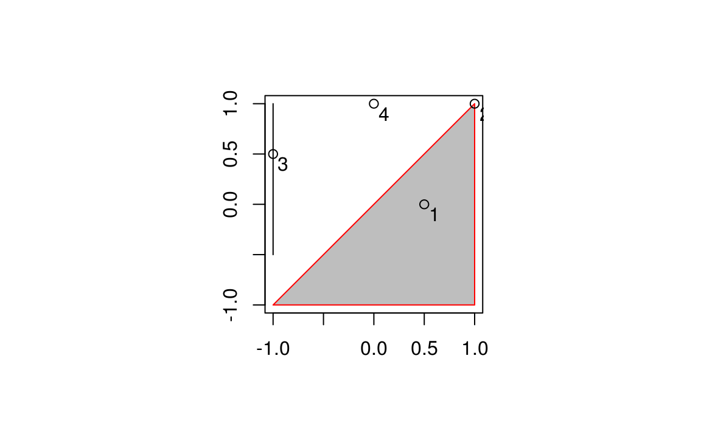
<p class="caption">(\#fig:relation-objects)Points (p 1 to 4), line and polygon objects arranged to demonstrate spatial relations.</p>
</div>

A simple query is: which of the points in `p` intersect in some way with polygon `a`?
The question can be answered by inspection (points 1 and 2 are over or touch the triangle).
It can also be answered by using the topological relation *intersects*, implemented in **sf** as follows:


```r
st_intersects(p, a)
#> Sparse geometry binary predicate list of length 4, where the predicate was `intersects'
#>  1: 1
#>  2: 1
#>  3: (empty)
#>  4: (empty)
```

The contents of the result should be as you expected:
the function returns a positive (`1`) result for the first two points, and a negative result (represented by an empty vector) for the last two.
What may be unexpected is that the result comes in the form of a list of vectors.
This *sparse matrix* output only registers a relation if one exists, reducing the memory requirements of topological operations on multi-feature objects.
As we saw in the previous section a *dense matrix* consisting of `TRUE` or `FALSE` values for each combination of features can also be returned when `sparse = FALSE`:


```r
st_intersects(p, a, sparse = FALSE)
#>       [,1]
#> [1,]  TRUE
#> [2,]  TRUE
#> [3,] FALSE
#> [4,] FALSE
```

The output is a matrix in which each row represents a feature in the target object and each column represents a feature in in the selecting object.
In this case only the first two features in `p` intersect with `a` and there is only one feature in `a` so the result has only one column.
The result can be used for subsetting as we saw in section \@ref(spatial-subsetting).

Note that `st_intersects()` returns `TRUE` for the second feature in the object `p` even though it just touches the polygon `a`: *intersects* is a 'catch-all' topological operation which identifies many types of spatial relation.

The opposite of `st_intersects()` is `st_disjoint()`, which returns only objects that do not spatially relate in any way to the selecting object (`[, 1]` ensures the output is a vector consuming one rather than four lines when printed):


```r
st_disjoint(p, a, sparse = FALSE)[, 1]
#> [1] FALSE FALSE  TRUE  TRUE
```

`st_within()` returns `TRUE` only for objects that are completely within the selecting object.
This applies only to the second object, which is inside the triangular polygon, as illustrated below:


```r
st_within(p, a, sparse = FALSE)[, 1]
#> [1]  TRUE FALSE FALSE FALSE
```

Note that although the first point is *within* the triangle, it does not *touch* any part of its border.
For this reason `st_touches()` only returns `TRUE` for the second point:


```r
st_touches(p, a, sparse = FALSE)[, 1]
#> [1] FALSE  TRUE FALSE FALSE
```

What about features that do not touch, but *almost touch* the selection object?
These can be selected using `st_is_within_distance()`, which has an additional `dist` argument.
It can be used to set how close target object need to be before they are selected.
Note that although point 4 is one unit of distance from the nearest node of `a` (at point 2 in Figure \@ref(fig:relation-objects)), it is still selected when the distance is set to 0.9.
This is illustrated in the code chunk below, the second line of which converts the lengthy list output into a `logical` object:


```r
sel = st_is_within_distance(p, a, dist = 0.9) # can only return a sparse matrix
lengths(sel) > 0
#> [1]  TRUE  TRUE FALSE  TRUE
```


<!-- Equals: -->
<!-- https://postgis.net/docs/ST_Equals.html -->

<!-- ```{r, eval=FALSE} -->
<!-- st_equals(a, b, sparse = FALSE) -->
<!-- ``` -->

<!-- Contains: -->
<!-- https://postgis.net/docs/ST_Contains.html -->
<!-- https://postgis.net/docs/ST_ContainsProperly.html -->

<!-- ```{r, eval=FALSE} -->
<!-- st_contains(a, b, sparse = FALSE) -->
<!-- st_contains_properly(a, b, sparse = FALSE) -->
<!-- ``` -->

<!-- Covers: -->
<!-- https://postgis.net/docs/ST_Covers.html -->
<!-- https://postgis.net/docs/ST_CoveredBy.html -->

<!-- ```{r, eval=FALSE} -->
<!-- st_covers(a, b, sparse = FALSE) -->
<!-- st_covered_by(a, b, sparse = FALSE) -->
<!-- ``` -->

<!-- Within: -->
<!-- https://postgis.net/docs/ST_Within.html -->

<!-- ```{r, eval=FALSE} -->
<!-- st_within(a, b, sparse = FALSE) -->
<!-- ``` -->

<!-- Overlaps: -->
<!-- https://postgis.net/docs/ST_Overlaps.html -->

<!-- ```{r, eval=FALSE} -->
<!-- st_overlaps(a, b, sparse = FALSE) -->
<!-- ``` -->

<!-- Intersects: -->
<!-- https://postgis.net/docs/ST_Intersects.html -->

<!-- ```{r, eval=FALSE} -->
<!-- st_intersects(a, b, sparse = FALSE) -->
<!-- ``` -->

<!-- Disjoint: -->
<!-- https://postgis.net/docs/ST_Disjoint.html -->

<!-- ```{r, eval=FALSE} -->
<!-- st_disjoint(a, b, sparse = FALSE) -->
<!-- ``` -->

<!-- Touches: -->
<!-- https://postgis.net/docs/ST_Touches.html -->

<!-- ```{r, eval=FALSE} -->
<!-- st_touches(a, b, sparse = FALSE) -->
<!-- ``` -->

<!-- Crosses: -->
<!-- https://postgis.net/docs/ST_Crosses.html -->

<!-- ```{r, eval=FALSE} -->
<!-- st_crosses(a, b, sparse = FALSE) -->
<!-- ``` -->

<!-- DE9-IM - https://en.wikipedia.org/wiki/DE-9IM -->
<!-- https://edzer.github.io/sfr/reference/st_relate.html -->

<!-- ```{r, eval=FALSE} -->
<!-- st_relate(a, b, sparse = FALSE) -->
<!-- ``` -->

<!-- examples (points/polygons) -->
<!-- examples (points/lines) -->
<!-- examples (lines/polygons) -->

<!-- TODO? create a series of polygons distributed evenly over the surface of the Earth and clip them. -->

<!-- ```{r} -->
<!-- set.seed(2018) -->
<!-- blob_points = st_sample(x = world, size = 2) -->
<!-- blobs = st_buffer(x = blob_points, dist = 1) -->
<!-- plot(blobs) -->


### Spatial joining 

Joining two non-spatial datasets relies on a shared 'key' variable, as described in section \@ref(vector-attribute-joining).
Spatial data joining applies the same concept, but instead relies on shared areas of geographic space.
As with attribute data joining adds a new column to the target object (the argument `x` in joining functions) from a source object (`y`).

The process is illustrated in Figure \@ref(fig:spatial-join), which shows a target object (the `asia` dataset, left) being joined to a source dataset (the three most populous cities of the world), resulting in a new attribute being added to the `joined` dataset (right).
<!-- Idea: use random points over Earth's surface to allocate data to world countries. -->
<!-- I'm not sure this is a good starting example to show how st_join works - thoughts? -->


```r
asia = world %>% 
  filter(continent == "Asia")
urb = urban_agglomerations %>% 
  filter(year == 2020) %>% 
  top_n(n = 3, wt = population_millions)
```


```r
joined = st_join(x = asia, y = urb) %>% 
  na.omit()
```

<div class="figure" style="text-align: center">
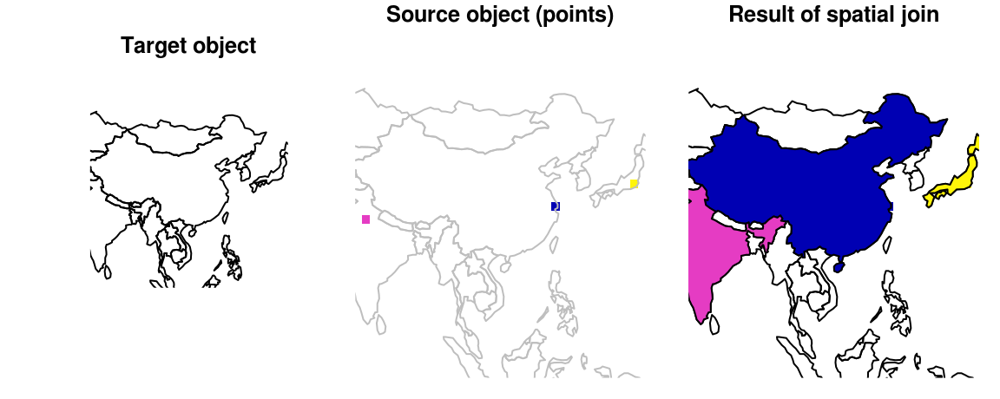
<p class="caption">(\#fig:spatial-join)Illustration of a spatial join: the populations of the world's three largest agglomerations joined onto their respective countries.</p>
</div>

This operation is also know as spatial overlay.
By default, `st_join()` performs a left join (see section \@ref(vector-attribute-joining)), but it can also do inner joins by setting the argument `left = FALSE`.
Like spatial subsetting, the default topological operator used by `st_join()` is `st_intersects()`.
This can be changed with the `join` argument (see `?st_join` for details).
In the example above, we have added features of a point layer to a polygon layer but there might be multiple point matches per polygon. 
Had we chosen to select the four (instead of three) most populous cities in the world, two of them would have belonged to China (Shanghai and Beijing, give it a try yourself).
In such a case `st_join()` simply adds a new row.
In our example we would have ended up with two polygons representing China.

### Non-overlapping joins

Sometimes two geographic datasets do not touch but still have a strong geographic relationship enabling joins.
The datasets `cycle_hire` and `cycle_hire_osm`, already loaded in the **spData** package, provide a good example.
Plotting them shows that they are often closely related but they do not touch, as shown in Figure \@ref(fig:cycle-hire), a base version of which is created with the following code below:


```r
plot(cycle_hire$geometry, col = "blue")
plot(cycle_hire_osm$geometry, add = TRUE, pch = 3, col = "red")
```

We can check if any points are the same `st_intersects()` as show below:


```r
any(st_touches(cycle_hire, cycle_hire_osm, sparse = FALSE))
#> [1] FALSE
```


<div class="figure" style="text-align: center">
preserve58dfe1b8085da04c
<p class="caption">(\#fig:cycle-hire)The spatial distribution of cycle hire points in London based on official data (blue) and OpenStreetMap data (red).</p>
</div>

Imagine that we need to join the `capacity` variable in `cycle_hire_osm` onto the official 'target' data contained in `cycle_hire`.
This is when a non-overlapping join is needed.
The simplest method is to use the topological operator `st_within_distance()` shown in section \@ref(topological-relations), using a threshold distance of 20 m.
Note that before performing the relation both datasets must be transformed into a projected CRS, saved as new objects denoted by the affix `P` (for projected) below:


```r
cycle_hire_P = st_transform(cycle_hire, 27700)
cycle_hire_osm_P = st_transform(cycle_hire_osm, 27700)
sel = st_is_within_distance(cycle_hire_P, cycle_hire_osm_P, dist = 20)
summary(lengths(sel) > 0)
#>    Mode   FALSE    TRUE 
#> logical     304     438
```

This shows that there are 438 points in the target object `cycle_hire_P` within the threshold distance of `cycle_hire_osm_P`.
How to retrieve the *values* associated with the respective `cycle_hire_osm_P` points?
The solution is again with `st_join()` although the additional dist argument must be specified:


```r
z = st_join(cycle_hire_P, cycle_hire_osm_P, st_is_within_distance, dist = 20)
nrow(cycle_hire)
#> [1] 742
nrow(z)
#> [1] 762
```

Note that the number of rows in the joined result is greater than the target.
This is because some cycle hire stations in `cycle_hire_P` have multiple matches in `cycle_hire_osm_P`.
To aggregate the values for the overlapping points and return the mean, we can use the aggregation methods learned in Chapter \@ref(attr), resulting in an object with the same number of rows as the target:


```r
z = z %>% 
  group_by(id) %>% 
  summarize(capacity = mean(capacity))
nrow(z) == nrow(cycle_hire)
#> [1] TRUE
```

The capacity of nearby stations can be verified by comparing a plot of the capacity of the source `cycle_hire_osm` data with the results in this new object (plots not shown):


```r
plot(cycle_hire_osm["capacity"])
plot(z["capacity"])
```

<!-- Nearest neighbour analysis -->
<!-- e.g. two point's datasets (non-overlapping) -->
<!-- e.g. two point's datasets (overlapping) -->
<!-- ? topological problems of joining lines/polygons? -->
<!-- joining different types (e.g. points + polygons = geometry) -> save as GPKG? -->
<!-- `merge()`; `st_interpolate_aw()` -->

The result of this join has used a spatial operation to change the attribute data associated with simple features but the geometry associated with each feature has remained unchanged.

### Spatial data aggregation {#spatial-aggr}

Like attribute data aggregation, covered in section \@ref(vector-attribute-aggregation), spatial data aggregation can be a way of *condensing* data.
Aggregated data show some statistic about a variable (typically average or total) in relation to some kind of *grouping variable*.
Section \@ref(vector-attribute-aggregation) demonstrated how `aggregate()` and `group_by() %>% summarize()` condense data based on attribute variables.
This section demonstrates how the same functions work using spatial grouping variables.

Returning to the example of New Zealand, imagine you want to find out the average height of high points in each region.
This is a good example of spatial aggregation: it is the geometry of the source (`y` or `nz` in this case) that defines how values in the target object (`x` or `nz_height`) are grouped.
This is illustrated using the base `aggregate()` function below:


```r
nz_avheight = aggregate(x = nz_height, nz, FUN = mean)
```

The result of the previous command is an `sf` object with the same geometry as the (spatial) aggregating object (`nz`).^[This can be verified with `identical(nz$geometry, nz_avheight$geometry)`.]
The result of the previous operation is illustrated in Figure \@ref(fig:spatial-aggregation).
The same result can also be generated using the 'tidy' functions `group_by()` and `summarize()` (used in combination with `st_join()`):

<div class="figure" style="text-align: center">

<p class="caption">(\#fig:spatial-aggregation)Average height of high points (stored in the `nz_height` object) across the regions of New Zealand (stored in `nz`.)</p>
</div>


```r
nz_avheight2 = st_join(nz, nz_height) %>%
  group_by(REGC2017_NAME) %>%
  summarize(elevation = mean(elevation, na.rm = TRUE))
```

The resulting `nz_avheight` objects have the same geometry as the aggregating object `nz` but with a a new column representing the mean average height of points within each region of New Zealand (other summary functions such as `median()` and `sd()` can be used in place of `mean()`).
Note that regions containing no points have an associated `elevation` value of `NA`.
For aggregating operations which also create new geometries, see section \@ref(geometry-unions).

Spatial congruence is an important concept related to spatial aggregation.
An *aggregating object* object (which we will refer to as `y`) is *congruent* with the target object (`x`) if the two objects have shared borders.
Often this is the case for administrative boundary data, whereby the larger units (e.g., Middle Layer Super Output Areas in the UK or districts in many other European countries) are composed of many smaller units (Output Areas in the UK, see [ons.gov.uk](https://www.ons.gov.uk/methodology/geography/ukgeographies/censusgeography) for further details or municipalities in many other European countries).

*Incongruent* aggregating objects, by contrast, do not share common borders with the target [@qiu_development_2012].
This is problematic for spatial aggregation (and other spatial operations) illustrated in Figure \@ref(fig:areal-example).
Areal interpolation can help to alleviate this issue.
It helps to transfer data from one set of areal units to another.
A number of algorithms have been developed for areal interpolation, including area weighted and pycnophylactic interpolation methods [@tobler_smooth_1979].

<!-- somehow the incongruent borders are hardly to discern in the right figure, maybe increasing the figure size could help -->
<div class="figure" style="text-align: center">

<p class="caption">(\#fig:areal-example)Illustration of congruent (left) and incongruent (right) areal units with respect to larger aggregating zones (translucent blue borders).</p>
</div>

The simplest useful method for spatial interpolation is *area weighted* spatial interpolation.
This is implemented in `st_interpolate_aw()`, as demonstrated in the code chunk below.
In this case values from the `incongruent` object are allocated to the `aggregating_zones` in proportion to the area:


```r
agg_aw = st_interpolate_aw(incongruent[, "value"], aggregating_zones, extensive = TRUE)
#> Warning in st_interpolate_aw(incongruent[, "value"], aggregating_zones, :
#> st_interpolate_aw assumes attributes are constant over areas of x
```

Instead of simply taking the mean average of each area within each aggregating feature, `st_interpolate_aw` applies a weight to each value in proportion to its area in each aggregating zone (use `extensive = FALSE` for 'spatially intensive' variables such as population density which should be averaged rather than summed).
For instance, if one intersection of `incongruent` and `aggregating_zones` is 0.5 km^^2^^ but the whole incongruent polygon in question has 1 km^^2^^ and 100  inhabitants, then the target aggregating zone will obtain half of the population, in this case 50 inhabitants.
<!-- - `aggregate.sf()` - aggregate an sf object, possibly union-ing geometries -->
<!-- - disaggregation?? `st_cast()` - https://github.com/edzer/sfr/wiki/migrating -->
<!-- - `group_by()` + `summarise()` - potential errors -->
<!-- - ? generalization **rmapsharper** - https://github.com/ateucher/rmapshaper -->
<!-- `st_union` -->

### Distance relations 

While topological relations are binary --- a feature either intersects with another or does not --- distance relations are continuous.
The distance between two objects is calculated with the `st_distance()` function.
This is illustrated in the code chunk below, which finds the distance between the highest point in New Zealand and the geographic centroid of the Canterbury region, created in section \@ref(spatial-subsetting):


```r
nz_heighest = nz_height %>% top_n(n = 1, wt = elevation)
canterbury_centroid = st_centroid(canterbury)
st_distance(nz_heighest, canterbury_centroid)
#> Units: m
#>        [,1]
#> [1,] 115566
```

There are two potentially surprising things about the result: 1) it comes with a `units` attribute, so you know that it's just over 100,000 m (not 100,000 inches, or any other measure of distance!); and 2) it is returned as a matrix, even though the result only contains a single value.
This second feature hints at another useful feature of `st_distance()`, its ability to return *distance matrices* between all combinations of features in objects `x` and `y`.
This is illustrated in the command below, which finds the distances between the first three features in `nz_height` and the Otago and Canterbury regions of New Zealand represented by the object `co`.


```r
st_distance(nz_height[1:3, ], co)
#> Units: m
#>        [,1]  [,2]
#> [1,] 123537 15498
#> [2,]  94283     0
#> [3,]  93019     0
```

Note that the distance between the second and third feature in `nz_height` and the second feature in `co` is zero.
This demonstrates the fact that distances between points and polygons refer to the distance to *any part of the polygon*:
The second and third points in `nz_height` are *in* Otago, which can be verified by plotting them (result not shown):


```r
plot(co$geometry[2])
plot(nz_height$geometry[2:3], add = TRUE)
```


## Spatial operations on raster data {#spatial-ras}

This section builds on section \@ref(manipulating-raster-objects), which highlights various basic methods for manipulating raster datasets, to demonstrate more advanced and explicitly spatial raster operations, and uses the objects `elev` and `grain` manually created in section \@ref(manipulating-raster-objects).
These datasets can be also found in the **spData** package.

### Spatial subsetting {#raster-subsetting}

In the previous chapter (section \@ref(manipulating-raster-objects)) we have already learned how to subset raster datasets using cell IDs and matrix indexing.
Naturally, we can subset rasters also with the help of coordinates and spatial objects.
To use coordinates for subsetting, we have to 'translate' them into the corresponding cell ID(s) or by using the `extract()` command.
This operation is also known as extracting values/attributes to points.


```r
# point within the top left pixel
elev[cellFromXY(elev, xy = c(-1.5, 1.5))]
# the same as
extract(elev, data.frame(x = -1.5, y = 1.5))
```

**raster** functions `cellFromXY()` and `extract()` also accept objects of class `sf`.
Raster objects can also be subset with another raster object, as illustrated in Figure \@ref(fig:raster-subset) (left panel) and demonstrated in the code chunk below:


```r
clip = raster(nrow = 3, ncol = 3, res = 0.3, xmn = 0.9, xmx = 1.8, 
              ymn = -0.45, ymx = 0.45, vals = rep(1, 9))
elev[clip]
#> [1] 18 24
# we can also use extract
# extract(elev, extent(clip))
```

Basically, this amounts to retrieving the values of the first raster (here: `elev`) falling within the extent of a second raster (here: `clip`).
To retrieve a spatial output, we can tell R to keep the matrix structure.
This will return the two output values as a raster object.


```r
elev[clip, drop = FALSE]
#> class       : RasterLayer 
#> dimensions  : 2, 1, 2  (nrow, ncol, ncell)
#> resolution  : 0.5, 0.5  (x, y)
#> extent      : 1, 1.5, -0.5, 0.5  (xmin, xmax, ymin, ymax)
#> coord. ref. : +proj=longlat +datum=WGS84 +ellps=WGS84 +towgs84=0,0,0 
#> data source : in memory
#> names       : layer 
#> values      : 18, 24  (min, max)
```

For the same operation we can also use the `intersect()` and `crop()` command.

<div class="figure" style="text-align: center">

<p class="caption">(\#fig:raster-subset)Subsetting raster values with the help of another raster (left). Raster mask (middle). Output of masking a raster.</p>
</div>

Frequently, however, we have two rasters with the same extent and resolution where one raster object serves as a mask (Figure \@ref(fig:raster-subset) middle and right panel).
In these cases `intersect()` and `crop()` are of little use.
Instead we can use the `[` again or the `mask()` and `overlay()` commands:


```r
rmask = raster(nrow = 6, ncol = 6, res = 0.5, 
               xmn = -1.5, xmx = 1.5, ymn = -1.5, ymx = 1.5,
               vals = sample(c(FALSE, TRUE), 36, replace = TRUE))
elev[rmask, drop = FALSE]
# using the mask command
mask(elev, rmask, maskvalue = TRUE)
# using overlay
# first we replace FALSE by NA
rmask[rmask == FALSE] = NA
# then we retrieve the maximum values
overlay(elev, rmask, fun = "max")
```

In the code chunk above, we have created a mask object called `rmask` randomly setting its values to `FALSE` and `TRUE`.
Next we only want to keep those values of `elev` which are `TRUE` in `rmask`, or expressed differently, we want to mask `elev` with `rmask`.
These operations are in fact Boolean local operations since we compare cell-wise two rasters.
The next subsection explores these and related operations in more detail.

### Map algebra

Map algebra makes raster processing really fast.
This is because raster datasets only implicitly store coordinates.
To derive the coordinate of a specific cell, we have to calculate it using its matrix position and the raster resolution and origin.
For the processing, however, the geographic position of a cell is barely relevant as long as we make sure that the cell position is still the same after the processing (one-to-one locational correspondence).
Additionally, if two or more raster datasets share the same extent, projection and the resolution, one could treat them as matrices for the processing.
This is exactly what map algebra is doing.
First, it checks the headers of the rasters on which to perform any algebraic operation, and only if they correspondent to each other, the processing goes on.
And secondly, map algebra retains the so-called one-to-one locational correspondence.
This is where it substantially differs from matrix algebra which changes positions when for example multiplying or dividing matrices.

Map algebra (or cartographic modeling) divides raster operations into four subclasses [@tomlin_geographic_1990], with each of them either working on one or several grids simultaneously:

1. *Local* or per-cell operations.
2. *Focal* or neighborhood operations.
Most often the output cell value is the result of a 3 x 3 input cell block.
3. *Zonal* operations are similar to focal operations but instead of a predefined neighborhood, classes, which can take on any, i.e., also an irregular size and shape, are the basis for calculations.
4. *Global* or per-raster operations, that means the output cell derives its value potentially from one or several entire rasters.

This classification scheme uses basically the number of cells involved in a processing step as distinguishing feature.
Raster operations can also be classified by discipline, for example terrain, hydrological analysis or image classifications.
The following sections explain how each type of map algebra operations can be used, with reference to worked examples (also see `vignette("Raster")` for a technical description of map algebra).

### Local operations

**Local** operations comprise all cell-by-cell operations in one or several layers.
A good example is the classification of intervals of numeric values into groups such as grouping a digital elevation model into low (class 1), middle (class 2) and high elevations (class 3).
Using the `reclassify()` command, we need first to construct a reclassification matrix, where the first column corresponds to the lower and the second column to the upper end of the class.
The third column represents the new value for the specified ranges in column one and two.
Here, we assign the raster values in the ranges 0--12, 12--24 and 24--36 are *reclassified* to take values 1, 2 and 3, respectively.


```r
rcl = matrix(c(0, 12, 1, 12, 24, 2, 24, 36, 3), ncol = 3, byrow = TRUE)
recl = reclassify(elev, rcl = rcl)
```

Raster algebra is another classical use case of local operations.
This includes adding, subtracting and squaring two rasters.
Raster algebra also allows logical operations such as finding all raster cells that are greater than a specific value (5 in our example below).
The **raster** package supports all these operations and more, as described in `vignette("Raster")` and demonstrated below (results not show):


```r
elev + elev
elev^2
log(elev)
elev > 5
```

Instead of arithmetic operators, one can also use the `calc()` and `overlay()` functions.
These functions are more efficient, hence, they are preferable in the presence of large raster datasets. 
Additionally, they allow to directly store an output file.

The calculation of the normalized difference vegetation index (NDVI) is one of the most famous local, i.e. pixel-by-pixel, raster operations.
It ranges between - 1 and 1 with positive values indicating the presence of living plants (mostly > 0.2).
To calculate the NDVI, one uses the red and near-infrared bands of remotely sensed imagery (e.g., Landsat or Sentinel imagery) exploiting the fact that vegetation absorbs light heavily in the visible light spectrum, and especially in the red channel, while reflecting it in the near-infrared spectrum.

$$
\begin{split}
NDVI&= \frac{\text{NIR} - \text{Red}}{\text{NIR} + \text{Red}}\\
\end{split}
$$
where NIR = near infrared channel
      Red = red channel

Predictive mapping is another interesting application of local raster operations.
The response variable correspond to measured or observed points in space, for example, species richness, the presence of landslides, tree disease or crop yield.
Consequently, we can easily retrieve space- or airborne predictor variables from various rasters (elevation, pH, precipitation, temperature, landcover, soil class, etc.).
Subsequently, we model our response as a function of our predictors using `lm`, `glm`, `gam` or a machine-learning technique. 
To make a spatial prediction, all we have to do, is to apply the estimated coefficients to the predictor rasters, and summing up the resulting output rasters (<!--Chapter ??; -->see also @muenchow_predictive_2013).
<!-- add reference to chapter ecological modeling -->

### Focal operations

While local functions operate on one cell, though possibly from multiple layers, **focal** operations take into account a central cell and its neighbors.
The neighborhood (also named kernel, filter or moving window) under consideration is typically of size 3-by-3 cells (that is the central cell and its eight surrounding neighbors) but can take on any other (not necessarily rectangular) shape as defined by the user.
A focal operation applies an aggregation function to all cells within the specified neighborhood, uses the corresponding output as the new value for the the central cell, and moves on to the next central cell (Figure \@ref(fig:focal-example)).
Other names for this operation are spatial filtering and convolution [@burrough_principles_2015].

In R, we can use the `focal()` function to perform spatial filtering. 
We define the shape of the moving window with a `matrix` whose values correspond to weights (see `w` parameter in the code chunk below).
Secondly, the `fun` parameter lets us specify the function we wish to apply to this neighborhood.
Here, we choose the minimum, but any other summary function, including `sum()`, `mean()`, or `var()` can be used.


```r
r_focal = focal(elev, w = matrix(1, nrow = 3, ncol = 3), fun = min)
```

<div class="figure" style="text-align: center">

<p class="caption">(\#fig:focal-example)Input raster (left) and resulting output raster (right) due to a focal operation - summing up 3-by-3 windows.</p>
</div>

We can quickly check if the output meets our expectations.
In our example, the minimum value has to be always the upper left corner of the moving window (remember we have created the input raster by rowwise incrementing the cell values by one starting at the upper left corner).
In this example, the weighting matrix consists only of 1s, meaning each cell has the same weight on the output, but this can be changed.

Focal functions or filters play a dominant role in image processing.
Low-pass or smoothing filters use the mean function to remove extremes.
In the case of categorical data, we can replace the mean with the mode, which is the most common value.
By contrast, high-pass filters accentuate features.
The line detection Laplace and Sobel filters might serve as an example here.
Check the `focal()` help page how to use them in R.

Also, terrain processing uses heavily focal functions.
Think, for instance, of the calculation of the slope, aspect and flow directions.
The `terrain()` function lets you compute a few of these terrain characteristics but has not implemented all popular methods.
For example, the Zevenbergen and Thorne method to compute the slope is missing.
Equally, many other terrain and GIS functions are **not** implemented in R such as curvatures, contributing areas, different wetness indexes, and many more.
Fortunately, desktop GIS commonly provide these algorithms.
In Chapter 13 we will learn how to access GIS functionality from within R.
<!-- Reference 13-gis chapter -->

### Zonal operations

*Zonal* operations are similar to focal operations.
The difference is that zonal filters can take on any shape instead of just a predefined window.
Our grain size raster is a good example (Figure \@ref(fig:cont-cate-rasters)) because the different grain sizes are spread in an irregular fashion throughout the raster.

To find the mean elevation for each grain size class, we can use the `zonal()` command.
This kind of operation is also known as *zonal statistics* in the GIS world. 


```r
z = zonal(elev, grain, fun = "mean") %>%
  as.data.frame
z
#>   zone mean
#> 1    1 17.8
#> 2    2 18.5
#> 3    3 19.2
```

This returns the statistics for each category, here the mean altitude for each grain size class and can be added to the attribute table of the ratified raster (see previous chapter).

### Global operations and distances

*Global* operations are a special case of zonal operations with the entire raster dataset representing a single zone.
The most common global operations are descriptive statistics for the entire raster dataset such as the minimum or maximum (see previous chapter).
Aside from that, global operations are also useful for the computation of distance and weight rasters.
In the first case, one can calculate the distance from each cell to a specific target cell.
For example, one might want to compute the distance to the nearest coast (see also `raster::distance()`).
We might also want to consider topography, that means, we are not only interested in the pure distance but would like also to avoid the crossing of mountain ranges when going to the coast.
To do so, we can weight the distance with elevation so that each additional altitudinal meter 'prolongs' the euclidean distance.
Visibility and viewshed computations also belong to the family of global operations<!--(in the exercises of Chapter ?? you will compute a viewshed raster)-->.
<!-- reference 13-gis chapter-->

Many map algebra operations have a counterpart in vector processing [@liu_essential_2009].
Computing a distance raster (zonal operation) while only considering a maximum distance (logical focal operation) is the equivalent to a vector buffer operation (section \@ref(clipping)).
Reclassifying raster data (either local or zonal function depending on the input) is equivalent to dissolving vector data (section \@ref(spatial-joining)). 
Overlaying two rasters (local operation), where one contains `NULL` or `NA` values representing a mask, is similar to vector clipping (section \@ref(clipping)).
Quite similar to spatial clipping is intersecting two layers (section \@ref(spatial-subsetting)). 
The difference is that two these two layers (vector or raster) simply share an overlapping area (see Figure \@ref(fig:venn-clip) for an example).
However, be careful with the wording.
Sometimes the same words have slightly different meanings for raster and vector data models.
Aggregating in the case of vector data refers to dissolving polygons while it means increasing the resolution in the case of raster data.
In fact, one could see dissolving or aggregating polygons as decreasing the resolution. 
However, zonal operations might be the better raster equivalent compared to changing the cell resolution. 
Zonal operations can dissolve the cells of one raster in accordance with the zones (categories) of another raster using an aggregation function (see above).

### Merging rasters

Suppose we would like to compute the NDVI (see section \@ref(local-operations)), and additionally want to compute terrain attributes from elevation data for observations within a study area.
Before such computations we would have to acquire airborne or remotely sensed information.
The corresponding imagery is often divided into scenes covering a specific spatial extent.
Frequently, a study area covers more than one scene.
In these cases we would like to merge the scenes covered by our study area. 
In the easiest case, we can just merge these scenes, that is put them side to side.
This is possible with digital elevation data (SRTM, ASTER).
In the following code chunk we first download the SRTM elevation data for Austria and Switzerland (for the country codes have a look at `ccodes()`).
In a second step, we merge the two rasters into one.


```r
aut = getData("alt", country = "AUT", mask = TRUE)
ch = getData("alt", country = "CHE", mask = TRUE)
aut_ch = merge(aut, ch)
```

**Raster**'s `merge()` command combines two images, and in case they overlap, it uses the value of the first raster.
You can do exactly the same with `gdalUtils::mosaic_rasters()` which is faster, and therefore recommended if you have to merge a multitude of large rasters stored on disk.

The merging approach is of little use when the overlapping values do not correspond to each other.
This is frequently the case when you want to combine spectral imagery from scenes that were taken on different dates.
The `merge()` command will still work but you will see a clear border in the resulting image.
The `mosaic()` command lets you define a function for the overlapping area. 
For instance, we could compute the mean value. 
This might smooth the clear border in the merged result but it will most likely not make it disappear.
To do so, we need a more advanced approach. 
Remote sensing scientist frequently apply histogram matching or use regression techniques to align the values of the first image with those of the second image.
The packages **landsat** (`histmatch()`, `relnorm()`, `PIF()`), **satellite** (`calcHistMatch()`) and **RStoolbox** (`histMatch()`, `pifMatch()`) provide the corresponding functions.

<!-- ## Spatial data creation -->

<!-- where should "area" example be? in this or the previous chapter? -->
<!-- Not here - I think this chapter should focus on geomtry data -->
<!-- `st_centroid()` -->
<!-- `st_buffer()` -->
<!-- http://r-spatial.org//r/2017/06/09/mapedit_0-2-0.html -->

<!-- Commented out - think this would be better in c3 (RL) -->
<!-- ```{r} -->
<!-- # add a new column -->
<!-- africa$area = set_units(st_area(africa), value = km^2) -->
<!-- africa$pop_density = africa$pop / africa$area -->

<!-- # OR -->
<!-- africa = africa %>% -->
<!--         mutate(area = set_units(st_area(.), value = km^2)) %>% -->
<!--         mutate(pop_density = pop / area) -->
<!-- ``` -->

<!-- Note that this has created a attributes for the area and population density variables: -->

<!-- ```{r} -->
<!-- attributes(africa$area) -->
<!-- attributes(africa$pop_density) -->
<!-- ``` -->

<!-- These can be set to `NULL` as follows: -->

<!-- ```{r} -->
<!-- attributes(africa$area) = NULL -->
<!-- attributes(africa$pop_density) = NULL -->
<!-- ``` -->

<!-- ## Spatial data transformation -->
<!-- changes classes; polygonize, etc-->

## Exercises
<!-- vector exercises -->
1. It was established in section \@ref(spatial-vec) that Canterbury was the region of New Zealand containing most of 100 highest points in the country. How many of these high points does Canterbury Region contain?

1. Which region has the second highest number of `nz_height` points in, and how many does it have?

1. Generalizing the question to all regions: how many of New Zealand's 16 regions contain points which belong to the top 100 highest points in the country? Which regions?
    - Bonus: create a table listing these regions in order of the number of points and their name.
<!-- Raster exercises-->
1. Use `data(dem, package = "RQGIS")`, and reclassify the elevation in three classes: low, middle and high.
Secondly, compute the NDVI (`data(ndvi, package = "RQGIS")`) and the mean elevation for each altitudinal class.
1. Apply a line detection filter to `data(dem, package = "RQGIS")`.
1. Calculate the NDVI of a Landsat image. 
Use the Landsat image provided by the **spDataLarge** package (`system.file("raster/landsat.tif", package="spDataLarge")`).
1. This [post](https://stackoverflow.com/questions/35555709/global-raster-of-geographic-distances) shows how to compute distances to the nearest coastline using `raster::distance()`.
Retrieve a digital elevation model of Spain, and compute a raster which represents the distance to the coast.
(Hint: Have a look at `getData()` to retrieve a digital elevation model and administrative boundaries for Spain.)
Before, computing the distance raster, you might want to increase the resolution of the input dem raster, otherwise computing time might become too long. 
Secondly, weight the distance raster with elevation.
Every 100 altitudinal meters should increase the distance to the coast by 10 km.
Finally, compute the difference between the raster using the euclidean distance and the raster weighted by elevation.
(Note that this is a very simple weighting approach.
A more advanced approach might instead weight by flow direction, i.e. favor the steepest drop or the slightest increase in elevation.)

<!--chapter:end:04-spatial-operations.Rmd-->


# Geometric operations {#transform}

## Prerequisites {-}

- This chapter requires the following packages:^[**lwgeom** is also needed for a couple of more advanced transformations.]


```r
library(sf)
library(raster)
library(tidyverse)
```

- It also relies on **spData** and **spDataLarge**, which load datasets and provide external files used in the code examples of this chapter:


```r
library(spData)
library(spDataLarge)
```

## Introduction

The previous three chapters have demonstrated how geographic datasets are structured in R (Chapter \@ref(spatial-class)) and how to manipulate them based on their non-geographic attributes (Chapter \@ref(attr)) and spatial properties (Chapter \@ref(spatial-operations)).
This chapter builds on these contents by demonstrating how to modify the geometry underlying spatial datasets for vector and raster objects.

Section \@ref(geo-vec) covers transforming vector geometries with 'unary' and 'binary' operations.
<!-- TODO: add something on n-ary ops (RL) -->
Unary operations work on a single geometry in isolation.
This includes simplification (of lines and polygons), the creation of buffers and centroids, and shifting/scaling/rotating single geometries using 'affine transformations' (sections \@ref(simplification) to \@ref(affine-transformations)).
Binary transformations modify one geometry based on the shape of another.
This includes clipping and geometry unions, covered in sections \@ref(clipping) and \@ref(geometry-unions) respectively.
Type transformations (from a polygon to a line, for example) are demonstrated in section \@ref(type-trans) and 'rasterization' is covered in section \@ref(rasterization).

Section \@ref(geo-ras) covers geometric transformations on raster objects.
This involves changing the size and number of the underlying pixels, and assigning them new values.
It teaches how to change the resolution (also called raster aggregation and disaggregation  - see section \@ref(ras-agg)), the extent and the origin of a raster.
These operations are especially useful if one would like to align raster datasets from diverse sources (see section \@ref(raster-alignment)).
Aligned raster objects share the same header information, allowing them to be processed using map algebra operations, described in section \@ref(map-algebra). 

A vital type of geometry transformation is *reprojecting* from one coordinate reference system (CRS) to another.
Because of the importance of reprojection, introduced in Chapter \@ref(spatial-class), and the fact that it applies to raster and vector geometries alike, it is the topic of the first section in this chapter.

## Reprojecting geographic data {#reproj-geo-data}

<!-- So far this intro mainly shows examples how to reproject vector data, and a few exemplarily pitfalls.
And though the pitfall examples are good, I wonder if we can keep them a bit more general (so far only related to vector data) or if at times a coding example is necessary, maybe only a figure would be sufficient.
We should especially point out that since we project from 3D to 2D we can only keep two out of three spherical (real-world) properties: angle, length, area (-> could be also part of which CRS to use or even better we refer to this explanation in "which CRS to use").
So a specific use case determines which projection to use. 
In sea navigation we need angles and lengths, real estate is especially interested in correct areas, etc.

Hence, maybe we should move parts from c2 to c5 since the stuff in c2 is already rather specific, and not a short intro to CRS anymore. 
Another solution would be to leave the intro crs stuff in c2 (extended by when to use which CRS) and in c5 we don't have a joint vector-raster projection section but have a repojection section in the vector and raster section.
(In the case of raster this would make perfectly sense since for reprojecting one needs all the geometric operations in section raster alignment (warp, shift, scale, aggregate, etc.).
Maybe (not sure) a few figures would also help (conic, azimuthal projection; ellipsoids, etc.)
-->

Section \@ref(crs-intro) introduced coordinate reference systems (CRSs) and demonstrated their importance for geocomputation.
This section goes further, by demonstrating some problems that can arise when using an inappropriate CRS and how to *transform* geometries from one CRS to another.

Many spatial operations assume that you are using a *projected* CRS.
The GEOS engine underlying most spatial operations in **sf**, for example, assumes your data is in a projected CRS.
For this reason **sf** contains a function for checking if geometries have a geographic or projected CRS.
This is illustrated below using the example of London introduced in section \@ref(vector-data), which is created by *coercing* a `data.frame` into an `sf` object (the `coords` argument specifies the coordinates):


```r
london = data.frame(lon = -0.1, lat = 51.5) %>% 
  st_as_sf(coords = c("lon", "lat"))
st_is_longlat(london)
#> [1] NA
```

The results show that when geographic data is created from scratch, or is loaded from a source that has no CRS metadata, the CRS is unspecified by default.
The CRS can be set with `st_set_crs()`:^[The CRS can also be added when creating `sf` objects with the `crs` argument (e.g. `st_sf(geometry = st_sfc(st_point(c(-0.1, 51.5))), crs = 4326)`).
The same argument can also be used to set the CRS when creating raster datasets (e.g. `raster(crs = "+proj=longlat")`).]


```r
london = st_set_crs(london, 4326)
st_is_longlat(london)
#> [1] TRUE
```

Many spatial operations assume that input vector objects are projected, even when in reality they are not.
This can lead to problems, as illustrated by the following code chunk, which creates a buffer of one degree around `london`:


```r
london_buff = st_buffer(london, dist = 1)
#> Warning in st_buffer.sfc(st_geometry(x), dist, nQuadSegs): st_buffer does
#> not correctly buffer longitude/latitude data
#> dist is assumed to be in decimal degrees (arc_degrees).
```

The message stating that `dist is assumed to be in decimal degrees` is useful: it warns that the result may be of limited use because it is in units of latitude and longitude, rather meters or some other suitable measure of distance.
The consequences of a failure to work on projected data are illustrated in Figure \@ref(fig:crs-buf) (left panel):
the buffer is elongated in the north-south direction because lines of longitude converge towards the Earth's poles.

\BeginKnitrBlock{rmdnote}<div class="rmdnote">The distance between two lines of longitude, called meridians, is around 111 km at the equator (execute `geosphere::distGeo(c(0, 0), c(1, 0))` to find the precise distance).
This shrinks to zero at the poles.
At the latitude of London, for example, meridians are less 70 km apart (challenge: execute code that verifies this).
<!-- `geosphere::distGeo(c(0, 51.5), c(1, 51.5))` -->
Lines of latitude, by contrast, have are of constant distance from each other irrespective of latitude: they are always around 111 km apart, including at the equator and near the poles.
This is illustrated in Figures \@ref(fig:crs-buf) and \@ref(fig:wintriproj).  </div>\EndKnitrBlock{rmdnote}

Do not interpret the warning about the geographic (`longitude/latitude`) CRS as "the CRS should not be set": it almost always should be!
It is better understood as a suggestion to *reproject* the data onto a projected CRS.
This suggestion does not always need to be heeded: performing spatial and geometric operations makes little or no difference in some cases (e.g., spatial subsetting).
But for operations involving distances such as buffering, the only way to ensure a good result is to create a projected copy of the data and run the operation on that.
This is done in the code chunk below:


```r
london_proj = data.frame(x = 530000, y = 180000) %>% 
  st_as_sf(coords = 1:2, crs = 27700)
```

The result is a new object that is identical to `london`, but reprojected onto a suitable CRS (the British National Grid, which has an EPSG code of 27700 in this case) that has units of meters. 
We can verify that the CRS has changed using `st_crs()` as follows (some of the output has been replace by `...`):


```r
st_crs(london_proj)
#> Coordinate Reference System:
#>   EPSG: 27700 
#>   proj4string: "+proj=tmerc +lat_0=49 +lon_0=-2 ... +units=m +no_defs"
```

Notable components of this CRS description include the EPSG code (`EPSG: 27700`), the projection ([transverse Mercator](https://en.wikipedia.org/wiki/Transverse_Mercator_projection), `+proj=tmerc`), the origin (`+lat_0=49 +lon_0=-2`) and units (`+units=m`).^[
For a short description of the most relevant projection parameters and related concepts, see the fourth lecture by Jochen Albrecht: [geography.hunter.cuny.edu/~jochen/GTECH361/lectures/](http://www.geography.hunter.cuny.edu/~jochen/GTECH361/lectures/lecture04/concepts/Map%20coordinate%20systems/Projection%20parameters.htm) as well as [http://proj4.org/parameters.html](http://proj4.org/parameters.html). 
Another great resource on projection definitions is [http://spatialreference.org/](http://spatialreference.org/).
]
The fact that the units of the CRS are meters (rather than degrees) tells us that this is a projected CRS: `st_is_longlat(london_proj)` now returns `FALSE` and geometry operations on `london_proj` will work without a warning, meaning buffers can be produced from it using proper units of distance.
<!-- 
1 degree distance (great circle distance) at the equator:
geosphere::alongTrackDistance(c(0, 0), c(0, 1), c(0, 1)) 
but 1 degree converted into m distance at the latitude of London:
coords = st_coordinates(london)
geosphere::alongTrackDistance(coords, coords + c(1, 0), coords + c(1, 0))
-->
As pointed out above, moving one degree means moving a bit more than 111 km at the equator (to be precise: 111,320 meters; to verify this, check out also `geosphere::alongTrackDistance(c(0, 0), c(1, 0), c(1, 0))`).
This is used as the new buffer distance:


```r
london_proj_buff = st_buffer(london_proj, 111320)
```

The result in Figure \@ref(fig:crs-buf) (right panel) shows that buffers based on a projected CRS are not distorted:
every part of the buffer's border is equidistant to London.

<div class="figure" style="text-align: center">

<p class="caption">(\#fig:crs-buf)Buffer on vector represenations of London with a geographic (left) and projected (right) CRS. The circular point represents London and the grey outline represents the outline of the UK.</p>
</div>

The importance of CRSs (primarily whether they are projected or geographic) has been demonstrated using the example of London.
The subsequent sections go into more depth, exploring which CRS to use and the details of reprojecting vector and raster objects.

### Which CRS to use?

While CRSs can be set manually --- as illustrated in the previous section with `st_set_crs(london, 4326)` --- it is more common in real world applications for CRSs to be set automatically when data is read-in.
The main task involving CRSs is often to *transform* objects provided in one CRS into another.
But when should data be transformed? And into which CRS?
There are no clear-cut answers to these questions and CRS selection always involves trade-offs [@maling_coordinate_1992].
However there are some general principles, provided in this section, that can help decide. 

The question of *when to transform* is easier to answer.
In some cases transformation to a projected CRS is essential for geocomputational work.
An example is when geometric operations involving distance measurements or area calculations are required.
Conversely, if the outputs of a project are to be published in an on-line map, it may be necessary to convert them to a geographic CRS.
If the visualization phase of a project involves publishing results using [leaflet](https://github.com/Leaflet/Leaflet) via the common format [GeoJSON](http://geojson.org/) (a common scenario) projected data should probably be transformed to WGS84. 
Another case is when two objects with different CRSs must be compared or combined: performing a geometric operation on two objects with different CRSs results in an error.
This is demonstrated in the code chunk below, which attempts to find the distance between the projected and unprojected versions of `london`:


```r
st_distance(london, london_proj)
# > Error: st_crs(x) == st_crs(y) is not TRUE
```

To make the `london` and `london_proj` objects geographically comparable one of them must be transformed into the CRS of the other.
But which CRS to use?
The answer is usually 'to the projected CRS', which in this case is the British National Grid (BNG, EPSG:27700):


```r
london2 = st_transform(london, 27700)
```

Now that a transformed version of `london` has been created, using the **sf** function `st_transform()`, the distance between the two representations of London can be found.
It may come as a surprise that `london` and `london2` are just over 2 km apart!^[
The difference in location between the two points is not due to imperfections in the transforming operation (which is in fact very accurate) but the low precision of the manually-created coordinates that created `london` and `london_proj`.
Also surprising may be that the result is provided in a matrix with units of meters.
This is because `st_distance()` can provide distances between many features and because the CRS has units of meters.
Use `as.numeric()` to coerce the result into a regular number.]


```r
st_distance(london2, london_proj)
#> Units: m
#>      [,1]
#> [1,] 2018
```

The question of *which CRS* is tricky, and there is often no 'right' answer:
"There exist no all-purpose projections, all involve distortion when far from the center of the specified frame" [@bivand_applied_2013].
For geographic CRSs the answer is often [WGS84](https://en.wikipedia.org/wiki/World_Geodetic_System#A_new_World_Geodetic_System:_WGS_84), not only for web mapping (covered in the previous paragraph) but also because GPS datasets and thousands of raster and vector datasets are provided in this CRS by default.
WGS84 is the most common CRS in the world, so it is worth knowing its EPSG code: 4326.
This 'magic number' can be used to convert objects with unusual projected CRSs into something that is widely understood.

What about when a projected CRS is required?
In some cases it is not something that we are free to decide:
"often the choice of projection is made by a public mapping agency" [@bivand_applied_2013].
This means that when working with local data sources, it is likely preferable to work with the CRS in which the data was provided, to ensure compatibility, even if the 'official' CRS is not the most accurate.
The example of London was easy to answer because a) the CRS 'BNG' (with its associated EPSG code 27700) is well-known and b) the original dataset (`london`) already had that CRS.

What about when a projected CRS is needed but the study region lacks a well-known CRS?
Again, although there is no universal answer there is a sensible default CRS: Universal Transverse Mercator ([UTM](https://en.wikipedia.org/wiki/Universal_Transverse_Mercator_coordinate_system)).
UTM is not actually a single CRS but a system of CRSs that covers the entire world, and breaks it into 60 segments, each containing 6 degrees of longitude.
All UTM projections have the same datum (WGS84) and their EPSG codes run sequentially from 32601 to 32660.
This makes it possible to create a function (we'll call it `lonlat2UTM`) to calculate the EPSG code associated with any point on the planet as follows:^[
Thanks to Josh O'Brien who provided the basis for this function in an answer to a question on [stackoverflow](https://stackoverflow.com/questions/9186496).
] 

<!-- Idea: create full function with message and flexibility in later chapter (RL) -->

```r
lonlat2UTM = function(lonlat) {
  utm = (floor((lonlat[1] + 180) / 6) %% 60) + 1
  utm + 32600
}
```

The following command uses this function to identify the UTM zone and associated EPSG code for London:


```r
(epsg_utm = lonlat2UTM(st_coordinates(london)))
#> [1] 32630
st_crs(epsg_utm)
#> Coordinate Reference System:
#>   EPSG: 32630 
#>   proj4string: "+proj=utm +zone=30 +datum=WGS84 +units=m +no_defs"
```

As expected by viewing a map of UTM zones (such as that provided by [dmap.co.uk](http://www.dmap.co.uk/utmworld.htm)), the EPSG code returned refers to UTM zone 30, which would represent a good projected CRS for England if the BNG did not exist.
<!-- London can be transformed into this CRS as follows (result not shown): -->

<!-- ```{r} -->
<!-- lnd_utm = st_transform(london, crs = epsg_utm) -->
<!-- ``` -->

Another approach to automatically selecting a projected CRS specific to a local dataset is to create an azimuthal equidistant ([AEQD](https://en.wikipedia.org/wiki/Azimuthal_equidistant_projection)) projection for the center-point of the study area.
This involves creating a custom CRS (with no EPSG code) with units of meters based on the centrepoint of a dataset.
This approach should be used with caution: no other datasets will be compatible with the custom CRS created and results may not be accurate when used on extensive datasets covering hundreds of kilometers.

Although we used vector datasets to illustrate the points outlined in this section, the principles apply equally to raster datasets.
The subsequent sections explain features of CRS transformation that are unique to each geographic data model, continuing with vector data in the next section (section \@ref(reproj-vec-geom)) and moving-on to explain how raster transformation is different, in section \@ref(reprojecting-raster-geometries).

<!-- This approach is used in the **stplanr** function `geo_select_crs()` which returns a CRS object that can be used in other functions (see `?stplanr::geo_select_aeq` for further details): -->

<!-- ```{r} -->
<!-- stplanr::geo_select_aeq(london) -->
<!-- ``` -->

<!-- Another **stplanr** function, `geo_buffer()`, uses this behind the scenes to enable buffers to be created around objects with geographic CRSs with units of metres, and returns the result in the original CRS, as illustrated in the code chunk below: -->

<!-- ```{r} -->
<!-- london_proj_buff2 = stplanr::geo_buffer(london, dist = 111320) -->
<!-- ``` -->

<!-- ```{r, eval=FALSE, echo=FALSE} -->
<!-- library(tmap) -->
<!-- tmap_mode("view") -->
<!-- qtm(st_transform(london_proj_buff, 4326)) + -->
<!--   qtm(london_proj_buff2, "red") + -->
<!--   qtm(london_buff) -->
<!-- ``` -->


### Reprojecting vector geometries {#reproj-vec-geom}

Chapter \@ref(spatial-class) demonstrated how vector geometries are made-up of points, and how points form the basis of more complex objects such as lines and polygons.
Reprojecting vectors thus consists of transforming the coordinates of these points.
<!-- Depending on projections used, reprojection could be either lossy or lossless. -->
<!-- I don't understand the following sentence -->
<!-- For example, loss of spatial information could occur when the new CRS is only adequate for smaller area than input vector. -->
<!-- Do you have an example for the next sentence? -->
<!-- The precision could be also lost when transforming coordinate systems with different datums - in those situations approximations are used. -->
<!-- However, in most cases CRS vector transformation is lossless. -->
This is illustrated by `cycle_hire_osm`, an `sf` object from **spData** that represents cycle hire locations across London.
The previous section showed how the CRS of vector data can be queried with `st_crs()`.
Although the output of this function is printed as a single entity, the result is in fact a named list of class `crs`, with names `proj4string` (which contains full details of the CRS) and `epsg` for its code.
This is demonstrated below:


```r
crs_lnd = st_crs(cycle_hire_osm)
class(crs_lnd)
#> [1] "crs"
crs_lnd$epsg
#> [1] 4326
```

This duality of CRS objects means that they can be set either using an EPSG code or a `proj4string`.
This means that `st_crs("+proj=longlat +datum=WGS84 +no_defs")` is equivalent to `st_crs(4326)`, although not all `proj4string`s have an associated EPSG code.
Both elements of the CRS are changed by transforming the object to a projected CRS:


```r
cycle_hire_osm_projected = st_transform(cycle_hire_osm, 27700)
```

The resulting object has a new CRS with an EPSG code 27700.
But how to find out more details about this EPSG code, or any code?
One option is to search for it online.
Another option is to use a function from the **rgdal** package to find the name of the CRS:


```r
crs_codes = rgdal::make_EPSG()[1:2]
dplyr::filter(crs_codes, code == 27700)
#>    code                                note
#> 1 27700 # OSGB 1936 / British National Grid
```

The result shows that the EPSG code 27700 represents the British National Grid, a result that could have been found by searching online for "[EPSG 27700](https://www.google.com/search?q=CRS+27700)".
But what about the `proj4string` element?
`proj4string`s are text strings in a particular format the describe the CRS.
They can be seen as formulas for converting a projected point into a point on the surface of the Earth and can be accessed from `crs` objects as follows (see [proj4.org](http://proj4.org/) for further details of what the output means):


```r
st_crs(27700)$proj4string
#> [1] "+proj=tmerc +lat_0=49 +lon_0=-2 +k=0.9996012717 +x_0=400000 +y_0=-100000 ...
```

\BeginKnitrBlock{rmdnote}<div class="rmdnote">Printing a spatial object in the console, automatically returns its coordinate reference system.
To access and modify it explicitly, use the `st_crs` function, for example, `st_crs(cycle_hire_osm)`.</div>\EndKnitrBlock{rmdnote}

### Modifying map projections

Established CRSs captured by EPSG codes are well-suited for many applications.
However in some cases it is desirable to create a new CRS, using a custom `proj4string`.
This system allows a very wide range of projections to be created, as we'll see in some of the custom map projections in this section.
<!-- as we mentioned in section \@ref(crs-in-r). -->

A long and growing list of projections has been developed and many of these these can be set with the `+proj=` element of `proj4string`s.^[See the Wikepedia page '[List of map projections](https://en.wikipedia.org/wiki/List_of_map_projections)' for 70+ projections, and illustrations.]
When mapping the world while preserving areal relationships, the Mollweide projection is a good choice [@jenny_guide_2017] (Figure \@ref(fig:mollproj)).
To use this projection, we need to specify it using the `proj4string` element, `"+proj=moll"`, in the `st_transform` function:


```r
world_mollweide = st_transform(world, crs = "+proj=moll")
```
<!-- plot(world_mollweide$geom) -->
<!-- plot(world_mollweide$geom, graticule = TRUE) -->

<div class="figure" style="text-align: center">

<p class="caption">(\#fig:mollproj)Mollweide projection of the world.</p>
</div>

On the other hand, when mapping the world, it is often desirable to have as little distortion as possible for all spatial properties (area, direction, distance).
One of the most popular projections to achieve this is the Winkel tripel projection (Figure \@ref(fig:wintriproj)).^[This projection is used, among others, by the National Geographic Society.]
`st_transform_proj()` from the **lwgeom** package allows for coordinate transformations to a wide range of CRSs, including the Winkel tripel projection: 


```r
world_wintri = lwgeom::st_transform_proj(world, crs = "+proj=wintri")
```
<!-- plot(world_wintri$geom) -->
<!-- plot(world_wintri$geom, graticule = TRUE) -->

<div class="figure" style="text-align: center">

<p class="caption">(\#fig:wintriproj)Winkel tripel projection of the world.</p>
</div>

\BeginKnitrBlock{rmdnote}<div class="rmdnote">The two main functions for transformation of simple features coordinates are `sf::st_transform()` and `sf::sf_project()`. 
The `st_transform` function uses the GDAL interface to PROJ.4, while `sf_project()` (which works with two-column numeric matrices, representing points) and `lwgeom::st_transform_proj()` use the PROJ.4 API directly.
The first one is appropriate for most situations, and provides a set of the most often used parameters and well defined transformations.
The second one allows for greater customization of a projection, which includes cases when some of the PROJ.4 parameters (e.g., `+over`) or projection (`+proj=wintri`) is not available in `st_transform()`.</div>\EndKnitrBlock{rmdnote}


Moreover, PROJ.4 parameters can be modified in most CRS definitions.
The below code transforms the coordinates to the Lambert azimuthal equal-area projection centered on longitude and latitude of `0` (Figure \@ref(fig:laeaproj1)).


```r
world_laea1 = st_transform(world, crs = "+proj=laea +x_0=0 +y_0=0 +lon_0=0 +lat_0=0")
```
<!-- plot(world_laea1$geom) -->
<!-- plot(world_laea1$geom, graticule = TRUE) -->

<div class="figure" style="text-align: center">

<p class="caption">(\#fig:laeaproj1)Lambert azimuthal equal-area projection of the world centered on longitude and latitude of 0.</p>
</div>

We can change the PROJ.4 parameters, for example the center of the projection using the `+lon_0` and `+lat_0` parameters. 
The code below gives the map centered on New York City (Figure \@ref(fig:laeaproj2)).


```r
world_laea2 = st_transform(world, crs = "+proj=laea +x_0=0 +y_0=0 +lon_0=-74 +lat_0=40")
```
<!-- plot(world_laea2$geom) -->
<!-- plot(world_laea2$geom, graticule = TRUE) -->

<div class="figure" style="text-align: center">

<p class="caption">(\#fig:laeaproj2)Lambert azimuthal equal-area projection of the world centered on New York City.</p>
</div>

More information on CRS modifications can be found in the [Using PROJ.4](http://proj4.org/usage/index.html) documentation.

<!-- https://github.com/r-spatial/lwgeom/issues/6 -->
<!-- ```{r} -->
<!-- # devtools::install_github("r-spatial/lwgeom") -->
<!-- library(lwgeom) -->
<!-- world_3 = lwgeom::st_transform_proj(world, crs = "+proj=wintri") -->
<!-- plot(world_3$geom) -->
<!-- ``` -->
<!-- http://bl.ocks.org/vlandham/raw/9216751/ -->

### Reprojecting raster geometries

The projection concepts described in the previous section apply equally to rasters.
However, there are important differences in reprojection of vectors and rasters:
transforming a vector object involves changing the coordinates of every vertex but this does not apply to raster data.
Rasters are composed of rectangular cells of the same size (expressed by map units, such as degrees or meters), so it is impossible to transform coordinates of pixels separately.

Raster reprojection involves creating a new raster object, often with a different number of columns and rows than the original.
The attributes must subsequently be re-estimated, allowing the new pixels to be 'filled' with appropriate values.
This two-stage process is done with `projectRaster()` from the **raster** package.
Like the `st_transform()` function demonstrated in the previous section, `projectRaster()` takes a geographic object (a raster dataset in this case) and a `crs` argument.
However, `projectRaster()` only accepts the lengthy `proj4string` definitions of a CRS rather than concise EPSG codes.

\BeginKnitrBlock{rmdnote}<div class="rmdnote">It is possible to use a EPSG code in a `proj4string` definition with `"+init=epsg:MY_NUMBER"`.
For example, one can use the `"+init=epsg:4326"` definition to set CRS to WGS84 (EPSG code of 4326).
The PROJ.4 library automatically adds the rest of parameters and converts it into `"+init=epsg:4326 +proj=longlat +datum=WGS84 +no_defs +ellps=WGS84 +towgs84=0,0,0"`,</div>\EndKnitrBlock{rmdnote}

Let's take a look at two examples of raster transformation - using categorical and continuous data.
Land cover data are usually represented by categorical maps.
The `nlcd2011.tif` file provides information for a small area in Utah, USA obtained from [National Land Cover Database 2011](https://www.mrlc.gov/nlcd2011.php) in the NAD83 / UTM zone 12N CRS.


```r
cat_raster = raster(system.file("raster/nlcd2011.tif", package = "spDataLarge"))
crs(cat_raster)
#> CRS arguments:
#>  +proj=utm +zone=12 +ellps=GRS80 +towgs84=0,0,0,0,0,0,0 +units=m
#> +no_defs
```

In this region, 14 land cover classes were distinguished^[Full list of NLCD2011 land cover classes can be found at https://www.mrlc.gov/nlcd11_leg.php]:


```r
unique(cat_raster)
#>  [1] 11 21 22 23 31 41 42 43 52 71 81 82 90 95
```

When reprojecting categorical raster, we need to ensure that our new estimated values would still have values of our original classes.
This could be done using the nearest neighbor method (`ngb`).
In this method, value of the output cell is calculated based on the nearest cell center of the input raster.

For example, we want to change the CRS to WGS 84. 
It can be desired when we want to visualize a raster data on top of a web basemap, such as the Google or OpenStreetMap map tiles.
The first step is to obtain the proj4 definition of this CRS, which can be done using the [http://spatialreference.org](http://spatialreference.org/ref/epsg/wgs-84/) webpage. 
The second and last step is to define the reprojection method in the `projectRaster()` function, which in case of categorical data is the nearest neighbor method (`ngb`):


```r
wgs84 = "+proj=longlat +ellps=WGS84 +datum=WGS84 +no_defs"
cat_raster_wgs84 = projectRaster(cat_raster, crs = wgs84, method = "ngb")
```

Many properties of the new object differs from the previous one, which include the number of columns and rows (and therefore number of cells), resolution (transformed from meters into degrees), and extent, as illustrated in Table \@ref(tab:catraster) (note that the number of categories increases from 14 to 15 because of the addition of `NA` values, not because a new category has been created --- the land cover classes are preserved).
<!-- freq(cat_raster_wgs84) -->
<!-- freq(cat_raster) -->


Table: (\#tab:catraster)Key attributes original `cat_raster` and projected `cat_raster_wgs84` raster datasets.

CRS      nrow   ncol     ncell   resolution   unique_categories
------  -----  -----  --------  -----------  ------------------
NAD83    1359   1073   1458207      31.5275                  14
WGS84    1394   1111   1548734       0.0003                  15

Reprojecting raster data with continuous (`numeric` or in this case `integer`) values follows an almost identical procedure.
`srtm.tif` in **spDataLarge** contains a digital elevation model from [the Shuttle Radar Topography Mission (SRTM)](https://www2.jpl.nasa.gov/srtm/) representing height above sea level (elevation) in meters.
Its CRS is WGS84:


```r
con_raster = raster(system.file("raster/srtm.tif", package = "spDataLarge"))
crs(con_raster)
#> CRS arguments:
#>  +proj=longlat +datum=WGS84 +no_defs +ellps=WGS84 +towgs84=0,0,0
```

We will reproject this dataset into a projected CRS, but *not* with the nearest neighbor method which is appropriate for categorical data.
Instead we will use the bilinear method which computes the output cell value based on the four nearest cells in the original raster.
<!--
"Quadric and cubic polynomials are also popular interpolation functions for resampling with more complexity and improved accuracy" [@liu_essential_2009].
However, these interpolation methods are still unavailable in the **raster** package.
-->
The values in the projected dataset are the distance-weighted average of the values from these four cells:
the closer the input cell is to the center of the output cell, the greater its weight.
The following commands create a text string representing the Oblique Lambert azimuthal equal-area projection, and reproject the raster into this CRS, using the `bilinear` method:

<!-- nice link, but does not fit into the text here in my opinion
First, we need to obtain the proj4 definition of the existing projected CRS appropriate for this area or create a new one using the [Projection Wizard](http://projectionwizard.org/) online tool [@savric_projection_2016].
-->


```r
equalarea = "+proj=laea +lat_0=37.32 +lon_0=-113.04"
con_raster_ea = projectRaster(con_raster, crs = equalarea, method = "bilinear")
crs(con_raster_ea)
#> CRS arguments:
#>  +proj=laea +lat_0=37.32 +lon_0=-113.04 +ellps=WGS84
```

Raster reprojection on numeric variables also leads to small changes values and spatial properties, such as the number of cells, resolution, and extent.
These changes small changes are demonstrated in Table \@ref(tab:rastercrs)^[
Another minor change, that is not represented in Table \@ref(tab:rastercrs), is that the class of the values in the new projected raster dataset is `numeric`.
This is because the `bilinear` method works with continuous data and the results are rarely coerced into whole integer values.
This can have implications for file sizes when raster datasets are saved.
]:


Table: (\#tab:rastercrs)Key attributes original `con_raster` and projected `con_raster_ea` raster datasets.

CRS           nrow   ncol    ncell   resolution   mean
-----------  -----  -----  -------  -----------  -----
WGS84          457    465   212505      31.5275   1843
Equal-area     467    478   223226       0.0003   1842


\BeginKnitrBlock{rmdnote}<div class="rmdnote">Of course, the limitations of 2D Earth projections apply as much to vector as to raster data.
At best we can comply with two out of three spatial properties (distance, area, direction).
Therefore, the task at hand determines which projection to choose. 
For instance, if we are interested in a density (points per grid cell or inhabitants per grid cell) we should use an equal-area projection (see also chapter \@ref(location)).</div>\EndKnitrBlock{rmdnote}

<!-- why new na? -->

<!-- res option in projectRaster? -->
<!-- note1: in most of the cases reproject vector, not raster-->
<!-- note2: equal area projections are the best for raster calculations -->
<!-- q: should we mentioned gdal_transform? -->

## Geometric operations on vector data {#geo-vec}

This section is about operations that in some way change the geometry of vector (`sf`) objects.
It is more advanced than the spatial data operations presented in the previous Chapter (in section \@ref(spatial-vec)) because here we drill down into the geometry:
the functions discussed in this section work on objects of class `sfc` in addition to objects of class `sf`.

### Simplification

Simplification is a process for generalization of vector objects (lines and polygons) usually for its use in smaller scale maps.
Additional reason for simplification is reduction of the object size and therefore the size of a saved file.
Therefore, data is often simplified before its use in interactive maps. 
The **sf** package provides `st_simplify()`, which uses the GEOS implementation of the Douglas-Peucker algorithm, to reduce the vertex count.
`st_simplify()` uses the `dTolerance` to control the level of generalization in map units [see @douglas_algorithms_1973 for details].
<!-- I have no idea what the next sentence means -->
<!-- As a result, all vertices in the simplified geometry will be within this value from the original ones. -->
Figure \@ref(fig:seine-simp) illustrates simplification of a `LINESTRING` geometry representing the river Seine and tributaries.
The simplified geometry was creating by the following command:


```r
seine_simp = st_simplify(seine, dTolerance = 2000)  # 2000 m
```

<div class="figure" style="text-align: center">

<p class="caption">(\#fig:seine-simp)Comparison of the original data of the Seine, Marne and Yonne rivers and its simplified version using `st_simplify`.</p>
</div>

The resulting `seine_simp` object is a copy of the original `seine` but with fewer vertices.
This is apparent, with the result being visually simpler (Figure \@ref(fig:seine-simp), right) and consuming less memory than the original object, as verified below:


```r
object.size(seine)
#> 16768 bytes
object.size(seine_simp)
#> 7808 bytes
```

Simplification is also applicable for polygons.
This is illustrated using `us_states`, representing the contiguous United States.
As we showed in section \@ref(reproj-geo-data), GEOS assumes that the data is in a projected CRS and this could lead to unexpected results when using a geographic CRS.
Therefore, the first step is to project the data into some adequate projected CRS, such as US National Atlas Equal Area (epsg = 2163) (on the left in Figure \@ref(fig:us-simp)):


```r
us_states2163 = st_transform(us_states, 2163)
```

`st_simplify()` works equally well with projected polygons:


```r
us_states_simp1 = st_simplify(us_states2163, dTolerance = 100000)  # 100 km
```

A limitation with `st_simplify()` is that it simplifies objects on a per-geometry basis.
This means the 'topology' is lost, resulting in overlapping and 'holy' areal units illustrated in Figure \@ref(fig:us-simp) (middle panel).
`ms_simplify()` from **rmapshaper** provides an alternative that overcomes this issue.
By default it uses the Visvalingam algorithm, which overcomes some limitations of the Douglas-Peucker algorithm [@visvalingam_line_1993].
<!-- https://bost.ocks.org/mike/simplify/ -->
The following code chunk uses this function to simplify `us_states2163`.
The result has only 0.5% of the vertices of the input (set using the argument `keep`) but its topology remains intact because we set `keep_shapes = TRUE`:


```r
# proportion of points to retain (0-1; default 0.05)
us_states_simp2 = rmapshaper::ms_simplify(us_states2163, keep = 0.005,
                                          keep_shapes = TRUE)
```

Finally, the visual comparison of the original dataset and the two simplified versions shows differences between the Douglas-Peucker (`st_simplify`) and Visvalingam (`ms_simplify`) algorithm outputs (Figure \@ref(fig:us-simp)):

<div class="figure" style="text-align: center">

<p class="caption">(\#fig:us-simp)Comparison of the original data of the contiguous United States and two simplified versions using `st_simplify` and `ms_simplify`.</p>
</div>

### Centroids

<!-- centroids intro -->
There are two main functions that create single point representations of more complex vector objects - `st_centroid()` and `st_point_on_surface()`.

The `st_centroid()` function calculates the geometric center of a geometry.
We can create centroids for polygons, lines (see black points on Figure \@ref(fig:centr)) and multipoints:


```r
nz_centroid = st_centroid(nz)
seine_centroid = st_centroid(seine)
```

Centroids could be useful to represent more complex objects - lines and polygons, for example to calculate distances between centers of polygons.
They are also often used as places where polygons or lines labels are put. 
However, it is important to know that centroids could be located outside of the given object, e.g. in cases of irregular shaped polygons or lines.
Examples of this could be seen on the right plot on Figure \@ref(fig:centr).

Alternatively, the `st_point_on_surface()` can be used.


```r
nz_pos = st_point_on_surface(nz)
seine_pos = st_point_on_surface(seine)
```

It ensures that the created point lies on the given object (see red points on Figure \@ref(fig:centr)).

<div class="figure" style="text-align: center">

<p class="caption">(\#fig:centr)Comparison between the outputs of `st_centroid()` (black points) and `st_point_on_surface()` (red points) on New Zeleand's regions (left) and the Seine, Marne and Yonne rivers (right).</p>
</div>

### Buffers

Buffers are polygons representing the area within a given distance of a geometric features:
regardless of whether the input is a point, line or polygon, the output is polygon.
Unlike simplification (which is often used for visualization and reducing file size) buffering tends to be used for geographic data analysis.
How many points are within a given distance of this line?
Which demographic groups are within travel distance of this new shop?
These kinds of questions can be answered and visualized by creating buffers around the geographic entities of interest.

Figure \@ref(fig:buffs) illustrates buffers of different sizes (5 and 20 km) surrounding the river Seine and tributaries.
These buffers were created with commands below, which show that the command `st_buffer()` requires at least two arguments: an input geometry and a distance:


```r
seine_buff_5km = st_buffer(seine, dist = 5000)
seine_buff_50km = st_buffer(seine, dist = 50000)
```

<div class="figure" style="text-align: center">

<p class="caption">(\#fig:buffs)Buffers around the `seine` datasets of 5km (left) and 50km (right). Note the colors, which reflect the fact that one buffer is created per geometry feature.</p>
</div>

\BeginKnitrBlock{rmdnote}<div class="rmdnote">The third and final argument of `st_buffer()` is `nQuadSegs`, which means 'number of segments per quadrant' and is set by default to 30 (meaning circles created by buffers are composed of $4 \times 30 = 120$ lines).
This argument rarely needs be set.
Unusual cases where it may be useful include when the memory consumed by the output of a buffer operation is a major concern (in which case it should be reduced) or when very high precision is needed (in which case it should be increased).</div>\EndKnitrBlock{rmdnote}


### Affine transformations

Affine transformation is any transformation that preserves lines and parallelism.
<!-- The midpoint of a line segment remains a midpoint and all points lying on a line initially still lie on a line after an affine transformation. -->
However, angles or length are not necessarily preserved.
Affine transformations include, among others, shifting (translation), scaling and rotating.
<!-- translation, scaling, homothety, similarity transformation, reflection, rotation, shear mapping -->
Additionally, it is possible to use any combination of those.
Affine transformations are essential part of geocomputation.
Its application could be found when a vector dataset was created based on a distorted or wrongly projected map.
It is also used in many regular GIS tasks, such as map display or datum changes.

The **sf** package implements affine transformation for objects of classes `sfg` and `sfc`.
<!-- stats sfc issue -->


```r
nz_sfc = nz$geometry
```

Shifting moves every point by the same distance in the map units.
It could be done by adding a numerical vector to a vector object.
For example, the code below keeps the x coordinates, while changing the y coordinates by 100,000 meters (left panel on the Fig. \@ref(fig:affine-trans)). 


```r
nz_shift = nz_sfc + c(0, 100000)
```

Scaling enlarges or shrinks objects by a scale factor.
It could be applied either globally or locally. <!-- my terms - jn-->
Global scaling increase or decrease all coordinates values in relation to the origin coordinates while keeping all geometries topological relations intact.
It can by done by subtraction or multiplication of a`sfg` or `sfc` object.

Local scaling treats geometries independently and it requires points around which geometries are going to be scaled, e.g. centroids.
In the example below, each geometry is shrunk by a factor of two around theirs centroids (central panel on the Fig. \@ref(fig:affine-trans)).
<!-- scaling by a two-elements vector -->


```r
nz_centroid_sfc = st_centroid(nz_sfc)
nz_scale = (nz_sfc - nz_centroid_sfc) * 0.5 + nz_centroid_sfc
```

Rotation of two-dimensional coordinates requires a rotation matrix:

$$
R =
\begin{bmatrix}
\cos \theta & -\sin \theta \\  
\sin \theta & \cos \theta \\
\end{bmatrix}
$$

It rotates points in a counterclockwise direction.
The rotation matrix could be implemented in R as:
<!-- https://r-spatial.github.io/sf/articles/sf3.html#affine-transformations -->

```r
rotation = function(a){
  r = a * pi/180 #degrees to radians
  matrix(c(cos(r), sin(r), -sin(r), cos(r)), nrow = 2, ncol = 2)
} 
```

The `rotation` function accepts one argument `a` - a rotation angle in degrees.
Rotation could be done around selected points, such as centroids (right panel on the Fig. \@ref(fig:affine-trans)).
See `vignette("sf3")` for more examples.


```r
nz_rotate = (nz_sfc - nz_centroid_sfc) * rotation(30) + nz_centroid_sfc
```

<div class="figure" style="text-align: center">

<p class="caption">(\#fig:affine-trans)Illustrations of affine transformations: shift, scale and rotate.</p>
</div>


Finally, the newly created geometries could replace the old ones with the `st_set_geometry()` function: 


```r
nz_scale_sf = st_set_geometry(nz, nz_scale)
```

### Clipping {#clipping}

Spatial clipping is a form of spatial subsetting that involves changes to the `geometry` columns of at least some of the affected features.

Clipping can only apply to features more complex than points: 
lines, polygons and their 'multi' equivalents.
To illustrate the concept we will start with a simple example:
two overlapping circles with a center point one unit away from each other and radius of one:


```r
b = st_sfc(st_point(c(0, 1)), st_point(c(1, 1))) # create 2 points
b = st_buffer(b, dist = 1) # convert points to circles
l = c("x", "y")
plot(b)
text(x = c(-0.5, 1.5), y = 1, labels = l) # add text
```

<div class="figure" style="text-align: center">

<p class="caption">(\#fig:points)Overlapping circles.</p>
</div>

Imagine you want to select not one circle or the other, but the space covered by both `x` *and* `y`.
This can be done using the function `st_intersection()`, illustrated using objects named `x` and `y` which represent the left and right-hand circles:


```r
x = b[1]
y = b[2]
x_and_y = st_intersection(x, y)
plot(b)
plot(x_and_y, col = "lightgrey", add = TRUE) # color intersecting area
```


The subsequent code chunk demonstrate how this works for all combinations of the 'Venn' diagram representing `x` and `y`, inspired by [Figure 5.1](http://r4ds.had.co.nz/transform.html#logical-operators) of the book R for Data Science [@grolemund_r_2016].
<!-- Todo: reference r4ds -->

<div class="figure" style="text-align: center">

<p class="caption">(\#fig:venn-clip)Spatial equivalents of logical operators.</p>
</div>

To illustrate the relationship between subsetting and clipping spatial data, we will subset points that cover the bounding box of the circles `x` and `y` in Figure \@ref(fig:venn-clip).
Some points will be inside just one circle, some will be inside both and some will be inside neither.

There are two different ways to subset points that fit into combinations of the circles: via clipping and logical operators.
But first we must generate some points.
We will use the *simple random* sampling strategy to sample from a box representing the extent of `x` and `y`.
To generate this points will use a function not yet covered in this book, `st_sample()`.
Next we will generate the situation plotted in Figure \@ref(fig:venn-subset):


```r
bb = st_bbox(st_union(x, y))
pmat = matrix(c(bb[c(1, 2, 3, 2, 3, 4, 1, 4, 1, 2)]), ncol = 2, byrow = TRUE)
box = st_polygon(list(pmat))
set.seed(2017)
p = st_sample(x = box, size = 10)
plot(box)
plot(x, add = TRUE)
plot(y, add = TRUE)
plot(p, add = TRUE)
text(x = c(-0.5, 1.5), y = 1, labels = l)
```

<div class="figure" style="text-align: center">

<p class="caption">(\#fig:venn-subset)Randomly distributed points within the bounding box enclosing circles x and y.</p>
</div>


### Geometry unions

Spatial aggregation can also be done in the **tidyverse**, using **dplyr** functions as follows:


```r
group_by(us_states, REGION) %>%
  summarize(sum(pop = total_pop_15, na.rm = TRUE))
```

For attribute data aggregation the grouping variable is another variable, typically one with few unique values relative to the number of rows (see section \@ref(vector-attribute-aggregation)).
What we did not cover in that section was that attribute data aggregation dissolves the geometries of touching polygons.
The `REGION` variable in the `us_states` dataset is a good example:
there are 49 states (excluding Hawaii and Alaska) which can be aggregated into four regions.
This is demonstrated in the code chunk below, the results of which are illustrated in Figure \@ref(fig:us-regions):


```r
regions = aggregate(x = us_states[, "total_pop_15"], by = list(us_states$REGION),
                    FUN = sum, na.rm = TRUE)
```
<!--
show also tidyverse way, so what you are doing is basically a spatial join and a subsequent aggregation without a grouping variable. Didactically, it might be better to present a grouping variable.
-->


<div class="figure" style="text-align: center">

<p class="caption">(\#fig:us-regions)Spatial aggregation on contiguous polygons, illustrated by aggregating the population of US states into regions, with population represented by color. Note the operation automatically dissolves boundaries between states.</p>
</div>

The equivalent result can be achieved using **tidyverse** functions as follows (result not shown):


```r
regions2 = us_states %>% 
  group_by(REGION) %>%
  summarize(sum(pop = total_pop_15, na.rm = TRUE))
```

### Type transformations {#type-trans}

Geometry casting is powerful operation which enable transformation of the geometry type.
It is implemented in the `st_cast` function from the `sf` package.
Importantly, `st_cast` behaves differently on single simple feature geometry (`sfg`) objects, and simple feature geometry column (`sfc`) and simple features objects.

Let's create a multipoint to illustrate how geometry casting works on simple feature geometry (`sfg`) objects:


```r
multipoint = st_multipoint(matrix(c(1, 3, 5, 1, 3, 1), ncol = 2))
```

In this case, `st_cast` can be useful to transform the new object into linestring or polygon (Figure \@ref(fig:single-cast)):

<!-- a/ points -> lines -> polygons  -->

```r
linestring = st_cast(multipoint, "LINESTRING")
polyg = st_cast(multipoint, "POLYGON")
```

<div class="figure" style="text-align: center">

<p class="caption">(\#fig:single-cast)Examples of linestring and polygon created based on multipoint using the `st_cast` function</p>
</div>

This process can be also reversed using `st_cast`:


```r
multipoint_2 = st_cast(linestring, "MULTIPOINT")
multipoint_3 = st_cast(polyg, "MULTIPOINT")
all.equal(multipoint, multipoint_2, multipoint_3)
#> [1] TRUE
```

\BeginKnitrBlock{rmdnote}<div class="rmdnote">For single simple feature geometries (`sfg`), `st_cast` provides also geometry casting from non-multi to multi types (e.g. `POINT` to `MULTIPOINT`) and from multi types to non-multi types.
However, only the first element of the old object would remain in the second group of cases.
<!-- note: beware of information lost (you will get a warning) --></div>\EndKnitrBlock{rmdnote}


Geometry casting of simple feature geometry column (`sfc`) and simple features objects works the same as for single geometries in most of the cases. 
One important difference is conversion between multi to non-multi types.
As a result of this process, multi-objects are split into many non-multi objects.

We would use a new object, `multilinestring_sf`, as an example (on the left in Figure \@ref(fig:line-cast)):


```r
multilinestring_list = list(matrix(c(1, 4, 5, 3), ncol = 2), 
                            matrix(c(4, 4, 4, 1), ncol = 2),
                            matrix(c(2, 4, 2, 2), ncol = 2))
multilinestring = st_multilinestring((multilinestring_list))
multilinestring_sf = st_sf(geom = st_sfc(multilinestring))
multilinestring_sf
#> Simple feature collection with 1 feature and 0 fields
#> geometry type:  MULTILINESTRING
#> dimension:      XY
#> bbox:           xmin: 1 ymin: 1 xmax: 4 ymax: 5
#> epsg (SRID):    NA
#> proj4string:    NA
#>                             geom
#> 1 MULTILINESTRING ((1 5, 4 3)...
```

You can imagine it as a road or river network. 
The new object has only one row that define all the lines.
This restrict number of operation that could be done, for example it prevent adding names to each line segment or calculating lengths of single lines.
The `st_cast` function can be used in this situation, as it separates one mutlilinestring into three linestrings:


```r
linestring_sf2 = st_cast(multilinestring_sf, "LINESTRING")
linestring_sf2
#> Simple feature collection with 3 features and 0 fields
#> geometry type:  LINESTRING
#> dimension:      XY
#> bbox:           xmin: 1 ymin: 1 xmax: 4 ymax: 5
#> epsg (SRID):    NA
#> proj4string:    NA
#>                geometry
#> 1 LINESTRING (1 5, 4 3)
#> 2 LINESTRING (4 4, 4 1)
#> 3 LINESTRING (2 2, 4 2)
```

<div class="figure" style="text-align: center">

<p class="caption">(\#fig:line-cast)Examples of type casting between MULTILINESTRING (left) and LINESTRING (right).</p>
</div>

The newel created object allows for attributes creation (see more in section \@ref(vec-attr-creation)) and length measurements:


```r
linestring_sf2$name = c("Riddle Rd", "Marshall Ave", "Foulke St")
linestring_sf2$length = st_length(linestring_sf2)
linestring_sf2
#> Simple feature collection with 3 features and 2 fields
#> geometry type:  LINESTRING
#> dimension:      XY
#> bbox:           xmin: 1 ymin: 1 xmax: 4 ymax: 5
#> epsg (SRID):    NA
#> proj4string:    NA
#>                geometry         name length
#> 1 LINESTRING (1 5, 4 3)    Riddle Rd   3.61
#> 2 LINESTRING (4 4, 4 1) Marshall Ave   3.00
#> 3 LINESTRING (2 2, 4 2)    Foulke St   2.00
```

<!-- ### Class conversion -->
<!-- placeholder for: -->
<!-- sf -> sp -->
<!-- sp -> sf -->
<!-- stars; https://github.com/r-spatial/stars/blob/master/vignettes/blog1.Rmd -->

### Rasterization {#rasterization}

Rasterization is a conversion from vector objects into rasters.
Usually, the output raster is used for quantitative analysis (e.g. analysis of terrain) or modeling.

The `rasterize()` function takes a vector object and converts it into a raster with extent, resolution and CRS determined by another raster object.
Parameters of a template raster have big impact on rasterization output -- coarse resolution could not capture all of important spatial objects, while high resolution could increase computation times.
However, there is no simple rules for parameters selection as it depends on the input data and rasterization purpose.
For the first group of examples, we will use a template raster having the same extent and CRS as `cycle_hire_osm_projected` and spatial resolution of 1000 meters:


```r
raster_template = raster(extent(cycle_hire_osm_projected), resolution = 1000,
                         crs = st_crs(cycle_hire_osm_projected)$proj4string)
```

Rasterization is very flexible operation and gives different results based not only on a template raster, but also on the type of an input vector (e.g. points, polygons) and given arguments.

Let's try three different approaches to rasterize points - cycle hire locations across London (Figure \@ref(fig:vector-rasterization1):A).
The simplest case is when we want to create a raster containing areas with cycle hire points (also known as a presence/absence raster).
In this situation, `rasterize()` expects only three arguments - an input vector data, a raster template, and a value to be transferred to all non-empty cells (Figure \@ref(fig:vector-rasterization1):B).


```r
ch_raster1 = rasterize(cycle_hire_osm_projected, raster_template, field = 1)
```

`rasterize()` also could take a `fun` argument which specifies how attributes are transferred to the raster object.
For example, the `fun = "count"` argument counts the number of points in each grid cell (Figure \@ref(fig:vector-rasterization1):C).


```r
ch_raster2 = rasterize(cycle_hire_osm_projected, raster_template, 
                       field = 1, fun = "count")
```

The new output, `ch_raster2`, shows the number of cycle hire points in each grid cell.
However, the cycle hire locations have different numbers of bicycles, which is described by the `capacity` variable.
We need to select a field (`"capacity"`) and a function (`sum`) to determine a cycle hire capacity in each grid cell (Figure \@ref(fig:vector-rasterization1):D).
In the same way another statistics could be calculated, such as an average capacity for each grid cell, etc.


```r
ch_raster3 = rasterize(cycle_hire_osm_projected, raster_template, 
                       field = "capacity", fun = sum)
```

<div class="figure" style="text-align: center">

<p class="caption">(\#fig:vector-rasterization1)Examples of point's rasterization.</p>
</div>

Additionally, we will illustrate polygons and lines rasterizations using California's polygons (`california`) and borders (`california_borders`).
A template raster here will have the resolution of a 0.5 degree:


```r
california = filter(us_states, NAME == "California")
california_borders = st_cast(california, "MULTILINESTRING")
raster_template2 = raster(extent(california), resolution = 0.5,
                         crs = st_crs(california)$proj4string)
```

All cells that are touched by a line get a value in a line rasterization (Figure \@ref(fig:vector-rasterization2):A).


```r
california_raster1 = rasterize(california_borders, raster_template2)
```

On the other hand, polygon rasterization is based on the positions of cells' centers (points on Figure \@ref(fig:vector-rasterization2):B).
Values are only given when the center on the cell lies inside of the input polygon (Figure \@ref(fig:vector-rasterization2):B).


```r
california_raster2 = rasterize(california, raster_template2)
```

<!-- getCover? -->
<!-- the fraction of each grid cell that is covered by the polygons-->
<!-- ```{r, echo=FALSE, eval=FALSE} -->
<!-- california_raster3 = rasterize(california, raster_template2, getCover = TRUE) -->
<!-- r3po = tm_shape(california_raster3) + -->
<!--   tm_raster(legend.show = TRUE, title = "Values: ", style = "fixed", breaks = c(0, 1, 25, 50, 75, 100)) + -->
<!--   tm_shape(california) + -->
<!--   tm_borders() + -->
<!--   tm_layout(outer.margins = rep(0.01, 4), -->
<!--             inner.margins = rep(0, 4)) -->
<!-- ``` -->

It is also possible to use the `field` or `fun` arguments for lines and polygons rasterizations.

<div class="figure" style="text-align: center">

<p class="caption">(\#fig:vector-rasterization2)Examples of line and polygon rasterizations.</p>
</div>

While `rasterize` works well for most cases, it is not performance optimized. 
Fortunately, there are several alternatives, including the `fasterize::fasterize()`^[The **fasterize** package is available at https://github.com/ecohealthalliance/fasterize.] and `gdalUtils::gdal_rasterize()`. 
The former is 100s times faster than `rasterize()`, however it is currently limited to polygon rasterization.
The latter is part of GDAL and therefore requires a vector file, instead of an `sf` object, as an input and rasterization parameters, instead of a `Raster*` template object.^[See more at http://www.gdal.org/gdal_rasterize.html.]

## Geometric operations on raster data {#geo-ras}

<!-- add intro -->

<!-- two useful citations for into on geometric operations on raster:

> Geometric operations include the shift, rotation and warping of images to a given shape or framework.
In remote sensing applications, geometric operations are mainly used for the co-registration of images of the same scene acquired by different sensor systems or at different times or from different positions, and for rectifying an image to fit a particular coordinate system (geocoding).
Image mosaic is a geometric operation that was commonly used in the early days of remote sensing image processing when computer power was inadequate for the massive demands of the geocoding process, but this is no longer the case.
Once a set of adjacent images is accurately rectified to a map projection system, such as a UTM coordinate system (see Chapter 13 in Part Two for details) the images, though separate, are effectively in a mosaic.

@liu_essential_2009: 105

> Vector data store their coordinate information implicitly with each node position in real-world coordinates and these are used directly to plot positions and to re-project from one coordinate system to another.
Raster data on the other hand have a regular local row and column number system for each pixel so that, internally, the geometry and position of a pixel’s location are implicit.
Externally, however, a world geographic reference must be explicitly stated; this requires the geographic location of the image origin and the ground distance represented by each pixel.
A transformation is then performed, which converts local image coordinates to realworld coordinates for each pixel location using the geometric operations described in Chapter 9. This transformation information is also stored explicitly.

@liu_essential_2009: 173-74

-->


### Aggregation {#ras-agg}

### Raster alignment


When merging or performing map algebra on rasters, their resolution, projection, origin and/or extent has to match.
Otherwise, how should we add the values of one raster with a resolution of 0.2 decimal degrees to a second with a resolution of 1 decimal degree?
The same problem arises when we would like to merge satellite imagery from different sensors with different projections and resolutions.
We can deal with such mismatches by aligning the rasters.

This section uses the `elev` object from \@ref(manipulating-raster-objects), which it is available in the `spData` package.
The `projectRaster()` function reprojects one raster to a desired projection, say from UTM to WGS84.
Equally, map algebra operations require the same extent.
Following code adds one row and two columns to each side of the raster while setting all new values to an elevation of 1000 meters (\@ref(fig:extend-example)).


```r
elev_2 = extend(elev, c(1, 2), value = 1000)
plot(elev_2)
```

<div class="figure" style="text-align: center">

<p class="caption">(\#fig:extend-example)Original raster extended by 1 one row on each side (top, bottom) and two columns on each side (right, left).</p>
</div>

Performing an algebraic operation on two objects with differing extents in R, the **raster** package returns the result for the intersection, and says so in a warning.


```r
elev_3 = elev + elev_2
#> Warning in elev + elev_2: Raster objects have different extents. Result for
#> their intersection is returned
```

However, we can also align the extent of two rasters with the `extend()` command.
Here, we extend the `elev` object to the extend of `elev_2`. 
The newly added rows and column receive the default value of the `value` parameter, i.e., `NA`.


```r
elev_4 = extend(elev, elev_2)
```

The `aggregate()` and `disaggregate()` functions help to change the cell size resolution of a raster.
For instance, let us aggregate `elev` from a resolution of 0.5 to a resolution of 1, that means we aggregate by a factor of 2 (Fig. \@ref(fig:aggregate-example)).
Additionally, the output cell value should correspond to the mean of the input cells (but  one could use other functions as well such as `median()`, `sum()`, etc.):


```r
elev_agg = aggregate(elev, fact = 2, fun = mean)
par(mfrow = c(1, 2))
plot(elev)
plot(elev_agg)
```

<div class="figure" style="text-align: center">

<p class="caption">(\#fig:aggregate-example)Original raster (left). Aggregated raster (right).</p>
</div>

Note that the origin of `elev_agg` has changed, too.


```r
origin(elev)
#> [1] 0 0
origin(elev_agg)
#> [1] 0.5 0.5
```

The origin is the point closest to (0, 0) if you moved towards it in steps of x and y resolution.
If two rasters have different origins, their cells do not overlap completely which would make map algebra impossible.
To change the origin , use `origin()`.^[If the origins of two raster datasets are just marginally apart, it sometimes is sufficient to simply increase the `tolerance` argument  of `raster::rasterOptions()`.]
Looking at figure \@ref(fig:origin-example) reveals the effect of changing the origin.


```r
# plot the aggregated raster
plot(elev_agg)
# change the origin
origin(elev_agg) = c(0, 0)
# plot it again
plot(elev_agg, add = TRUE)
```

<div class="figure" style="text-align: center">

<p class="caption">(\#fig:origin-example)Plotting rasters with the same values but different origins.</p>
</div>

The `resample()` command lets you align several raster properties in one go, namely origin, extent and resolution.
Let us resample an extended `elev_agg` to the properties of `elev` again.


```r
# add 2 rows and columns, i.e. change the extent
elev_agg = extend(elev_agg, 2)
elev_disagg = resample(elev_agg, elev)
```

Though our disaggregated `elev_disagg` retrieved back its original resolution, cell size and extent, its values differ. 
However, this is to be expected, disaggregating **cannot** predict values at a finer resolution, it simply uses an interpolation algorithm.
It is important to keep in mind that disaggregating results in a finer resolution, the corresponding values, however, are only as accurate as their lower resolution source.

Finally, if you want to align many (possibly hundreds or thousands of) images stored on disk, you might want to checkout the `gdalUtils::align_rasters()` function.
Nevertheless, you may also use **raster** with very large datasets. 
This is because **raster**:

1. Lets you work with raster datasets that are too large to fit into the main memory (RAM) by only processing chunks of it.
2. Tries to facilitate parallel processing.
For more information have a look at the help pages of `beginCluster()` and `clusteR()`.
Additionally, check out the *Multi-core functions* section in `vignette("functions", package = "raster")`.

### Vectorization

<!-- ref to rasterization -->
Vectorization is a process of converting rasters into vectors.^[This term should not be confused with a code vectorization.]
It is often used when we want to connect features extracted from raster data with an attribute table.
The simplest form of vectorization is a conversion from a raster to points.
The `rasterToPoints()` function creates point representations of every non-NA raster grid cell centroids and it is usually used for continuous data, such as elevation (Figure \@ref(fig:raster-vectorization1)).
<!-- Spatial* class mentioned -->
<!-- why? -->


```r
elev_point = rasterToPoints(elev, spatial = TRUE) %>% 
  st_as_sf()
```

<div class="figure" style="text-align: center">

<p class="caption">(\#fig:raster-vectorization1)Raster and point representation of the elev dataset.</p>
</div>

On the other hand, categorical rasters (e.g. scanned maps or satellite images) represent discrete features that could occupy areas larger than only one cell.
The `rasterToPolygons()` function could be used to extract these features into a `SpatialPolygonsDataFrame` object.
We can also convert the result into an object of class `sf`.^[The `spex::polygonize()` function could be used as a faster alternative. It returns an `sf` object a default.]


```r
grain_poly = rasterToPolygons(grain) %>% 
  st_as_sf()
```

The output consists of many polygons representing grid cells from the original raster object.
They could be aggregated (see section \@ref(spatial-aggr)) into irregular polygons having the same value (Figure \@ref(fig:raster-vectorization1)).


```r
grain_poly2 = grain_poly %>% 
  group_by(layer) %>%
  summarize()
```

<div class="figure" style="text-align: center">

<p class="caption">(\#fig:raster-vectorization2)Illustration of vectorization of raster (left) into polygon (center) and polygon aggregation (right).</p>
</div>

<!-- rasterToContour() -->
<!-- e.g. landcover map to polygonss -->

<!-- ```{r} -->
<!-- nlcd2011 = raster(system.file("raster/nlcd2011.tif", package = "spDataLarge")) -->
<!-- plot(nlcd2011) -->
<!-- ``` -->

<!-- it's slow - maybe it worth to use https://www.rdocumentation.org/packages/spex/versions/0.4.0 -->
<!-- ```{r} -->
<!-- nlcd2011_poly = rasterToPolygons(nlcd2011) -->
<!-- plot(nlcd2011_poly) -->
<!-- ``` -->

<!-- ```{r} -->
<!-- system.time({nlcd2011_poly2 = polygonize(nlcd2011)}) -->
<!-- ``` -->

<!-- ```{r} -->
<!-- nlcd2011_cont = rasterToContour(nlcd2011) %>%  -->
<!--   st_as_sf() -->
<!-- plot(nlcd2011_cont) -->
<!-- ``` -->

## Exercises

<!-- CRS CONVERSION -->
<!-- 1. vector reprojection exercise (e.g. modification of proj4) -->
1. Transform the `world` dataset to the transverse Mercator projection (`"+proj=tmerc"`) and plot the result.
What has changed and why?
Try to transform it back into WGS 84 and plot the new object.
Why the new object differs from the original one?

1. Transform the continuous raster (`cat_raster`) into WGS 84 using the nearest neighbor interpolation method. 
What has changed?
How it influences the results?

1. Try to transform the categorical raster (`cat_raster`) into WGS 84 using the bi-linear interpolation method.
What has changed?
How it influences the results?

<!-- SIMPLIFICATION-->
<!-- new zeleand example -->

<!-- CENTROIDS AND BUFFERS-->
<!-- AFFINE TRANSFORMATION -->1. Most of the world maps have a north-up orientation.
A world map with a south-up orientation could be created by a reflection (one of affine transformations not mentioned in \@ref(affine-transformations)) of the `world` object's geometry.
Write code to do so.
Hint: you need to use a two-element vector for this transformation.
    - Bonus: create a upside down map of your country.

<!-- CLIPPING -->
1. Write code that subsets points that are contained within `x` *and* `y` (illustrated by the plot in the 2^nd^ row and the 1^st^ column in Figure \@ref(fig:venn-clip)).
    - Create a randomly located point with the command `st_point()` (refer back to section \@ref(sfg) to see how to create spatial data 'from scratch').
<!-- GEOMETRY UNIONS -->
1. Write code that uses functions `aggregate()` and `st_buffer()` to answers the following question: What proportion of the world's population lives in countries that intersect a circle with a 10 degree radius of the intersection between the equator and the [9^th^ meridian](https://en.wikipedia.org/wiki/9th_meridian_east)?

1. Assuming that people are evenly distributed across countries, estimate the population living *within* the circle created to answer the previous question.

1. Warning messages should have been produced during the working to find the answer to the previous questions. What do these warnings mean and how could they be stopped? 
    - Bonus: rewrite code that generated the answer to the previous question using a projected CRS (suggestion: UTM).
1. Advanced challenge: find the point with the highest number of people within a 10 degree radius.
<!-- TYPE TRANS. -->
1. Calculate the length of the boundary lines of US states in meters.
Which state has the longest border and which has the shorter border?
Hint: The `st_length` function computes the length of a `LINESTRING` or `MULTILINESTRING` geometry.

<!-- RASTERIZATION-->
1. Subset points higher than 3100 meters a.s.l in New Zealand (the `nz_height` object). 
Using the new object:
    - Count numbers of the highest points in grid cells of 3 km resolution.
    - Find maximum elevation value for grid cells of 3 km resolution.

<!-- advances exercise - rotate nz as a whole - union new zeleand and rotate it around its centroid by 180 degrees -->
<!-- RASTER AGGREGATION -->
<!-- RASTER ALIGNMENT -->
<!-- VECTORIZATION -->

<!--chapter:end:05-transform.Rmd-->


# Geographic data I/O {#read-write}

## Prerequisites {-}

- This chapter requires the following packages:


```r
library(sf)
library(raster)
library(tidyverse)
library(spData)
```

## Introduction

This chapter is about reading and writing geographic data.
Geographic data *import* is an essential part of geocomputational software because without data real-world applications are impossible.
The skills taught in this book will enable you to *add value* to data meaning that, for others to benefit from the results, data *output* is also vital.
These two processes go hand-in-hand and are referred to as I/O --- short for input/output --- in Computer Science [@gillespie_efficient_2016].
Hence the title of this chapter.

Geographic data I/O is almost always part of a wider process.
It depends on knowing which datasets are *available*, where they can be *found* and how to *retrieve* them, topics covered in section \@ref(retrieving-data).
This section demonstrates how to access open access *geoportals* which collectively contain many terrabytes of data.
There is a wide range of geographic file formats, each of which has pros and cons.
These are described in section \@ref(file-formats).
The process of actually reading and writing such file formats efficiently is not covered until sections \@ref(data-input) and \@ref(data-output) respectively.
The final section (\@ref(visual-outputs)) demonstrates methods for saving visual outputs (maps), in preparation for a subsequent chapter dedicated to visualization.
<!-- Todo: Add reference to vis chapter (RL) -->

## Retrieving open data {#retrieving-data}

Nowadays, a vast amount of spatial data is available on the internet.
Best of all, much of it is freely available.
You just have to know where to look.
While we cannot provide a comprehensive guide to all available geodata, we point to a few of the most important sources.
Various 'geoportals' (web services providing geographic data such as the geospatial datasets in [Data.gov](https://catalog.data.gov/dataset?metadata_type=geospatial)) are a good place to start, providing a wide range of geographic data.
Geoportals are a very useful data source but often only contain data for a specific locations (see the [Wikipedia page on geoportals](https://en.wikipedia.org/wiki/Geoportal) for a list of geoportals covering many areas of the world).

To overcome this limitation some global geoportals have been developed.
The [GEOSS portal](http://www.geoportal.org/), for example, provides global remote sensing data.
Additional geoportals with global coverage and an emphasis on raster data include the [EarthExplorer](https://earthexplorer.usgs.gov/) and the [Copernicus Open Access Hub](https://scihub.copernicus.eu/).
A wealth of European data is available from the [INSPIRE geoportal](http://inspire-geoportal.ec.europa.eu/).

Typically, geoportals provide an interface that lets you query interactively the existing data (spatial and temporal extent, and product).
However, in this book we encourage you to create reproducible workflows.
In many cases data downloads can be scripted via download calls to static URLs or APIs (see the [Sentinel API](https://scihub.copernicus.eu/twiki/do/view/SciHubWebPortal/APIHubDescription) for example), saving time, and enabling others to repeat and update the unglamorous data download process. 

Traditionally, files have been stored on servers.
<!-- that's probably not the best example - replace it with something better -->
<!-- btw naturalearth website has some problems today - the link will probably change in the future -->
You can easily download such files with the `download.file()` command.
For example, to download National Park Service units in the United States, run:


```r
url = file.path("http://www.naturalearthdata.com/http//www.naturalearthdata.com",
                "download/10m/cultural/ne_10m_parks_and_protected_lands.zip")
download.file(url = url,
              destfile = "USA_parks.zip")
unzip(zipfile = "USA_parks.zip")
usa_parks = st_read("ne_10m_parks_and_protected_lands_area.shp")
```

Specific R packages providing an interface to spatial libraries or geoportals are even more user-friendly (Table \@ref(tab:datapackages)).

<!-- add sentinel2 package as soon as it is published on CRAN https://github.com/IVFL-BOKU/sentinel2-->

Table: (\#tab:datapackages)Selected R packages for spatial data retrieval

Package name    Description                                                                                                  
--------------  -------------------------------------------------------------------------------------------------------------
osmdata         Download and import of OpenStreetMap data.                                                                   
raster          The `getData()` function downloads and imports administrative country, SRTM/ASTER elevation, WorldClim data. 
rnaturalearth   Functions to download Natural Earth vector and raster data, including world country borders.                 
rnoaa           An R interface to National Oceanic and Atmospheric Administration (NOAA) climate data.                       
rWBclimate      An access to the World Bank climate data.                                                                    

<!-- https://cdn.rawgit.com/Nowosad/Intro_to_spatial_analysis/05676e29/Intro_to_spatial_analysis.html#39 -->
<!-- Maybe add a section to Data I/O on where and how to retrieve data (with a focus on free data): osmdata (OpenStreetMap; maybe mention TomTom, HERE), Landsat (wrspathrow), Sentinel (mention Python API), AVHRR, RapidEye rgbif, letsR, etc. Of course, point to Transforming science through open data project (https://www.ropensci.org) -->
<!-- https://github.com/ropensci/GSODR -->
<!-- https://github.com/lbusett/MODIStsp -->
<!-- https://github.com/walkerke/tigris -->
<!-- https://github.com/ropensci/hddtools/ -->

For example, you can get the borders of any country with the `ne_countries()` function from the **rnaturalearth** package:

```r
library(rnaturalearth)
usa = ne_countries(country = "United States of America") # United States borders
class(usa)
#> [1] "SpatialPolygonsDataFrame"
#> attr(,"package")
#> [1] "sp"
# you can do the same with raster::getData()
# getData("GADM", country = "USA", level = 0)
```

As a default, **rnaturalearth** returns the output as a `Spatial*` class. 
You can easily convert it to the `sf` class with `st_as_sf()`:


```r
usa_sf = st_as_sf(usa)
```

As a second example, we will download a raster dataset.
The code below downloads a series of rasters that contains global monthly precipitation sums.
The spatial resoultion is ten minutes.
The result is a multilayer object of class `RasterStack`.


```r
library(raster)
worldclim_prec = getData(name = "worldclim", var = "prec", res = 10)
class(worldclim_prec)
#> [1] "RasterStack"
#> attr(,"package")
#> [1] "raster"
```

A third example uses the recently developed package **osmdata** [@R-osmdata] to find parks from the OpenStreetMap (OSM) database.
As illustrated in the code-chunk below, queries begin with the function `opq()` (short for OpenStreetMap query), the first argument of which is bounding box, or text string representing a bounding box (the city of Leeds in this case).
The result is passed to a function for selecting which OSM elements we're interested in (parks in this case), represented by *key-value pairs*, which in turn is passed to the function `osmdata_sf()` which does the work of downloading the data and converting it into a list of `sf` objects (see `vignette('osmdata')` for further details):


```r
library(osmdata)
parks = opq(bbox = "leeds uk") %>% 
  add_osm_feature(key = "leisure", value = "park") %>% 
  osmdata_sf()
```

OpenStreetMap is a vast global database of crowd-sourced data and it is growing by the minute.
Although the quality is not as spatially consistent as many official datasets, OSM data have many advantages: they are globally available free of charge and using crowd-source data can encourage 'citizen science' and contributions back to the digital commons.
Further examples of **osmdata** in action are provided in Chapters \@ref(location) and \@ref(transport).
<!-- Todo: Replace the above with "Chapters \@ref(location) and \@ref(gis)." when gis is online (RL) -->

Finally, R packages might contain or just consist of spatial data (e.g., package **spData**).
You can access such data with the `data()` function.
For example, you can get a list of dataset in a package, `data(package = "spData")`.
To attach the dataset to the global environment specify the name of a dataset (`data("cycle_hire", package = "spData")`).
Sometimes, packages come also with the original files.^[Data loaded with `data()` often is a R dataset (`.Rdata` ord `.rda`)].
To load such a file from the package, you need to specify the package name and the relative path to the dataset, for example:


```r
world_raw_filepath = system.file("shapes/world.gpkg", package = "spData")
world_raw = st_read(world_raw_filepath)
#> Reading layer `wrld.gpkg' from data source `/home/travis/R/Library/spData/shapes/world.gpkg' using driver `GPKG'
#> Simple feature collection with 177 features and 10 fields
#> geometry type:  MULTIPOLYGON
#> dimension:      XY
#> bbox:           xmin: -180 ymin: -90 xmax: 180 ymax: 83.64513
#> epsg (SRID):    4326
#> proj4string:    +proj=longlat +datum=WGS84 +no_defs
```

Find more information on getting data using R packages in [section 5.5](https://csgillespie.github.io/efficientR/input-output.html#download) and [section 5.6](https://csgillespie.github.io/efficientR/input-output.html#accessing-data-stored-in-packages) of @gillespie_efficient_2016.

## File formats

Spatial data is usually stored as files or in spatial databases. 
File-based data formats can contain either vector or raster data, while spatial databases could store both.
Historically, GIS file formats were developed by mapping agencies and software companies. <!--examples-->
Exchanging spatial data between different software packages each coming with its own format was troublesome in the beginning.

GDAL^[GDAL should be prounounced "goo-dal", with the double o making a reference to object-orientation.] put an end to these troubles by enabling reading and writing many raster and vector data formats.
Subsequently, many open and proprietary GIS software (e.g., GRASS, QGIS, ArcGIS, ENVI) were quick to incorporate it.
<!-- GDAL (it's great - you can read, convert, and very often (though not always) write) -->
<!-- GDAL info "it is possible to have smaller number of supported formats than there are on the GDAL webpage; you may need to recompile..." -->

Another change for spatial data formats came with the foundation of the Open Geospatial Consortium (OGC)^[http://www.opengeospatial.org].
This organization collaborates on the development and implementation of open standards for geospatial content including file formats such as the KML and GeoPackage formats as well as the simple feature standard. 
Developing and maintaining spatial file formats in an open model provides several benefits over the proprietary formats <!-- such as??-->, and eases interoperability.

Nowadays, more than a hundred spatial data formats exist.
<!-- In the same time, they could differ in many ways. -->
<!-- Spatial data could be stored as a single file (e.g. GeoPackage), multiple files (e.g. ESRI Shapefile), or folders (ESRI ArcInfo Coverages). -->
<!-- way of storage (single file, multiple files, folders) -->
Table \@ref(tab:formats) presents some basic information about selected, often used spatial file formats.

<!-- simple features are missing from this table-->

Table: (\#tab:formats)Selected spatial file formats.

Name                Extension              Info                                                                                                                                                                                                                                                                                     Type                Model          
------------------  ---------------------  ---------------------------------------------------------------------------------------------------------------------------------------------------------------------------------------------------------------------------------------------------------------------------------------  ------------------  ---------------
ESRI Shapefile      .shp (the main file)   One of the most popular vector file format. Consists of at least three files. The main files size cannot exceed 2 GB. It lacks support for mixed type. Columns names are limited to 10 characters, and number of columns are limited at 255. It has poor support for Unicode standard.   Vector              Partially open 
GeoJSON             .geojson               Extends the JSON exchange format by including a subset of the simple feature representation.                                                                                                                                                                                             Vector              Open           
KML                 .kml                   XML-based format for spatial visualization, developed for use with Google Earth. Zipped KML file forms the KMZ format.                                                                                                                                                                   Vector              Open           
GPX                 .gpx                   XML schema created for exchange of GPS data.                                                                                                                                                                                                                                             Vector              Open           
GeoTIFF             .tiff                  GeoTIFF is one of the most popular raster formats. Its structure is similar to the regular `.tif` format, however, additionally stores  the raster header.                                                                                                                               Raster              Open           
Arc ASCII           .asc                   Text format where the first six lines represent the raster header, followed by the raster cell values arranged in rows and columns.                                                                                                                                                      Raster              Open           
R-raster            .gri, .grd             Native raster format of the R-package raster.                                                                                                                                                                                                                                            Raster              Open           
SQLite/SpatiaLite   .sqlite                SQLite is a standalone, relational database management system. It is used as a default database driver in GRASS GIS 7. SpatiaLite is the spatial extension of SQLite providing support for simple features.                                                                              Vector and raster   Open           
ESRI FileGDB        .gdb                   Collection of spatial and nonspatial objects created in the ArcGIS software. It allows to store multiple feature classes and enables use of topological definitions. Limited access to this format is provided by GDAL with the use of the OpenFileGDB and FileGDB drivers.              Vector and raster   Proprietary    
GeoPackage          .gpkg                  Lightweight database container based on SQLite allowing an easy and platform-independent exchange of geodata                                                                                                                                                                             Vector and raster   Open           

<!-- http://switchfromshapefile.org/ -->
<!-- 3. JPEG - (possibly mention SAGA's sdat, Erdas Imagine) -->
<!-- 1. SQLite/SpatialLite + mention GRASS (uses SQLite) -->
<!-- 3. WKT/WKB for transfering and storing geometry data on databases. PostGIS (has even its own raster WKT (https://trac.osgeo.org/postgis/wiki/WKTRasterTutorial01); WKT also supported by Spatiallite, Oracle, MySQL, etc. (https://en.wikipedia.org/wiki/Well-known_text#RDBMS_Engines_that_provide_support) -->
<!-- 4. ESRI geodatabase, Oracle spatial database (mention + gdal support?) -->

## Data Input (I) {#data-input}

Executing commands such as `sf::st_read()` (the main function we use for loading vector data) or `raster::raster()` (the main function used for loading raster data) silently sets off a chain of events that reads data from files.
<!-- transition is unclear, not sure what you would like to say -->
Moreover, there are many R packages containing a wide range of spatial data or providing simple access to different data sources.
All of them load the data into R or, more precisely, assign objects to your workspace, stored in RAM accessible from the `.GlobalEnv`^[See http://adv-r.had.co.nz/Environments.html for more information on the environment] of your current R session.

### Vector data

Spatial vector data comes in a wide variety of file formats, most of which can be read-in via the **sf** function `st_read()`.
Behind the scenes this calls GDAL.
To find out which data formats **sf** supports, run `st_drivers()`. 
Here, we show only the first five drivers (see Table \@ref(tab:drivers)):


```r
sf_drivers = st_drivers()
head(sf_drivers, n = 5)
```


Table: (\#tab:drivers)Sample of available drivers for reading/writing vector data (it could vary between different GDAL versions).

name             long_name                       write   copy    is_raster   is_vector 
---------------  ------------------------------  ------  ------  ----------  ----------
ESRI Shapefile   ESRI Shapefile                  TRUE    FALSE   FALSE       TRUE      
GPX              GPX                             TRUE    FALSE   FALSE       TRUE      
KML              Keyhole Markup Language (KML)   TRUE    FALSE   FALSE       TRUE      
GeoJSON          GeoJSON                         TRUE    FALSE   FALSE       TRUE      
GPKG             GeoPackage                      TRUE    TRUE    TRUE        TRUE      

<!-- One of the major advantages of **sf** is that it is fast. -->
<!-- reference to the vignette -->
The first argument of `st_read()` is `dsn`, which should be a text string or an object containing a single text string.
The content of a text string could vary between different drivers.
In most cases, as with the ESRI Shapefile (`.shp`) or the `GeoPackage` format (`.gpkg`), the `dsn` would be a file name.
`st_read()` guesses the driver based on the file extension, as illustrated for a `.gpkg` file below:


```r
vector_filepath = system.file("shapes/world.gpkg", package = "spData")
world = st_read(vector_filepath)
#> Reading layer `wrld.gpkg' from data source `/home/travis/R/Library/spData/shapes/world.gpkg' using driver `GPKG'
#> Simple feature collection with 177 features and 10 fields
#> geometry type:  MULTIPOLYGON
#> dimension:      XY
#> bbox:           xmin: -180 ymin: -90 xmax: 180 ymax: 83.64513
#> epsg (SRID):    4326
#> proj4string:    +proj=longlat +datum=WGS84 +no_defs
```

For some drivers, `dsn` could be provided as a folder name, access credentials for a database, or a GeoJSON string representation (see the examples of the `st_read()` help page for more details).

Some vector driver formats can store multiple data layers.
By default, `st_read` automatically reads the first layer of the file specified in `dsn`, however, using the `layer` argument you can specify any other layer.

Naturally, some options are specific to certain drivers[^1]. 
For example, think of coordinates stored in a spreadsheet format (`.csv`).
To read in such files as spatial objects, we naturally have to specify the names of the columns (`X` and `Y` in our example below) representing the coordinates.
We can do this with the help of the `options` parameter.
To find out about possible options, please refer to the 'Open Options' section of the corresponding GDAL driver description.
For the comma-separated value (csv) format, visit http://www.gdal.org/drv_csv.html.


```r
cycle_hire_txt = system.file("misc/cycle_hire_xy.csv", package = "spData")
cycle_hire_xy = st_read(cycle_hire_txt, options = c("X_POSSIBLE_NAMES=X",
                                                    "Y_POSSIBLE_NAMES=Y"))
```

Instead of columns describing xy-coordinates, a single column can also contain the geometry information.
Well-known text (WKT), well-known binary (WKB), and the GeoJSON formats are examples for this.
For instance, the `world_wkt.csv` file has a column named `WKT` representing polygons of the world's countries.
We will again use the `options` parameter to indicate this.
Here, we will use `read_sf()` which does exactly the same as `st_read()` except it does not print the driver name to the console and stores strings as characters instead of factors.


```r
world_txt = system.file("misc/world_wkt.csv", package = "spData")
world_wkt = read_sf(world_txt, options = "GEOM_POSSIBLE_NAMES=WKT")
# the same as
world_wkt = st_read(world_txt, options = "GEOM_POSSIBLE_NAMES=WKT", 
                    quiet = TRUE, stringsAsFactors = FALSE)
```

\BeginKnitrBlock{rmdnote}<div class="rmdnote">Not all of the supported vector file formats store information about their coordinate reference system.
In these situations, it is possible to add the missing information using the `st_set_crs()` function.
Please refer also to section \@ref(crs-intro) for more information.</div>\EndKnitrBlock{rmdnote}

As a final example, we will show how `st_read()` also reads KML files.
A KML file stores geographic information in XML format - a data format for the creation of web pages and the transfer of data in an application-independent way [@nolan_xml_2014].
Here, we access a KML file from the web.
This file contains more than one layer.
`st_layers()` lists all available layers.
We choose the first layer `Placemarks` and say so with the help of the `layer` parameter in `read_sf()`.


```r
url = "https://developers.google.com/kml/documentation/KML_Samples.kml"
st_layers(url)
#> Driver: LIBKML 
#> Available layers:
#>               layer_name geometry_type features fields
#> 1             Placemarks                      3     11
#> 2      Styles and Markup                      1     11
#> 3       Highlighted Icon                      1     11
#> 4        Ground Overlays                      1     11
#> 5        Screen Overlays                      0     11
#> 6                  Paths                      6     11
#> 7               Polygons                      0     11
#> 8          Google Campus                      4     11
#> 9       Extruded Polygon                      1     11
#> 10 Absolute and Relative                      4     11
kml = read_sf(url, layer = "Placemarks")
```

### Raster data

Similar to vector data, raster data comes in many file formats with some of them supporting even multilayer files.
**raster**'s `raster()` command reads in a single layer.


```r
raster_filepath = system.file("raster/srtm.tif", package = "spDataLarge")
single_layer = raster(raster_filepath)
```

In case you want to read in a single band from a multilayer file use the `band` parameter to indicate a specific layer.


```r
multilayer_filepath = system.file("raster/landsat.tif", package = "spDataLarge")
band3 = raster(multilayer_filepath, band = 3)
```

If you want to read in all bands, use `brick()` or `stack()`.


```r

multilayer_brick = brick(multilayer_filepath)
multilayer_stack = stack(multilayer_filepath)
```

Please refer to section \@ref(raster-classes) for information on the difference between raster stacks and bricks.

<!-- ### Databases -->
<!-- postgis input example -->

## Data output (O) {#data-output}

<!--maybe we can come up with an intro which is a bit more compelling-->
The ability of writing spatial data could be used for conversion between different formats and for saving newly created objects.
Depending on the data type (vector or raster), object class (e.g `multipoint` or `RasterLayer`), and type and amount of stored information (e.g. object size, range of values) - it is important to know how to store spatial files in the most efficient way.
The next two section will show how to do that.

<!-- should we add a note about recommended way to decide on a file name, for example "don't use spaces in the name", "create descriptive names" -->

### Vector data


The counterpart of `st_read()` is `st_write()`.
It allows to write **sf** objects to a wide range of geographic vector file formats, including the most common ones such as `.geojson`, `.shp` and `.gpkg`.
Based on the file name, `st_write()` decides automatically which driver to use. 
How fast the writing process is depends also on the driver.
<!-- ref to the vignette -->


```r
st_write(obj = world, dsn = "world.gpkg")
#> Writing layer `world' to data source `world.gpkg' using driver `GPKG'
#> features:       177
#> fields:         10
#> geometry type:  Multi Polygon
```

**Note**: if you try to write to the same data source again, the function will fail:


```r
st_write(obj = world, dsn = "world.gpkg")
#> Updating layer `world' to data source `/home/travis/build/Robinlovelace/geocompr/world.gpkg' using driver `GPKG'
#> Warning in CPL_write_ogr(obj, dsn, layer, driver, as.character(dataset_options), : GDAL Error 1: Layer world already exists, CreateLayer failed.
#> Use the layer creation option OVERWRITE=YES to replace it.
#> Creating layer world failed.
#> Error in CPL_write_ogr(obj, dsn, layer, driver, as.character(dataset_options), : Layer creation failed.
```

<!-- ##   GDAL Error 1: Layer world.gpkg already exists, CreateLayer failed. -->
<!-- ## Use the layer creation option OVERWRITE=YES to replace it. -->

The error message provides some information as to why the function failed.
The `GDAL Error 1` statement makes clear that the failure occurred at the GDAL level.
Additionally, the suggestion to use `OVERWRITE=YES` provides a clue how to fix the problem.
However, this is not a `st_write()` argument, it is a GDAL option.
Luckily, `st_write` provides a `layer_options` argument through which we can pass driver-dependent options:


```r
st_write(obj = world, dsn = "world.gpkg", layer_options = "OVERWRITE=YES")
```

Another solution is to use the `st_write()` argument `delete_layer`. Setting it to `TRUE` deletes already existing layers in the data source before the function attempts to write (note there is also a `delete_dsn` argument):


```r
st_write(obj = world, dsn = "world.gpkg", delete_layer = TRUE)
```

You can achieve the same with `write_sf()` since it is equivalent to (technically an *alias* for) `st_write()`, except that its defaults for `delete_layer` and `quiet` is `TRUE`.


```r
write_sf(obj = world, dsn = "world.gpkg")
```

<!-- how about saving multilayer gpkg? -->
The `layer_options` argument could be also used for many different purposes.
One of them is to write spatial data to a text file.
This can be done by specifying `GEOMETRY` inside of `layer_options`. 
It could be either `AS_XY` for simple point datasets (it creates two new columns for coordinates) or `AS_WKT` for more complex spatial data (one new column is created which contains the well-known-text representation of spatial objects).


```r
st_write(cycle_hire_xy, "cycle_hire_xy.csv", layer_options = "GEOMETRY=AS_XY")
st_write(world_wkt, "world_wkt.csv", layer_options = "GEOMETRY=AS_WKT")
```

### Raster data

The `writeRaster()` function saves `Raster*` objects to files on disk. 
The function expects input regarding output datatype, file format, but also accepts GDAL options specific to a selected file format (see `?writeRaster` for more details).

<!-- datatypes -->
The **raster** package offers nine datatypes when saving a raster: LOG1S, INT1S, INT1U, INT2S, INT2U, INT4S, INT4U, FLT4S, and FLT8S^[Using INT4U is not recommended as R does not support 32-bit unsigned integers.<!--recheck this info-->].
The datatype determines the bit representation of the raster object written to disk (\@ref(tab:datatypes)).
Which datatype to use depends on the range of the values of your raster object.
The more values a datatype can represent, the larger the file will get on disk.
Commonly, one would use LOG1S for bitmap (binary) rasters.
Unsigned integers (INT1U, INT2U, INT4U) are suitable for categorical data, while float numbers (FLT4S and FLTS8S) usually represent continuous data.
`writeRaster()` uses FLT4S as the default.
While this works in most cases, the size of the output file will be unnecessarly large if you save binary or categorical data.
Therefore, we would recommend to use the datatype that needs the least storing space but is still able to represent all values (check the range of values with the `summary()` function).


Table: (\#tab:datatypes)Datatypes supported by the raster package

Datatype   Minimum value    Maximum value 
---------  ---------------  --------------
LOG1S      FALSE (0)        TRUE (1)      
INT1S      -127             127           
INT1U      0                255           
INT2S      -32,767          32,767        
INT2U      0                65,534        
INT4S      -2,147,483,647   2,147,483,647 
INT4U      0                4,294,967,296 
FLT4S      -3.4e+38         3.4e+38       
FLT8S      -1.7e+308        1.7e+308      

The file extension determines the output file when saving a `Raster*` object to disk.
For example, the `.tif` extension will create a GeoTIFF file:


```r
writeRaster(x = single_layer,
            filename = "my_raster.tif",
            datatype = "INT2U")
```

The `raster` file format (native to the `raster` package) is used when a file extension is invalid or missing. 
Some raster file formats come with additional options.
You can use them with the `options` parameter[^2].
For example, GeoTIFF allows to compress the output raster with the `COMPRESS` option^[Find out about GeoTIFF options under http://www.gdal.org/frmt_gtiff.html.]:


```r
writeRaster(x = single_layer,
            filename = "my_raster.tif",
            datatype = "INT2U",
            options = c("COMPRESS=DEFLATE"),
            overwrite = TRUE)
```

Note that `writeFormats()` returns a list with all supported file formats on your computer.

<!-- ### Databases -->
<!-- postgis output example -->

## Visual outputs

R supports many different static and interactive graphics formats.
The most general method to save a static plot is to open a graphic device, create a plot, and close it, for example:


```r
png(filename = "lifeExp.png", width = 500, height = 350)
plot(world["lifeExp"])
dev.off()
```

Other available graphic devices include `pdf()`, `bmp()`, `jpeg()`, `png()`, and `tiff()`. 
You can specify several properties of the output plot, including width, height and resolution.

Additionally, several graphic packages provide its own function to save a graphical output.
For example, the **tmap** package has the `save_tmap()` function.
You can save a `tmap` object to different graphic formats by specifying the object name and a file path to a new graphic file.


```r
library(tmap)
tmap_obj = tm_shape(world) +
  tm_polygons(col = "lifeExp")
save_tmap(tm  = tmap_obj, filename = "lifeExp_tmap.png")
```

<!-- Note about that the `plot` function do not create an object -->
<!-- ```{r} -->
<!-- a = plot(world["lifeExp"]) -->
<!-- ``` -->

On the other hand, on can save interactive maps created in the `mapview` package as an HTML file or image using the `mapshot()` function:

<!-- example doesn't work, problem with colors I guess -->

```r
library(mapview)
mapview_obj = mapview(world, zcol = "lifeExp", legend = TRUE)
mapshot(mapview_obj, file = "my_interactive_map.html")
```

## Exercises

1. List and describe three types of vector, raster, and geodatabase formats.

1. Name at least two differences between `read_sf()` and the more well-known function `st_read()`.

1. Read the `cycle_hire_xy.csv` file from the **spData** package (Hint: it is located in the `misc\` folder).
What is a geometry type of the loaded object? 

1. Download the borders of Germany using **rnaturalearth**, and create a new object called `germany_borders`.
Write this new object to a file of the GeoPackage format.

1. Download the global monthly minimum temperature with a spatial resolution of five minutes using the **raster** package.
Extract the June values, and save them to a file named `tmin_june.tif` file (Hint: use `raster::subset()`).

1. Create a static map of Germany's borders, and save it to a PNG file.

1. Create an interactive map using data from the `cycle_hire_xy.csv` file. 
Export this map to a file called `cycle_hire.html`.

[^1]: A list of supported vector formats and theirs options can be found at http://www.gdal.org/ogr_formats.html.

[^2]: Full list of supported raster formats with theirs options can be found at http://www.gdal.org/formats_list.html

<!--chapter:end:06-read-write-plot.Rmd-->


# (PART) Basic applications {-}

# Location analysis {#location}

## Prerequisites {-}

- This chapter requires the following packages (**ggmap** must also be installed):


```r
library(osmdata)
library(raster)
library(sf)
library(tidyverse)
```

- Required data will be downloaded in due course.

## Introduction

This chapter demonstrates how the skills learned in Part I can be applied to a particular domain: location analysis (also called geomarketing).
This is a broad field of research and commercial application, the aim of which is usually to decide the optimal location for new services.
A typical example is where to locate a new shop.
The aim here is to attract most visitors and, ultimately, make most profit.
There are also many non-commercial applications that can use the technique for public benefit, for example where to locate new health services [@tomintz_geography_2008].

People are fundamental to location analysis, in particular where they are likely to spend their time and other resources.
Interestingly, ecological concepts and models are quite similar to those used for store location analysis.
Animals and plants can best meet their needs in certain 'optimal' locations, based on variables that change over space [@muenchow_review_2017]<!--and chapter xx-->.
This is one of the great strength of geocomputation and GIScience in general.
Concepts and methods are transferable to other fields.
<!-- add reference!! -->
Polar bears, for example, prefer northern latitudes where temperatures are lower and food (seals and sea lions) is plentiful.
Similarly, humans tend to congregate certain places, creating economic niches (and high land prices) analogous to the ecological niche of the Arctic.
The main task of location analysis is to find out where such 'optimal locations' are for specific services, based on available data.
Typical research questions include:

- Where do target groups live and which areas do they frequent?
- Where are competing stores or services located?
- How many people can easily reach specific stores?
- Do existing services over or under-exploit the market potential?
- What is the market share of a company in a specific area?

This chapter demonstrates how geocomputation can answer such questions based on a hypothetical case study based on real data.

## Case study: bike shops in Germany {#case-study}

Imagine you are starting a chain of bike shops in Germany.
The stores should be placed in urban areas with as many potential customers as possible.
Additionally, a survey^[This is a hypothetical survey, i.e. it never took place.] suggests that single young males (aged 20 to 40) are most likely to buy your products: this is the *target audience*.
You are in the lucky position to have sufficient capital to open a number of shops.
But where should they be placed?
Consulting companies (employing location analysts) would happily charge high rates to answer such questions.
Luckily, we can do so ourselves with the help of open data and open source software.
The following sections will demonstrate how the techniques learned during the first chapters of the book can be applied to undertake the following steps:

- Tidy the input data from the German census (section \@ref(tidy-the-input-data)).
- Convert the tabulated census data into raster objects (section \@ref(create-census-rasters)).
- Identify metropolitan areas with high population densities (section \@ref(define-metropolitan-areas)).
- Download detailed geographic data (from OpenStreetMap, with **osmdata**) for these areas (section \@ref(points-of-interest)).
- Create rasters for scoring the relative desirability of different locations using map algebra (section \@ref(identifying-suitable-locations)).

Although we have applied these steps to a specific case study, they could be generalized to many scenarios of store location or public service provision.

### Tidy the input data

The German government provides gridded census data at either 1 km or 100 m resolution.
The following code chunk downloads, unzips and reads-in the 1 km data.


```r
download.file("https://tinyurl.com/ybtpkwxz", 
              destfile = "census.zip", mode = "wb")
unzip("census.zip") # unzip the files
census = readr::read_csv2(list.files(pattern = "Gitter.csv"))
```


The `census` object is a data frame containing 13 variables for more than 300,000 grid cells across Germany.
For our work we only need a subset of these: Easting and Northing, number of inhabitants (population), mean average age, proportion of women and average household size.
These variables and selected and renamed in the code chunk below and summarized in Table \@ref(tab:census-desc). 
Further, `mutate_all()` is used to convert values -1 and -9 (meaning unknown) to `NA`.

<table>
<caption>(\#tab:census-desc)Excerpt from the data description 'Datensatzbeschreibung_klassierte_Werte_1km-Gitter.xlsx' located in the downloaded file census.zip describing the classes of the retained variables. The classes -1 and -9 refer to uninhabited areas or areas which have to be kept secret, for example due to anonymization reasons.</caption>
 <thead>
  <tr>
   <th style="text-align:center;"> class </th>
   <th style="text-align:center;"> population\
(number of people) </th>
   <th style="text-align:center;"> women\
(%) </th>
   <th style="text-align:center;"> mean age\
(years) </th>
   <th style="text-align:center;"> household size\
(number of people) </th>
  </tr>
 </thead>
<tbody>
  <tr>
   <td style="text-align:center;"> 1 </td>
   <td style="text-align:center;"> 3-250 </td>
   <td style="text-align:center;"> 0-40 </td>
   <td style="text-align:center;"> 0-40 </td>
   <td style="text-align:center;"> 1-2 </td>
  </tr>
  <tr>
   <td style="text-align:center;"> 2 </td>
   <td style="text-align:center;"> 250-500 </td>
   <td style="text-align:center;"> 40-47 </td>
   <td style="text-align:center;"> 40-42 </td>
   <td style="text-align:center;"> 2-2.5 </td>
  </tr>
  <tr>
   <td style="text-align:center;"> 3 </td>
   <td style="text-align:center;"> 500-2000 </td>
   <td style="text-align:center;"> 47-53 </td>
   <td style="text-align:center;"> 42-44 </td>
   <td style="text-align:center;"> 2.5-3 </td>
  </tr>
  <tr>
   <td style="text-align:center;"> 4 </td>
   <td style="text-align:center;"> 2000-4000 </td>
   <td style="text-align:center;"> 53-60 </td>
   <td style="text-align:center;"> 44-47 </td>
   <td style="text-align:center;"> 3-3.5 </td>
  </tr>
  <tr>
   <td style="text-align:center;"> 5 </td>
   <td style="text-align:center;"> 4000-8000 </td>
   <td style="text-align:center;"> &gt;60 </td>
   <td style="text-align:center;"> &gt;47 </td>
   <td style="text-align:center;"> &gt;3.5 </td>
  </tr>
  <tr>
   <td style="text-align:center;"> 6 </td>
   <td style="text-align:center;"> &gt;8000 </td>
   <td style="text-align:center;">  </td>
   <td style="text-align:center;">  </td>
   <td style="text-align:center;">  </td>
  </tr>
</tbody>
</table>


```r
# pop = population, hh_size = household size
input = dplyr::select(census, x = x_mp_1km, y = y_mp_1km, pop = Einwohner,
                      women = Frauen_A, mean_age = Alter_D,
                      hh_size = HHGroesse_D)
# set -1 and -9 to NA
input_tidy = mutate_all(input, funs(ifelse(. %in% c(-1, -9), NA, .)))
```

### Create census rasters
 
After the preprocessing, the data can be converted into a raster stack or brick (see sections \@ref(raster-classes) and \@ref(raster-subsetting)).
`rasterFromXYZ()` makes this really easy.
It requires an input data frame where the first two columns represent coordinates on a regular grid.
All the remaining columns (here: `pop`, `women`, `mean_age`, `hh_size`) will serve as input for the raster brick layers (Figure \@ref(fig:census-stack)).


```r
input_ras = rasterFromXYZ(input_tidy, crs = st_crs(3035)$proj4string)
# print the output to the console
input_ras
#> class       : RasterBrick 
#> dimensions  : 868, 642, 557256, 4  (nrow, ncol, ncell, nlayers)
#> resolution  : 1000, 1000  (x, y)
#> extent      : 4031000, 4673000, 2684000, 3552000  (xmin, xmax, ymin, ymax)
#> coord. ref. : +proj=laea +lat_0=52 +lon_0=10 +x_0=4321000 +y_0=3210000 +ellps=GRS80 +towgs84=0,0,0,0,0,0,0 +units=m +no_defs 
#> data source : in memory
#> names       : pop, women, mean_age, hh_size 
#> min values  :   1,     1,        1,       1 
#> max values  :   6,     5,        5,       5
```

\BeginKnitrBlock{rmdnote}<div class="rmdnote">Note that we are using an equal-area projection (EPSG:3035; Lambert Equal Area Europe), i.e., a projected CRS where each grid cell has the same area, here 1000 x 1000 square meters. 
Since we are using mainly densities such as the number of inhabitants or the portion of women per grid cell, it is of utmost importance that the area of each grid cell is the same to avoid 'apple and oranges comparisons'.
Be careful with geographic CRS where grid cell areas constantly decrease in poleward directions (see also sections \@ref(crs-intro) and \@ref(reproj-geo-data)). </div>\EndKnitrBlock{rmdnote}

<div class="figure" style="text-align: center">

<p class="caption">(\#fig:census-stack)Gridded German census data of 2011. See Table \@ref(tab:census-desc) for a description of the classes.</p>
</div>

<!-- find out about new lines in headings + blank cells-->
The next stage is to reclassify the values of the rasters stored in `input_ras` in accordance with the survey mentioned in section \@ref(case-study), using the **raster** function `reclassify()`, which was introduced in section \@ref(local-operations).
In the case of the population data we convert the classes into a numeric data type using class means. 
Raster cells are assumed to have a population of 127 if they had a value of 1 (cells in 'class 1' contain between 3 and 250 inhabitants) and 375 if they had a value of 2 (containing 250 to 500 inhabitants), and so on (see Table \@ref(tab:census-desc)).
A cell value of 8000 inhabitants was chosen for 'class 6' because these cells contain more than 8000 people.
Of course, these are approximations of the true population, not precise values.^[The potential error introduced during this reclassification stage will be explored in the exercises.]
However, the level of detail is sufficient to delineate metropolitan areas (see next section).

In contrast to the `pop` variable, representing absolute estimates of the total population, the remaining variables were re-classified as weights corresponding with weights used in the survey.
Class 1 in the variable `women`, for instance, represents areas in which 0 to 40% of the population is female;
these are reclassified with a comparatively high weight of 3 because the target demographic is predominantly male.
Similarly, the classes containing the youngest people and highest proportion of single households are reclassified to have high weights.


```r
rcl_pop = matrix(c(1, 1, 127, 2, 2, 375, 3, 3, 1250, 
                   4, 4, 3000, 5, 5, 6000, 6, 6, 8000), 
                 ncol = 3, byrow = TRUE)
rcl_women = matrix(c(1, 1, 3, 2, 2, 2, 3, 3, 1, 4, 5, 0), 
                   ncol = 3, byrow = TRUE)
rcl_age = matrix(c(1, 1, 3, 2, 2, 0, 3, 5, 0),
                 ncol = 3, byrow = TRUE)
rcl_hh = rcl_women
rcl = list(rcl_pop, rcl_women, rcl_age, rcl_hh)
```

We can loop with `map2()`, the **purrr** version of base R's `mapply()`, in parallel over two vectors (here `lists`; for more information please refer to @wickham_advanced_2014 and @grolemund_r_2016).
Note that we have to transform the raster brick into a list for the loop to work.
Finally, we convert the output list back into a raster stack. 


```r
reclass = map2(as.list(input_ras), rcl, function(x, y) {
  reclassify(x = x, rcl = y, right = NA)
}) %>% 
  stack
names(reclass) = names(input_ras)
reclass
#> class       : RasterStack 
#> dimensions  : 868, 642, 557256, 4  (nrow, ncol, ncell, nlayers)
#> resolution  : 1000, 1000  (x, y)
#> extent      : 4031000, 4673000, 2684000, 3552000  (xmin, xmax, ymin, ymax)
#> coord. ref. : +proj=laea +lat_0=52 +lon_0=10 +x_0=4321000 +y_0=3210000 +ellps=GRS80 +towgs84=0,0,0,0,0,0,0 +units=m +no_defs 
#> names       :  pop, women, mean_age, hh_size 
#> min values  :  127,     0,        0,       0 
#> max values  : 8000,     3,        3,       3
```

<!-- 

-->


### Define metropolitan areas

We define metropolitan areas as pixels of 20 km^2^ inhabited by more than 500,000 people.
Pixels at this coarse resolution can rapidly be created using `aggregate()`, as introduced in section \@ref(raster-alignment).
The command below uses the argument `fact = 20` to reduce the resolution of the result twenty-fold (recall the original raster resolution was 1 km^2^):


```r
pop_agg = aggregate(reclass$pop, fact = 20, fun = sum)
```

The next stage is to keep only cells with more than half a million people, and convert the result cells into a vector object of class `sf`.


```r
polys = rasterToPolygons(pop_agg[pop_agg > 500000, drop = FALSE]) %>% 
  st_as_sf(polys)
```

Plotting these polygons reveals eight metropolitan regions (Fig. \@ref(fig:metro-areas)).
Each region consists of one or more polygons (raster cells).
It would be nice if we could join all polygons belonging to one region.
One approach is to union the polygons (see section \@ref(clipping)).


```r
polys = st_union(polys)
```

This returns one multipolygon feature with its elements corresponding to the metropolitan regions. 
To extract these polygons from the multipolygon, we can use `st_cast()`.


```r
metros = st_cast(polys, "POLYGON")
```

However, visual inspection reveals eight metropolitan areas whereas the unioning-casting approach comes up with nine.
This is because one polygon just touches the corner of another polygon (western Germany, Cologne/Düsseldorf area; Fig. \@ref(fig:metro-areas)).

One could assign it to the neighboring region using a dissolving procedure, however, we leave this as an exercise to the reader, and simply delete the offending polygon.


```r
# find out about the offending polygon
int = st_intersects(metros, metros)
# polygons 5 and 9 share one border, delete polygon number 5
metros_2 = metros[-5]
```


<!-- maybe a good if advanced exercise
This requires finding the nearest neighbors (`st_intersects()`), and some additional processing.
Do not worry too much about the following code.
There is probably a better way to do it. 
Nevertheless, it finds all pixels belonging to one region in a generic way.
We use this information to assign each polygon (pixel) to a region.
Subsequently, we can use the region information to dissolve the pixels into region polygons.


```r
# dissolve on spatial neighborhood
nbs = st_intersects(polys, polys)
# nbs = over(polys, polys, returnList = TRUE)

fun = function(x, y) {
  tmp = lapply(y, function(i) {
  if (any(x %in% i)) {
   union(x, i)
  } else {
   x
    }
  })
  Reduce(union, tmp)
}
# call function recursively
fun_2 = function(x, y) {
  out = fun(x, y)
  while (length(out) < length(fun(out, y))) {
    out = fun(out, y)
  }
  out
}

cluster = map(nbs, ~ fun_2(., nbs) %>% sort)
# just keep unique clusters
cluster = cluster[!duplicated(cluster)]
# assign the cluster classes to each pixel
for (i in seq_along(cluster)) {
  polys[cluster[[i]], "region_id"] = i
}
# dissolve pixels based on the the region id
polys = group_by(polys, region_id) %>%
  summarize(pop = sum(layer, na.rm = TRUE))
# polys_2 = aggregate(polys, list(polys$region_id), sum)
plot(polys[, "region_id"])

# Another approach, can be also be part of an excercise

coords = st_coordinates(polys_3) %>% 
  as.data.frame
ls = split(coords, f = coords$L2)
ls = lapply(ls, function(x) {
  dplyr::select(x, X, Y) %>%
    as.matrix %>%
    list %>%
    st_polygon
})
metros = do.call(st_sfc, ls)
metros = st_set_crs(metros, 3035)
metros = st_sf(data.frame(region_id = 1:9), geometry = metros)
st_intersects(metros, metros)
plot(metros[-5,])
st_centroid(metros) %>%
  st_coordinates
```
-->


<div class="figure" style="text-align: center">

<p class="caption">(\#fig:metro-areas)The aggregated population raster (resolution: 20 km) with the identified metropolitan areas (golden polygons) and the corresponding names.</p>
</div>


The defined metropolitan areas (Fig. \@ref(fig:metro-areas)) suitable for bike shops are still missing a name.
A reverse geocoding approach can settle this problem.
Given a coordinate, reverse geocoding finds the corresponding address.
Consequently, extracting the centroid coordinate of each metropolitan area can serve as an input for a reverse geocoding API.
The **ggmap** package makes use of the one provided by Google.^[Note that Google allows each user to access its services on a free basis for a maximum of 2500 queries a day.]
`ggmap::revgeocode()` only accepts geographical coordinates (latitude/longitude), therefore, the first requirement is to bring the metropolitan polygons into an appropriate coordinate reference system (chapter \@ref(transform)).


```r
metros_wgs = st_transform(metros, 4326)
coords = st_centroid(metros_wgs) %>%
  st_coordinates() %>%
  round(., 4)
#> Warning in st_centroid.sfc(metros_wgs): st_centroid does not give correct
#> centroids for longitude/latitude data
```

Additionally, `ggmap::revgeocode()` only accepts one coordinate at a time, which is why we iterate over each coordinate of `coords` via a loop (`map_dfr()`).
`map_dfr()` does exactly the same as `lapply()` except for returning a `data.frame` instead of a `list`.^[To learn more about the split-apply-combine strategy for data analysis, we refer the reader to @wickham_split-apply-combine_2011.]
Sometimes, the reverse geocoding API of Google is unable to find an address returning `NA`.
Often enough trying the same coordinate again, returns an address at the second or third attempt (see `while()-loop`).
However, if three attempts have already failed, this is a good indication that the requested information is indeed unavailable.
Since it is our interest to be a good cyberspace citizen, we try not to overburden the server with too many queries within a short amount of time. 
Hence, we let the loop sleep between one and four seconds after each iteration before accessing the reverse geocoding API again.


```r
# reverse geocoding to find out the names of the metropolitan areas
metro_names = map_dfr(1:nrow(coords), function(i) {
  add = ggmap::revgeocode(coords[i, ], output = "more")
  x = 2
  while (is.na(add$address) & x > 0) {
    add = ggmap::revgeocode(coords[i, ], output = "more")
    # just try three times
    x = x - 1
  }
  # give the server a bit time
  Sys.sleep(sample(seq(1, 4, 0.1), 1))
  # return the result
  add
})
```


Choosing `more` as `revgeocode()`'s `output` option will give back a `data.frame` with several columns referring to the location including the address, locality and various administrative levels.
Overall, we are satisfied with the `locality` column serving as metropolitan names (München, Nürnberg, Stuttgart, Frankfurt, Hamburg, Berlin, Leipzig) apart from one exception, namely Velbert.
Hence, we replace Velbert with the corresponding name in the `administrative_area_level_2` column, that is Düsseldorf (Fig. \@ref(fig:metro-areas)).
Umlauts like `ü` might lead to trouble further on, for example when determining the bounding box of a metropolitan area with `opq()` (see further below), which is why we replace them.


```r
metro_names = 
  dplyr::select(metro_names, locality, administrative_area_level_2) %>%
  # replace Velbert and umlaut ü
  mutate(locality = ifelse(locality == "Velbert", administrative_area_level_2, 
                           locality),
         locality = gsub("ü", "ue", locality)) %>%
  pull(locality)
```

### Points of interest

The **osmdata** package provides a fantastic and easy-to-use interface to download OSM data (see also section \@ref(retrieving-data)).
Instead of downloading all shops for the whole of Germany, we restrict the download to the defined metropolitan areas. 
This relieves the OSM server resources, reduces download time and above all only gives back the shop locations we are interested in.
The `map()` loop, the `lapply()` equivalent of **purrr**, runs through all eight metropolitan names which subsequently define the bounding box in the `opq()` function (see section \@ref(retrieving-data)).
Alternatively, we could have provided the bounding box in the form of coordinates ourselves.
Next, we indicate that we only would like to download `shop` features (see this [page](http://wiki.openstreetmap.org/wiki/Map_Features) for a full list of OpenStreetMap map features).
`osmdata_sf()` returns a list with several spatial objects (points, lines, polygons, etc.).
Here, we will only keep the point objects.
As with Google's reverse geocode API, the OSM-download will once in a while not work at the first attempt.
The `while` loop increases the number of download trials to three. 
If then still no features can be downloaded, most likely there are none.
Or it is an indication that another error has occurred before. 
For instance, the `opq()` function might have retrieved a wrong bounding box.


```r
shops = map(metro_names, function(x) {
  message("Downloading shops of: ", x, "\n")
  # give the server a bit time
  Sys.sleep(sample(seq(5, 10, 0.1), 1))
  query = opq(x) %>%
    add_osm_feature(key = "shop")
  points = osmdata_sf(query)
  # request the same data again if nothing has been downloaded
  iter = 2
  while (nrow(points$osm_points) == 0 & iter > 0) {
    points = osmdata_sf(query)
    iter = iter - 1
  }
  points = st_set_crs(points$osm_points, 4326)
})
```

It is highly unlikely that there are no shops in any of our defined metropolitan areas.
The following `if` condition simply checks if there is at least one shop for each region.
If not, we would try to download again the shops for this/these specific region/s.


```r
# checking if we have downloaded shops for each metropolitan area
ind = map(shops, nrow) == 0
if (any(ind)) {
  message("There are/is still (a) metropolitan area/s without any features:\n",
          paste(metro_names[ind], collapse = ", "), "\nPlease fix it!")
}
```

To make sure that each list element (an `sf` data frame) comes with the same columns, we only keep the `osm_id` and the `shop` columns with the help of another `map` loop.
This is not a given since OSM contributors are not equally meticulous when collecting data.
Finally, we `rbind` all shops into one large `sf` object.


```r
# select only specific columns and rbind all list elements
shops = map(shops, dplyr::select, osm_id, shop) %>%
  reduce(rbind)
```


It would have been easier to simply use `map_dfr()`. 
Unfortunately, so far it does not work in harmony with `sf` objects.

The only thing left to do is to convert the spatial point object into a raster (see section \@ref(rasterization)).
The `sf` object, `shops`, is converted into a raster having the same parameters (dimensions, resolution, CRS) as the `reclass` object.
Importantly, the `count()` function is used here to calculate the number shops in each cell.

\BeginKnitrBlock{rmdnote}<div class="rmdnote">If the `shop` column were used instead of the `osm_id` column, we would have retrieved fewer shops per grid cell. 
This is because the `shop` column contains `NA` values, which the `count()` function omits when rasterizing vector objects.</div>\EndKnitrBlock{rmdnote}

The result of the subsequent code chunk is therefore an estimate of shop density (shops/km^2^).
`st_transform()` is used before `rasterize()` to ensure the CRS of both inputs match.


```r
shops = st_transform(shops, proj4string(reclass))
# create poi raster
poi = rasterize(x = shops, y = reclass, field = "osm_id", fun = "count")
```

As with the other raster layers (population, women, mean age, household size) the `poi` raster is reclassified into four classes (see section \@ref(create-census-rasters)). 
Defining class intervals is an arbitrary undertaking to a certain degree.
One can use equal breaks, quantile breaks, fixed values or others.
Here, we choose the Fisher-Jenks natural breaks approach which minimizes within-class variance, the result of which provides an input for the reclassification matrix.


```r
# construct reclassification matrix
int = classInt::classIntervals(values(poi), n = 4, style = "fisher")
int = round(int$brks)
rcl_poi = matrix(c(int[1], rep(int[-c(1, length(int))], each = 2), 
                   int[length(int)] + 1), ncol = 2, byrow = TRUE)
rcl_poi = cbind(rcl_poi, 0:3)  
# reclassify
poi = reclassify(poi, rcl = rcl_poi, right = NA) 
names(poi) = "poi"
```

### Identifying suitable locations

The only steps that remain before combining all the layers are to add POI and delete the population from the raster stack.
The reasoning for the latter is twofold.
First of all, we already have delineated metropolitan areas, that is areas where the population density is above average compared to the rest of Germany.
Secondly, though it is advantageous to have many potential customers within a specific catchment area, the sheer number alone might not actually represent the desired target group.
For instance, residential tower blocks are areas with a high population density but not necessarily with a high purchasing power for expensive cycle components.
This is achieved with the complimentary functions `addLayer()` and `dropLayer()`:


```r
# add poi raster
reclass = addLayer(reclass, poi)
# delete population raster
reclass = dropLayer(reclass, "pop")
```

In common with other data science projects, data retrieval and 'tidying' have consumed much of the overall workload so far.
With clean data the final step, calculating a final score by summing up all raster layers, can be accomplished in a single line.


```r
# calculate the total score
result = sum(reclass)
```

For instance, a score greater 9 might be a suitable threshold indicating raster cells where to place a bike shop (Figure \@ref(fig:bikeshop-berlin)).

<div class="figure" style="text-align: center">
preserve8593752c735dcc3f
<p class="caption">(\#fig:bikeshop-berlin)Suitable areas (i.e., raster cells with a score > 9) in accordance with our hypothetical survey for bike stores in Berlin.</p>
</div>

## Discussion and next steps

The presented approach is a typical example of the normative usage of a GIS [@longley_geographic_2015].
We combined survey data with expert-based knowledge and assumptions (definition of metropolitan areas, defining class intervals, definition of a final score threshold).
It should be clear that this approach is not suitable for scientific knowledge advancement but is a very applied way of information extraction.
This is to say, we can only suspect based on common sense that we have identified areas suitable for bike shops.
However, we have no proof that this is in fact the case.

A few other things remained unconsidered but might improve the analysis:

- We used equal weights when calculating the final scores.
But is, for example, the household size as important as the portion of men or the mean age?
- We used all points of interest. 
Maybe it would be wiser to use only those which might be interesting for bike shops such as do-it-yourself, hardware, bicycle, fishing, hunting, motorcycles, outdoor and sports shops (see the range of shop values available on the  [OSM Wiki](http://wiki.openstreetmap.org/wiki/Map_Features#Shop)).
- Maybe data at a better resolution changes and improves the output. For example, there is also population data at a finer resolution (100 m; see exercises).
- We have used only a limited set of variables. 
For example, the [INSPIRE geoportal](http://inspire-geoportal.ec.europa.eu/discovery/) might contain much more data of possible interest to our analysis (see also section\@ref(retrieving-data).
The bike paths density might be another interesting variable as well as the purchasing power or even better the retail purchasing power for bikes.
- Interactions remained unconsidered such as a possible interaction between the portion of men and single households.
However, to find out about such an interaction we would need customer data.

In short, the presented analysis is far from perfect.
Nevertheless, it should have given you a first impression and understanding of how to obtain, and deal with spatial data in R within a location analysis context.

Finally, we have to point out that the presented analysis would be merely the first step of finding suitable locations.
So far we have identified areas, 1 by 1 km in size, potentially suitable for a bike shop in accordance with our survey.
We could continue the analysis as follows:

- Find an optimal location based on number of inhabitants within a specific catchment area.
For example, the shop should be reachable for as much people as possible within 15 minutes of traveling bike distance (catchment area routing).
Thereby, we should account for the fact that the farther away the people are from the shop, the more unlikely it becomes that they actually visit it (distance decay function).
- Also it would be a good idea to take into account competitors. 
That is, if there already is a bike shop in the vicinity of the chosen location, one has to distribute possible customers (or sales potential) between the competitors [@huff_probabilistic_1963; @wieland_market_2017].
- We need to find suitable and affordable real estate (accessible, parking spots, frequency of passers-by, big windows, etc.).

## Exercises

1. In our use we have used `raster::rasterFromXYZ()` to convert a `input_tidy` into a raster brick. Try to achieve the same with the help of the `sp::gridded()` function.
<!--
input = st_as_sf(input, coords = c("x", "y"))
# use the correct projection (see data description)
input = st_set_crs(input, 3035)
# convert into an sp-object
input = as(input, "Spatial")
gridded(input) = TRUE
# convert into a raster stack
input = stack(input)
-->

1. In the text we have deleted one polygon of the `metros` object (polygon number 5) since it only touches the border of another polygon.
Recreate the `metros` object and instead of deleting polygon number 5, make it part of the Cologne/Düsseldorf metropolitan region (hint: create a column named region_id, add polygon number 5 to the Cologne/Düsseldorf area and dissolve).

1. Download the csv file containing inhabitant information for a 100 m cell resolution (https://www.zensus2011.de/SharedDocs/Downloads/DE/Pressemitteilung/DemografischeGrunddaten/csv_Bevoelkerung_100m_Gitter.zip?__blob=publicationFile&v=3).
Please note that the unzipped file has a size of 1.23 GB.
To read it into R you can use `readr::read_csv`.
This takes 30 seconds on my machine (16 GB RAM)
`data.table::fread()` might be even faster, and returns an object of class `data.table()`.
Use `as.tibble()` to convert it into a tibble.
Build an inhabitant raster, aggregate it to a cell resolution of 1 km, and compare the difference with the inhabitant raster (`inh`) we have created using class mean values.

1. Suppose our bike shop predominantly sold electric bikes to older people. 
Change the age raster accordingly, repeat the remaining analyses and compare the changes with our original result.

<!--chapter:end:07-location.Rmd-->


# Transport applications {#transport}

## Prerequisites {-}

- This chapter requires the following packages to be loaded (it also uses **osmdata** and **nabor** although these do not need to be loaded):


```r
library(sf)
library(stplanr)
library(tidyverse)
```

## Introduction

In few other sectors is geographic space more tangible than transport.
The effort of moving (overcoming distance) is central to the 'first law' of geography, defined by Waldo Tobler in 1970 as follows [@miller_toblers_2004]: 

> Everything  is related  to  everything  else,  but  near  things  are more  related  than  distant  things

This 'law' is the basis for spatial autocorrelation and other key geographic concepts.
It applies  to phenomena as diverse as friendship networks and ecological diversity and can be explained by the costs of transport --- in terms of time, energy and money --- which constitute the 'friction of distance'.
From this perspective transport technologies are disruptive, changing geographic relationships between geographic entities including mobile humans and goods: "the purpose of transportation is to overcome space" [@rodrigue_geography_2013].

Transport is an inherently geospatial activity.
It involves traversing continuous geographic space between A and B, and infinite localities in between.
It is therefore unsurprising that transport researchers have long turned to geocomputational methods to understand movement patterns and that transport problems are a motivator of geocomputational methods.

This chapter provides an introduction to geographic analysis of transport systems.
We will explore how movement patterns can be understood at multiple geographic levels, including:

- **Areal units**: transport patterns can be understood with reference to zonal aggregates such as the main mode of travel (by car, bike or foot, for example) and average distance of trips made by people living in a particular zone.
- **Desire lines**: straight lines that represent 'origin-destination' data that records how many people travel (or could travel) between places (points or zones) in geographic space.
- **Routes**: these are circuitous (non-straight) routes, typically representing the 'optimal' path along the route network between origins and destinations along the desire lines defined in the previous bullet point.
- **Nodes**: these are points in the transport system that can represent common origins and destinations (e.g., with one centroid per zone) and public transport stations such as bus stops and rail stations.
- **Route networks**: these represent the system of roads, paths and other linear features in an area. They can be represented as geographic features (representing route segments) or structured as an interconnected graph.
Each can be assigned values representing the level of traffic on different parts of the network, referred to as 'flow' by transport modellers [@hollander_transport_2016].

Another key level is **agents**, mobile entities like you and me.
These can be represented computationally thanks to software such as [MATSim](http://www.matsim.org/), which captures the dynamics of transport systems using an agent-based modelling (ABM) approach at high spatial and temporal resolution [@horni_multi-agent_2016].
ABM is a powerful approach to transport research with great potential for integration with R's spatial classes [@thiele_r_2014; @lovelace_spatial_2016], but is outside the scope of this chapter.
Beyond geographic levels and agents, the basic unit of analysis in most transport models is the **trip**, a single purpose journey from an origin 'A' to a destination 'B' [@hollander_transport_2016].
Trips join-up the different levels of transport systems: they are usually represented as *desire lines* connecting *zone* centroids (*nodes*), they can be allocated onto the *route network* as *routes*, and are made by people who can be represented as *agents*.

Another complication is time.
Although many trips are regular and predictable --- such as the daily commute to work --- transport systems are dynamic and constantly evolving over time.
The purpose of geographic transport modeling can be interpreted as simplifying this complexity in a way that captures the essence of transport problems.
Selecting an appropriate level of geographic analysis can help simplify this complexity, to capture the essence of a transport system without loosing its most important features and variables [@hollander_transport_2016].

Typically, models are designed to solve a particular problem.
For this reason this chapter is based around a policy scenario that asks:
how to increase walking and cycling in the city of Bristol?
Both policies aim to prevent traffic jams, reduce carbon emissions, and promote a healthier life style all of which makes the city greener and thus more attractive and enjoyable to live in.
The case study city is a coastal settlement in the West of England, described in the next section.

<!-- Idea: make it about reducing CO2 emissions instead. Thoughts? + Multi-model - more complex -->

## A case study of Bristol {#bris-case}

The case study used for this chapter is located in Bristol - a city in the west of England, around 30 km East of the Welsh capital Cardiff.
An overview of the region's transport network is illustrated in Figure \@ref(fig:bristol), which shows a diversity of transport infrastructure, for cycling, public transport, and private motor vehicles.


<div class="figure" style="text-align: center">

<p class="caption">(\#fig:bristol)Bristol's transport network represented by colored lines for active (green), public (railways, black) and private motor (red) modes of travel. Blue border lines represent the inner city boundary and the larger Travel To Work Area (TTWA).</p>
</div>

Bristol is the 10^th^ largest city council in England, with a population of half a million people, although its travel catchment area is larger (see section \@ref(transport-zones)).
It has a vibrant economy with aerospace, media, financial service and tourism companies, alongside two major universities.
Bristol shows a high average income per capita but also contains areas of severe deprivation [@bristol_city_council_deprivation_2015].

In terms of transport, Bristol is well served by rail and road links, and has a relatively high level of active travel.
19% of its citizens cycle and 88% walk at least once per month according to the [Active People Survey](https://www.gov.uk/government/statistical-data-sets/how-often-and-time-spent-walking-and-cycling-at-local-authority-level-cw010#table-cw0103) (the national average is 15% and 81%, respectively).
8% of the population reported to cycle to work in the 2011 census, compared with only 3% nationwide.


Despite impressive walking and cycling statistics, the city has a major congestion problem.
Part of the solution is to continue increase the proportion of trips made by cycling.
Cycling has a greater potential to replace car trips than walking because of the speed of this mode, around 3-4 times faster than walking (with typical [speeds](https://en.wikipedia.org/wiki/Bicycle_performance) of 15-20 km/h vs 4-6 km/h for walking).
There is an ambitious [plan](http://www.cyclingweekly.com/news/interview-bristols-mayor-george-ferguson-24114) to double the share of cycling by 2020.

In this policy context the aim of this chapter, beyond demonstrating how geocomputation with R can be used to support sustainable transport planning, is to provide evidence for decision-makers in Bristol to decide how best to increase the share of walking and cycling in particular in the city.
This high-level aim will be met via the following objectives:

- Describe the geographical pattern of transport behavior in the city.
- Identify key public transport nodes and routes along which cycling to rail stations could be encouraged, as the first stage in multi-model trips.
- Analyze travel 'desire lines' in the city to identify those with greatest potential for modal shift.
- Building on the desire-line level analysis, identify which routes would most benefit from having dedicated cycleways and improved provision for pedestrians. 

To get the wheels rolling on the practical aspects of this chapter, we begin by loading zonal data on travel patterns.
These zone-level data are small but often vital for gaining a basic understanding of a settlement's overall transport system.

## Transport zones

Although transport systems are primarily based on linear features and nodes --- including pathways and stations --- it often makes sense to start with areal data, to break continuous space into tangible units [@hollander_transport_2016].
Two zone types will typically be of particular interest: the study region and origin (typically residential areas) and destination (typically containing 'trip attractors' such as schools and shops) zones.
Often the geographic units of destinations are the geographic units that comprise the origins, but a different zoning system, such as '[Workplace Zones](https://data.gov.uk/dataset/workplace-zones-a-new-geography-for-workplace-statistics3)', may be appropriate to represent the increased density of trip destinations in central areas [@office_for_national_statistics_workplace_2014].

The simplest way to define a study area is often the first matching boundary returned by OpenStreetMap, which can be obtained using **osmdata** as follows:


```r
region_bb = osmdata::getbb("Bristol", format_out = "sf_polygon")
```

The result is an `sf` object representing the bounds of the largest matching city region, either a rectangular polygon of the bounding box or a detailed polygonal boundary.^[
In cases where the first match does not provide the right name, the country or region should be specified, for example `Bristol Tennessee` for a Bristol located in America.
]
In this case the command returns a detailed polygon representing the official boundary of Bristol (see the inner blue boundary in Figure \@ref(fig:bristol)).
A word of warning: First, OSM boundaries as returned by OSM are not necessarily the official boundaries provided by local authorities.
Secondly, even if OSM returns the official boundaries, these still may not be appropriate for transport research because they bear little relation to where people travel.

Travel to Work Areas (TTWAs) overcome the second issue by creating a zoning system analogous to hydrological watersheds.
TTWAs were first defined as contiguous zones within which 75% of the population travels to work [@coombes_efficient_1986], and this is the definition used in this chapter.
Because Bristol is a major employer attracting travel from surrounding towns, its TTWA --- loaded in the command below --- is substantially larger than the city bounds (see Figure \@ref(fig:bristol)).


```r
region_ttwa = readRDS("extdata/bristol-ttwa.rds")
```

The origin and destination zones used in this chapter are the same: officially defined zones of intermediate geographic resolution (their [official](https://www.ons.gov.uk/peoplepopulationandcommunity/populationandmigration/populationestimates/bulletins/annualsmallareapopulationestimates/2014-10-23) name is Middle layer Super Output Areas or MSOAs).
Each house around 8,000 people.
Such administrative zones can provide vital context to transport analysis, such as the type of people who might benefit most from particular interventions [e.g. @moreno-monroy_public_2017].

The geographic resolution of these zones is important: small zones with high geographic resolution are usually preferable but their high number in large regions can have consequences for processing (especially for origin-destination analysis in which the number of possibilities increases as a non-linear function of the number of zones) [@hollander_transport_2016].


<div class="rmdnote">
<p>Another issue with small zones is related to anonymity rules. To make it impossible to infer the identity of individuals in zones detailed socio-demographic variables are often only available at low geographic resolution. Breakdowns of travel mode by age and sex, for example, are available at the Local Authority level in the UK, but not at the much higher Output Area level, each of which contains around 100 households --- see <a href="https://www.ons.gov.uk/methodology/geography/ukgeographies/censusgeography">ons.gov.uk</a> for further details.</p>
</div>

The 102 zones used are illustrated in Figure \@ref(fig:zones).
These can be loaded from the `exdata` folder of the book:


```r
zones = readRDS("extdata/bristol-zones.rds")
```

This dataset provides a useful basis for dividing-up space into meaningful chunks, with each zone housing a similar number of people.
However at present the dataset contains no attribute data, other than the zone name and zone code:


```r
names(zones)
#> [1] "geo_code" "name"     "geometry"
```

Chapter \@ref(attr) demonstrated how to join attribute data onto geographic variables.
This is a common task usually involved joining a table containing official zonal statistics to a geographic object via a shared key variable ([ons.gov.uk](https://www.ons.gov.uk/help/localstatistics) contains datasets at various geographic levels in the UK, for example).
For this chapter an additional stage is needed:
aggregation of the origin-destination (OD) data to the level of residential zones (the nature of this OD dataset is described in more detail in section \@ref(desire-lines)), as demonstrated below:


```r
od = readRDS("extdata/bristol-od.rds")
zones_attr = group_by(od, o) %>% 
  summarize_if(is.numeric, sum) %>% 
  rename(geo_code = o)
```

What just happened?
The code first read-in data to create `od`, a data frame object representing travel to work between zones from the UK's 2011 Census in which the first column is the ID of the zone of origin and the second column is the zone of destination (`od` is described more fully in the next section).
Then the chained operation performed three main steps:

- Grouped the data by zone of origin (contained in the column `o`).
- Aggregated the variables in the `od` dataset *if* they were numeric, to find the total number of people living in each zone by mode of transport.^[
the `_if` affix requires a `TRUE`/`FALSE` question to be asked of the variables, in this case 'is it numeric?' and only variables returning true are summarized.
]
- Renamed the grouping variable `o` so it matches the ID column `geo_code` in the `zones` object.

The resulting object `zones_attr` is a data frame with rows representing zones and an ID variable.
We can verify that the IDs match those in the `zones` dataset using `%in%` operator as follows:


```r
summary(zones_attr$geo_code %in% zones$geo_code)
#>    Mode    TRUE 
#> logical     102
```

The results show that all 102 zones are present in the new object and that `zone_attr` is in a form that can be joined onto the zones.^[
It would also be important to check that IDs match in the opposite direction on real data.
This could be done by reversing the order of the ID's in the commend --- `summary(zones$geo_code %in% zones_attr$geo_code)` --- or by using `setdiff()` as follows: `setdiff(zones$geo_code, zones_attr$geo_code)`.
]
This is done using the joining function `left_join()` (note that `inner_join()` would produce here the same result):


```r
zones = left_join(zones, zones_attr)
#> Joining, by = "geo_code"
sum(zones$all)
#> [1] 238805
names(zones)
#> [1] "geo_code"   "name"       "all"        "bicycle"    "foot"      
#> [6] "car_driver" "train"      "geometry"
```

The result is an updated `zones` dataset that contains new columns representing the total number of trips originating in each zone in the study area (almost 1/4 of a million) and their mode of travel (by bicycle, foot, car and train).
The geographic distribution of trip origins is illustrated in the left-hand map in Figure \@ref(fig:zones).
This shows that most zones have between 0 and 4,000 trips originating from them in the study area.
More trips are made by people living near the center of Bristol and fewer on the outskirts.
Why is this? Remember that we are only dealing with trips within the study region:
low trip numbers in the outskirts of the region can be explained by the fact that many people in these peripheral zones will travel to other regions outside of the study area.
Trips outside the study region can be included in regional model by a special destination ID covering any trips that go to a zone not represented in the model, for example to a different travel region or a different country [@hollander_transport_2016], but are simply ignored in this chapter.

In the same way that OD datasets can be aggregated to the zone of origin, they can also be aggregated to provide information about destination zones.
People tend to gravitate towards central places.
This explains why the spatial distribution represented in the right panel in Figure \@ref(fig:zones) is relatively uneven, with the most common destination zones concentrated in Bristol city center.
The updated `zones` dataset, which contains a new column reporting the number of trip destinations by any mode, is created as follows:


```r
zones = group_by(od, d) %>% 
  summarize_if(is.numeric, sum) %>% 
  dplyr::select(geo_code = d, all_dest = all) %>% 
  inner_join(zones, ., by = "geo_code")
```

<div class="figure" style="text-align: center">
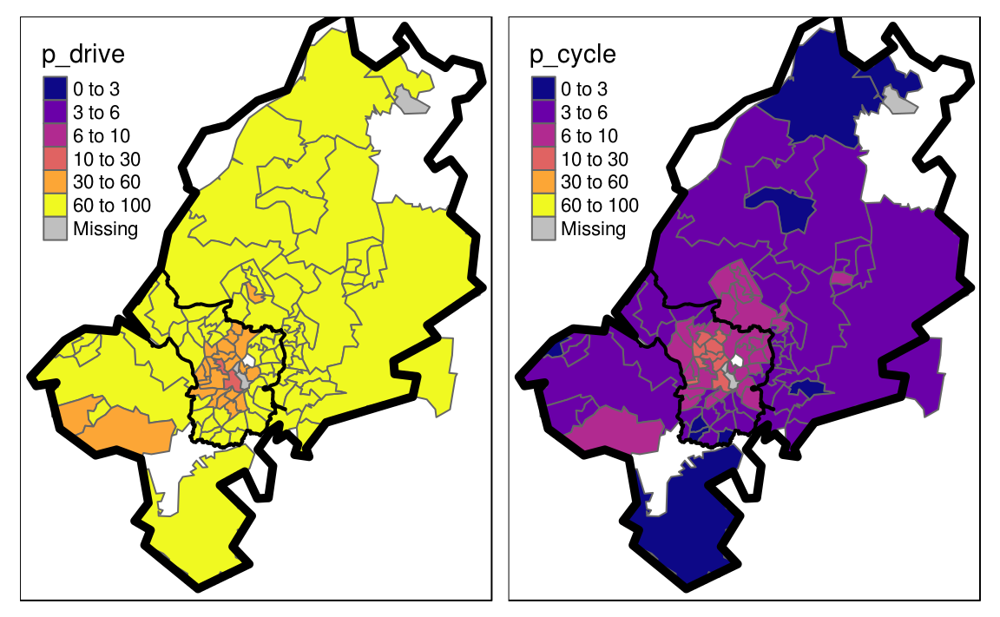
<p class="caption">(\#fig:zones)Number of trips (commuters) living and working in the region. The left map shows zone of origin of commute trips; the right map shows zone of destination.</p>
</div>

## Desire lines

Unlike zones, which represent trip origins and destinations, desire lines connect the centroid of the origin and the destination zone, and thereby represent where people *desire* to go between zones.
If it were not for obstacles such as buildings and windy roads, people would travel in a 'bee-line' from one place to the next, explaining why desire lines are straight (we will see how to convert desire lines into routes in the next section).

We have already loaded data representing desire lines in the dataset `od`.
This origin-destination (OD) data frame object represents the number of people traveling between the zone represented in `o` and `d`, as illustrated in Table \@ref(tab:od).
To arrange the OD data by all trips and then filter-out only the top 5, type (please refer to Chapter \@ref(attr) for a detailed description of non-spatial attribute operations):


```r
od_top5 = arrange(od, desc(all)) %>% 
  top_n(5, wt = all)
```


Table: (\#tab:od)Sample of the origin-destination data stored in the data frame object `od`. These represent the top 5 most common desire lines between zones in the study area.

o           d             all   bicycle   foot   car_driver   train
----------  ----------  -----  --------  -----  -----------  ------
E02003043   E02003043    1493        66   1296           64       8
E02003047   E02003043    1300       287    751          148       8
E02003031   E02003043    1221       305    600          176       7
E02003037   E02003043    1186        88    908          110       3
E02003034   E02003043    1177       281    711          100       7

The resulting table provides a snapshot of Bristolian travel patterns in terms of commuting, travel to work.
It demonstrates that walking is the most popular mode of transport among the top 5 origin-destination pairs, that zone `E02003043` is a popular destination (Bristol city center, the destination of all the top 5 OD pairs), and that the *intrazonal* trips, from one part of zone `E02003043` to another (first row of table \@ref(tab:od)), constitute the most traveled OD pair in the dataset.
But from a policy perspective \@ref(tab:od) is of limited use:
aside from the fact that it contains only a tiny portion of the 2910 OD pairs, it tells us little about *where* policy measures are needed.
What is needed is a way to plot this origin-destination data on the map.

The solution is to convert the non-geographic `od` dataset into geographical desire lines that can be plotted on a map.
The geographic representation of the *interzonal* OD pairs (in which the destination is different from the origin) presented in Table \@ref(tab:od) are displayed as straight black lines in \@ref(fig:desire).
These are clearly more useful from a policy perspective.
The conversion from `data.frame` to `sf` class is done by the **stplanr** function `od2line()`, which matches the IDs in the first two columns of the `od` object to the `zone_code` ID column in the geographic `zones` object.^[
Note that the operation emits a warning: this is `od2line()` works by allocating the start and end points of each origin-destination pair to the *centroid* of its zone of origin and destination.
This represents a straight line between the centroid of zone `E02003047` and the centroid of `E02003043` for the second origin-destination pair represented in Table \@ref(tab:od), for example.
For real-world use one would use centroid values generated from projected data or, preferably, use *population-weighted* centroids [@lovelace_propensity_2017].
]


```r
od_intra = filter(od, o == d)
od_inter = filter(od, o != d)
desire_lines = od2line(od_inter, zones)
#> Warning in st_centroid.sfc(st_geometry(x), of_largest_polygon =
#> of_largest_polygon): st_centroid does not give correct centroids for
#> longitude/latitude data
```

The first two lines of the preceding code chunk split the `od` dataset into two mutually exclusive objects, `od_intra` (which only contains OD pairs representing intrazone trips) and `od_inter` (which represents interzonal travel).
The third line generates a geographic object `desire_lines` (of class `sf`) that allows a subsequent geographic visualization of interzone trips.
An illustration of the results are presented in Figure \@ref(fig:desire) (we will cover the visualization methods that produced this plot in a subsequent chapter) <!-- to do: add reference to chapter -->.
The map shows the city center dominates transport patterns in the region, suggesting policies should be prioritized there, although a number of peripheral sub-centers can also be seen.
Next it would be interesting to have a look at the distribution of interzonal modes, e.g., between which zones is cycling the least, the most common means of transport. <!-- maybe an idea for an exercise? -->
<!-- These include Bradford Stoke to the North and Portishead to the West. -->


```r
plot(desire_lines$geometry, lwd = desire_lines$all / 500)
```

<div class="figure" style="text-align: center">

<p class="caption">(\#fig:desire)Desire lines representing trip patterns in the Bristol Travel to Work Area. The four black lines represent the object `od_top5` created previously and illustrated in Table 8.1.</p>
</div>

## Routes

From a geographical perspective routes are desire lines that are no longer straight:
the origin and destination points are the same, but the pathway to get from A to B is more complex.
Desire lines contain only two vertices (their beginning and end points) but routes can contain hundreds of vertices if they cover a large distance or represent travel patterns on an intricate road network (routes on simple grid-based road networks require relatively few vertices).

Routes are generated from desire lines --- or more commonly origin-destination pairs --- using routing algorithms.
Routing algorithms can either run locally or remotely.
Routing is computationally intensive and might be slow on a local machine (depending on the hardware).
In any case, local routing requires the route network to be stored on a local computer (we will see how in section \@ref(route-networks)).
By contrast, remote routing services use a web API to receive queries about origin and destination points, run the routing on the route network on a powerful server and return just the results, the routes, to the user, the so-called client.
There are many advantages of using remote routing services, including the fact that they can be up-to-date, have global coverage, and run on a set-up that was designed for the job, explaining this section's focus on online routing services.
Before proceeding, however, you should be aware of the disadvantages of online routing services: they are slow or even inaccessible when accessed with a bad internet connection and can be expensive, i.e., not all services are free of charge.
For instance, the Google routing API sets the limit to 2500 free queries per day.^[`ggmap::route()` lets you use Google's routing API through R and the **dodgr** package allows for rapid routing on locally stored route network data.]
<!-- Todo: add link to Mark's presentation on dodgr vs Google routing costs (RL) -->

A popular and free routing service is the Open Source Routing Machine ([OSRM](http://project-osrm.org/)).^[Another popular OSM routing API is https://openrouteservice.org/.]
Instead of routing *all* desire lines generated in the previous section, which would be time and memory-consuming, we will focus on the desire lines of policy interest.
The benefits of cycling trips are greatest when they replace car trips.
Clearly not all car trips can realistically be replaced by cycling, but 5 km Euclidean distance (or around 6-8 km of route distance) is easily accessible within 30 minutes for most people.
Based on this reasoning
<!-- Todo: add references supporting this (RL) -->
we will only route desire lines along which a high (300+) number of car trips take place that are up to 5 km in distance.
This routing is done by the **stplanr** function `line2route()` which takes straight lines in `Spatial` or `sf` objects, and returns 'bendy' lines representing routes on the transport network in the same class as the input.


```r
desire_lines$distance = as.numeric(st_length(desire_lines))
desire_carshort = dplyr::filter(desire_lines, car_driver > 300 & distance < 5000)
route_carshort = line2route(desire_carshort, route_fun = route_osrm)
```

`st_length()` determines the length of a linestring, and falls into the distance relations category (see also section \@ref(distance-relations)).
Subsequently, we apply a simple attribute filter operation (see section \@ref(vector-attribute-subsetting)) before letting the OSRM service do the routing on a remote server.
Note that the routing only works with a working internet connection.

We could keep the new `route_carshort` object separate from the straight line representation of the same trip in `desire_carshort` but, from a data management perspective, it makes more sense to combine them: they represent the same trip.
The new route dataset contains `distance` (referring to route distance this time) and `duration` fields (in seconds) which could be useful.
However, for the purposes of this chapter we are only interested in the geometry, from which route distance can be calculated.
The following command makes use of the ability of simple features objects to contain multiple geographic columns:


```r
desire_carshort$geom_car = route_carshort$geometry
```

This allows plotting the desire lines along which many short car journeys take place alongside likely routes traveled by cars, with the width of the routes proportional to the number of car journeys that could potentially be replaced.
The code below results in Figure \@ref(fig:routes), which demonstrates along which routes people are driving short distances:^[
In this plot the origins of the red routes and black desire lines are not identical.
This is because zone centroids rarely lie on the route network: instead the route originate from the transport network node nearest the centroid.
Note also that routes are assumed to originate in the zone centroids, a simplifying assumption which is used in transport models to reduce the computational resources needed to calculate the shortest path between all combinations of possible origins and destinations [@hollander_transport_2016].
]


```r
plot(desire_carshort$geometry)
plot(desire_carshort$geom_car, col = "red", add = TRUE)
plot(st_centroid(zones)$geometry, add = TRUE)
```

<div class="figure" style="text-align: center">
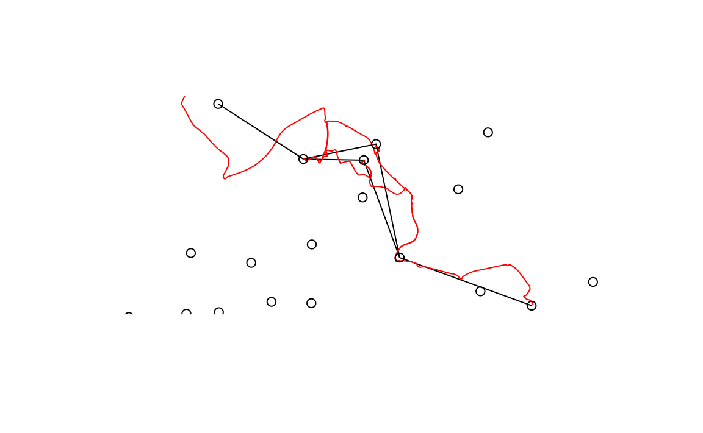
<p class="caption">(\#fig:routes)Routes along which many (300+) short (<5km Euclidean distance) car journeys are made (red) overlaying desire lines representing the same trips (black) and zone centroids (dots).</p>
</div>

The results show that the short desire lines along which most people travel by car are geographically clustered.
Plotting the results on an interactive map, for example, with `mapview::mapview(desire_carshort)`, reveals that these car trips take place in and around Bradley Stoke.
According to [Wikipedia](https://en.wikipedia.org/wiki/Bradley_Stoke), Bradley Stoke is "Europe's largest new town built with private investment", which may help understand its high level of car dependency due to limited public transport provision.
The proliferation of short car journeys in this area can also be understood in terms of the surrounding transport infrastructure:

> Bradley Stoke housing development of 8500 homes constructed by volume house builders; and major transport nodes such as junctions on both the M4 and M5 motorways [@tallon_bristol_2007].

There are many benefits of converting travel desire lines into likely routes of travel from a policy perspective, primary among them the ability to understand what it is about the surrounding environment that makes people travel by a particular mode.
We discuss future directions of research building on the routes in section \@ref(future-directions-of-travel).
For the purposes of this case study, suffice to say that the roads along which these short car journeys travel should be prioritized for investigation to understand how they can be made more conducive to sustainable transport modes.
One option would be to add new public transport nodes to the network.
Such nodes are described in the next section.

## Nodes

Nodes in geographic transport data are zero dimensional features (points) among the predominantly one dimensional features (lines) that comprise the network.
There are two types of transport nodes:

1. Nodes not directly on the network such as zone centroids  --- covered in the next section --- or individual origins and destinations such as houses and workplaces.
2. Nodes that are a part of transport networks, representing individual pathways, intersections between pathways (junctions) and points for entering or exiting a transport network such as bus stops and train stations.

From a mathematical perspective transport networks can be represented as graphs, in which each segment is connected (via edges representing geographic lines) to one or more other edges in the network.
The first type of node can be connected to the network with "centroid connectors", new route segments joining nodes outside the the network with one or more nearby nodes on the network [@hollander_transport_2016].
The location of these connectors should be chosen carefully because they can lead to over-estimates of traffic volumes on in their immediate surroundings [@jafari_investigation_2015].
The second type of nodes are nodes on the graph, each of which is connected by one or more straight 'edges' that represent individual segments on the network.
We will see how transport networks can be represented as mathematical graphs in section \@ref(route-networks).

Public transport stops are particularly important nodes that can be represented as either type of node: a bus stop that is part of a road, or a large rail station that is represented by its pedestrian entry point hundreds of meters from railway tracks.
We will use railway stations to illustrate public transport nodes, in relation to the research question of increasing cycling in Bristol.
These stations are loaded as follows:


```r
rail_stations = readRDS("extdata/rail_stations.rds")
```

A common barrier preventing people from switching away from cars for commuting to work is that the distance from home to work is too far to walk or cycle.
Public transport can reduce this barrier by providing a fast and high-volume option for common routes into cities.
From an active travel perspective public transport 'legs' of longer journeys divide trips into three: 

<!-- Add image to show this if needs be (RL) -->
- The origin leg, typically from residential areas to public transport stations.
- The public transport leg, which typically goes from the station nearest a trip's origin to the station nearest its destination.
- The destination leg, from the station of alighting to the destination.

Building on the analysis conducted in section \@ref(desire-lines), public transport nodes can be used to construct three-part desire lines for trips that can be taken by bus and (the mode used in this example) rail.
The first stage is to identify the desire lines with most public transport travel, which in our case is easy because our previoulsy created dataset `desire_lines` already contains a variable describing the number of trips by train (the public transport potential could also be estimated using public transport routing services such as [OpenTripPlanner](http://www.opentripplanner.org/)).
To make our approach easy to follow we will select just the top three desire lines in terms of rails use:


```r
desire_rail = top_n(desire_lines, n = 3, wt = train)
```

The challenge now is to 'break-up' each of these lines into three pieces, representing travel via public transport nodes.
This can be done by converting a desire line into a multiline object consisting of three line geometries representing origin, public transport and destination legs of the trip.
The first stage is to create matrices of coordinates that will subsequently be used to create matrices representing each leg:


```r
mat_orig = as.matrix(line2df(desire_rail)[c("fx", "fy")])
mat_dest = as.matrix(line2df(desire_rail)[c("tx", "ty")])
mat_rail = st_coordinates(rail_stations)
```

The outputs are three matrices representing the starting points of the trips, their destinations and possible intermediary points at public transport nodes (named `orig`, `dest` and `rail` respectively).
But how to identify *which* intermediary points to use for each desire line?
The `knn()` function from the **nabor** package (which is used internally by **stplanr** so it should already be installed) solves this problem by finding *k nearest neighbors* between two sets of coordinates.
By setting the `k` parameter, one can define how many nearest neighors should be returned. 
Of course, `k` cannot exceed the number of observations in the input (here: `mat_rail`).
We are interested in just one nearest neighbor, namely, the closest railway station.
:


```r
knn_orig = nabor::knn(mat_rail, query = mat_orig, k = 1)$nn.idx
knn_dest = nabor::knn(mat_rail, query = mat_dest, k = 1)$nn.idx
```

This results not in matrices of coordinates, but row indices that can subsequently be used to subset the `mat_rail`.
It is worth taking a look at the results to ensure that the process has worked properly, and to explain what has happened:


```r
as.numeric(knn_orig)
#> [1] 28  3  2
as.numeric(knn_dest)
#> [1] 30 30 30
```

The output demonstrates that each object contains three whole numbers (the number of rows in `desire_rail`) representing the rail station closest to the origin and destination of each desire line.
Note that while each 'origin station' is different, the destination (station `30`) is the same for all desire lines.
This is to be expected because rail travel in cities tends to converge on a single large station (in this case Bristol Temple Meads).
The indices can now be used to create matrices representing the rail station of origin and destination:


```r
mat_rail_o = mat_rail[knn_orig, ]
mat_rail_d = mat_rail[knn_dest, ]
```

The final stage is to convert these matrices into meaningful geographic objects, in this case simple feature 'multilinestrings' that capture the fact that each stage is a separate line, but part of the same overall trip:


```r
mats2line = function(mat1, mat2) {
  lapply(1:nrow(mat1), function(i) {
    rbind(mat1[i, ], mat2[i, ]) %>%
    st_linestring()
  }) %>% st_sfc()
}
desire_rail$leg_orig = mats2line(mat_orig, mat_rail_o)
desire_rail$leg_rail = mats2line(mat_rail_o, mat_rail_d)
desire_rail$leg_dest = mats2line(mat_rail_d, mat_dest)
```


Now we are in a position to visualize the results, in Figure \@ref(fig:stations):
the three initial `desire_rail` lines now have three additional geometry list-columns representing travel from home to the origin station, from there to the destination, and finally from the destination station to the destination.
In this case the destination leg is very short (walking distance) but the origin legs may be sufficiently far to justify investment in cycling infrastructure to encourage people to cycle to the stations on the outward leg of peoples' journey to work in the residential areas surrounding the three origin stations in Figure \@ref(fig:stations).

<div class="figure" style="text-align: center">
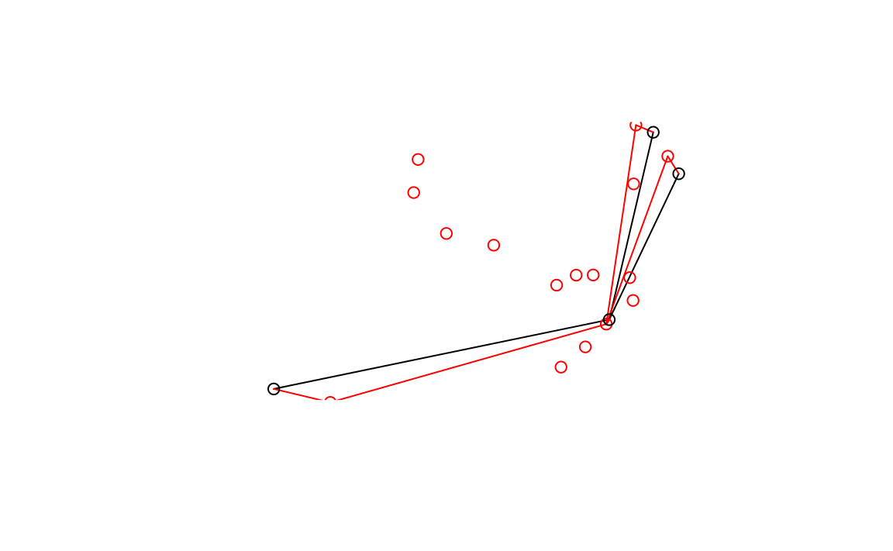
<p class="caption">(\#fig:stations)Station nodes (red dots) used as intermediary points that convert straight desire lines with high rail usage (black) into three legs: to the origin station (red) via public transport (grey) and to the destination (a very short blue line).</p>
</div>

## Route networks

The data used in this section was downloaded using **osmdata**.
To avoid having to request the data from OSM repeatedly, we will use a locally saved version of the data, which contains point and line data for the case study area:


```r
ways = readRDS("extdata/ways.rds")
summary(ways)
#>      highway        maxspeed         ref                geometry   
#>  cycleway:1261   30 mph : 822   A38    : 199   LINESTRING   :4591  
#>  rail    : 813   20 mph : 435   M5     : 138   epsg:4326    :   0  
#>  road    :2517   70 mph : 323   A432   : 128   +proj=long...:   0  
#>                  40 mph : 314   A4018  : 120                       
#>                  50 mph : 131   A420   : 112                       
#>                  (Other): 475   (Other):1681                       
#>                  NA's   :2091   NA's   :2213
```

The above code chunk loaded a simple feature object representing around 3,000 segments on the transport network.
This an easily manageable dataset size (transport datasets be large but it's best to start small).

As mentioned, route networks can usefully be represented as mathematical graphs, with nodes on the network connected by edges.
A number of R packages have been developed for dealing with such graphs, notably **igraph**.
One can manually convert a route network into an `igraph` object, but that process risks loosing the geographic attributes.
To overcome this issue `SpatialLinesNetwork()` was developed in the **stplanr** package to represent route networks simultaneously as graphs *and* a set of geographic lines.
This function is demonstrated below using a subset of the `ways` object used in previous sections.


```r
ways_freeway = ways %>% filter(maxspeed == "70 mph") 
ways_sln = SpatialLinesNetwork(ways_freeway)
slotNames(ways_sln)
#> [1] "sl"          "g"           "nb"          "weightfield"
weightfield(ways_sln)
#> [1] "length"
class(ways_sln@g)
#> [1] "igraph"
```

The output of the previous code chunk shows that `ways_sln` is a composite object with various 'slots'.
These include: the spatial component of the network (named `sl`), the graph component (`g`) and the 'weightfield', the edge variable used for shortest path calculation (by default segment distance).
`ways_sln` is of class `sfNetwork`, defined by the S4 class system.
This means that each component can be accessed using the `@` operator, which is used below to extract its graph component and process it using the **igraph** package, before plotting the results in geographic space.
In the example below the 'edge betweeness', meaning the number of shortest paths passing through each edge, is calculated (see `?igraph::betweenness` for further details).
The results demonstrating that each graph edge represents a segment: the segments near the center of the road network have the greatest betweeness scores.

<!-- Todo (optional): make this section use potential cycle routes around Stokes Bradley not freeway data (RL) -->

```r
g = ways_sln@g
e = igraph::edge_betweenness(ways_sln@g)
plot(ways_sln@sl$geometry, lwd = e / 500)
```

<div class="figure" style="text-align: center">
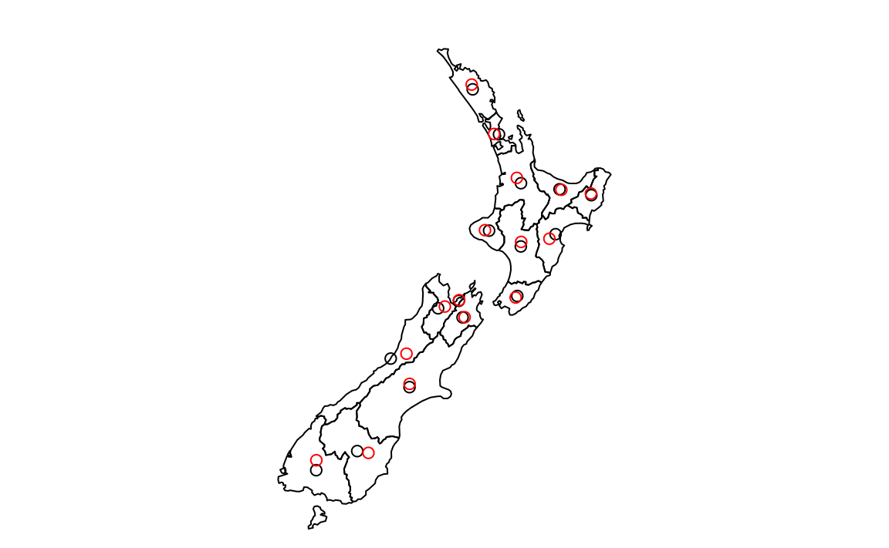
<p class="caption">(\#fig:unnamed-chunk-29)Illustration of a small route network, with segment thickness proportional to its betweeness, generated using the **igraph** package and described in the text.</p>
</div>


One can also find the shortest route between origins and destinations using this graph representation of the route network.
This is can be done using the `sum_network_routes()` function from **stplanr**, which uses local route network data instead of the online routing service described in section \@ref(routes).
This finds the shortest path between arbitrary nodes 1 and 20, on the network ---
'shortest' with reference to the `weightfield` slot of `ways_sln` (route distance by default).^[
To select nodes by geographic location the **stplanr** function `find_network_nodes()` can be used.
]
The result is a spatial linestring object that can be plotted using **sf** plotting methods (result not shown --- readers are encouraged to plot the result locally):


```r
path = sum_network_routes(ways_sln, 1, 20, "length")
```

```r
plot(path$geometry, col = "red", lwd = 10)
plot(ways_sln@sl$geometry, add = TRUE)
```


## Prioritizing new infrastructure

This chapter's final practical section demonstrates the policy-relevance of geocomputation for transport applications by identifying locations where new transport infrastructure may be needed.
Chapter \@ref(location) demonstrates methods for prioritising the location of new bike shops which may benefit from new cycling infrastructure, demonstrating an important feature of transport systems: they are closely linked to broader social, economic and land-use patterns.
This section ties-together the various strands that explored some geographic features of Bristol's transport system, covered in sections \@ref(transport-zones) to \@ref(route-networks).

Geocomputational methods to prioritize cycling infrastructure have been demonstrated (these would be supplemented with other methods for assessing the social, economic and environmental impacts of different options for a real case study):
short but car-dependent commuting routes (generated from desire lines) were created in section \@ref(routes); desire lines representing the first leg to public transport nodes were created in section \@ref(nodes); and the ability to analyze route networks using concepts from graph theory were demonstrated in the previous section.
The final code chunk of this chapter combines car-dependent routes in `route_carshort` with a newly-created object, `route_rail`, and adds a new column representing the amount of travel along the centroid-to-centroid desire lines they represent:


```r
route_rail = st_set_geometry(desire_rail, "leg_orig") %>% 
  line2route(route_fun = route_osrm) %>% 
  st_set_crs(4326)
route_cycleway = rbind(route_rail, route_carshort)
route_cycleway$all = c(desire_rail$all, desire_carshort$all)
```


<div class="figure" style="text-align: center">
preserve26837285f504b54c
<p class="caption">(\#fig:cycleways)Potential routes along which to prioritise cycle infrastructure in Bristol, based on access key rail stations (red dots) and routes with many short car journeys (north of Bristol surrounding Stoke Bradley. Line thickness is proportional to number of trips.</p>
</div>

The result of this code, visualized in Figure \@ref(fig:cycleways), identifies routes of interest terms of car dependency and key opportunities to invest in public transport-cycling integration.
Although other routes between zones are possible and likely --- in reality people do not travel to zone centroids or always use the shortest route algorithm for a particular mode --- the results demonstrate routes along which cycle paths could be prioritized.
Clearly further work is needed to create a regional cycling and walking strategy in the Bristol region.
However, the chapter demonstrates how geocomputational skills, combined with open access data and a strong policy motivation, can provide a powerful, transparent and reproducible evidence base for transport applications.

The wider point is that transport systems are intimately linked to the wider economic and social context.
The example of Stokes Bradley is a case in point:
its location, lack of public transport services and active travel infrastructure help explain why it is so highly car-dependent.
Geocomputation has the potential to provide evidence to people in Stokes Bradley, Bristol and beyond about how to best intervene to encourage the uptake of sustainable transport.
This work is part of an unfolding story about the transition away from fossil fuels in transport systems worldwide, from London to Delhi [@hickman_transitions_2011].

## Future directions of travel

This chapter has provided a taster of the possibilities of using geocomputation for transport research.
It has explored some of the geographic key features of the travel patterns in a major city using open data to identify where investment in sustainable transport options may be most urgently needed.
More importantly, from a learning perspective, it has demonstrated how representing transport systems at multiple interacting geographical levels can lead to new insights about how they work, and how to change them.
However, there is much more that could be done in this area.
Geocomputation for transport applications is a small but rapidly growing field and space requirements mean that we have only scratched the surface of what is possible, while emphasizing the principles and key methods of implementation in R.

It is possible to build on the foundations presented in this chapter in many directions.
Transport is the fastest growing source of greenhouse gas emissions in many countries, and is set to become according to become "the largest GHG emitting sector, especially in developed countries" according to a recent article in the online platform [EURACTIV](https://www.euractiv.com/section/agriculture-food/opinion/transport-needs-to-do-a-lot-more-to-fight-climate-change/).
Because of the highly unequal distribution of transport-related emissions across society, and the fact that transport (unlike food and heating) is not essential for well-being, there is great potential for the sector to rapidly decarbonize through demand reduction, electrification of the vehicle fleet and the uptake of active travel modes such as walking and cycling.
Further exploration of such 'transport futures' represents a particularly promising future direction of travel from a policy perspective.

From a methods perspective there are also many further potential directions.
<!-- Something on lines, routes, route networks (RL) -->
Characteristics of the route such as speed limits, busyness and the provision of protected cycling and walking paths may be able to help explain differences in 'mode-split' (the proportion of trips made by different modes of transport).
By aggregating OpenStreetMap data (downloaded using methods presented in Chapter \@ref(read-write)) using buffers and spatial data methods presented in Chapters \@ref(attr) and \@ref(spatial-operations), for example, it would be possible to detect the presence of green space in close proximity to parks.
Using R's statistical modelling capabilities this could then be used to predict the current number of using a certain mode along particular desire lines, and how that may switch under scenarios of change.
A similar approach was used to create the Propensity to Cycle Tool (PCT), a publicly accessible mapping tool developed in R to prioritize investment in cycling, available at [www.pct.bike](http://www.pct.bike/) [@lovelace_propensity_2017].
Similar tools could be used to encourage evidence-based policies around other modes, not just cycling.

One growing area of interest surrounds the simulation of individual people and vehicles on the road network using techniques such as spatial microsimulation and agent-based modelling (ABM).
R has the capability to model people in zones, and interface with ABM software such as NetLogo.
Combined with its geographical capabilities, demonstrated in this book, R would seem an appropriate language for such developments to take place.
Of course this should be done in ways that build-on and extend existing work in the area.
R's 'ecological niche' in transport modelling software could be around the integration of detailed geographic and advanced statistical analysis methods with techniques already used in transport research.

## Exercises {#ex-transport}

1. What is the total distance of cycleways that would be constructed if all the routes presented in Figure \@ref(fig:cycleways) were to be constructed?
    - Bonus find two ways of arriving at the same answer.


1. What proportion of trips represented in the `desire_lines` are accounted for in the `route_cycleway` object?
    - Bonus: what proportion of trips cross the proposed routes?
    - Advanced: write code that would increase this proportion.


1. The analysis presented in this chapter is designed for teaching how geocomputation methods can be applied to transport research. If you were to do this 'for real' for local government or a transport consultancy what top 3 things would you do differently?
<!-- Higher level of geographic resolution. -->
<!-- Use cycle-specific routing services. -->
<!-- Identify key walking routes. -->
<!-- Include a higher proportion of trips in the analysis -->
1. Clearly the routes identified in Figure \@ref(fig:cycleways) only provide part of the picture. How would you extend the analysis to incorporate more trips that could potentially be cycled?
1. Imagine that you want to extend the scenario by creating key *areas* (not routes) for investment in place-based cycling policies such as car-free zones, cycle parking points and reduced car parking strategy. How could raster data assist with this work? 
    - Bonus: develop a raster layer that divides the Bristol region into 100 cells (10 by 10) and provide a metric related to transport policy, such as number of people trips that pass through each cell by walking or the average speed limit of roads (from the `ways` dataset).

<!--chapter:end:08-transport.Rmd-->


# References {-}

<!--chapter:end:references.Rmd-->

